# 概要

これを作ります。

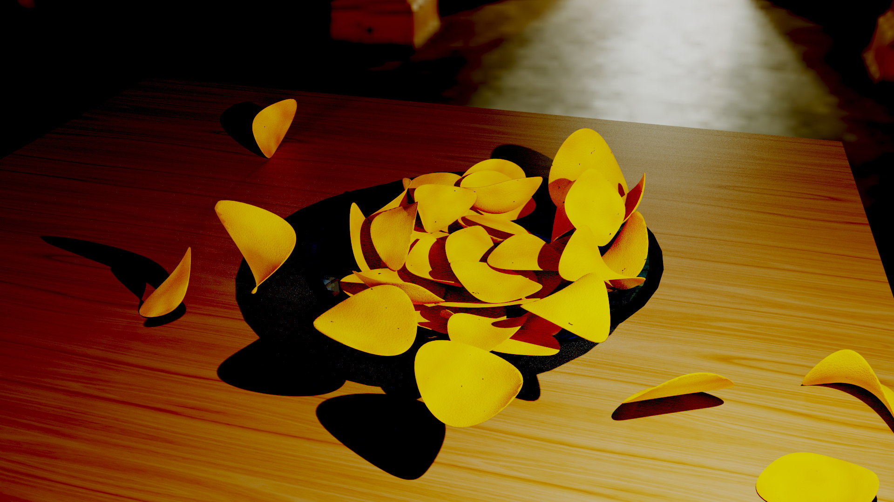

## 動機

sachiko15さんという方が、[モデリング文化祭](https://www.youtube.com/watch?v=T4cjjDc7gmI&list=PLVep7mFEtS5Cdtu_gpQmdbSP6VtTQIENM&index=1
)という3DCG作品の展覧会のようなものを開催していらっしゃいます。それに自分も何か出そうと思ったのが事の発端です。

## ポテトチップスには鞍点がある

まず、ポテトチップスをどのようにモデリングするかを考えます。
今回は鞍点をキーワードにしてみました。

## 鞍点とは

[Wiki](https://ja.wikipedia.org/wiki/%E9%9E%8D%E7%82%B9)の定義では、鞍点は次のようになっています。

>鞍点（あんてん、saddle point）は、多変数実関数の変域の中で、ある方向で見れば極大値だが別の方向で見れば極小値となる点である。
>鞍部点、峠点とも言う。微分可能な関数については極値を取らない停留点とも言う。

図を見ればさらに直感的に理解できると思います。

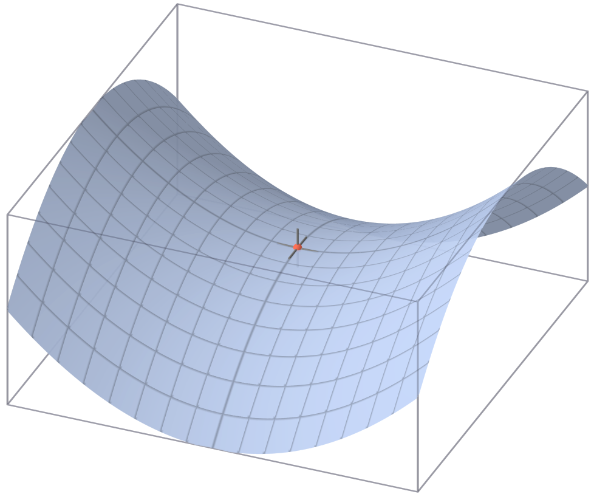

（Wikiより引用, パブリック・ドメイン, [link](https://commons.wikimedia.org/w/index.php?curid=21943)）

この図は数式 $z=x^2-y^2$ で表されます。

$z=f(x,y)$ の形式で表される二次曲面は、クロスタームを含まない時、楕円放物面、双曲放物面に大別されます。上の図は双曲放物面です。

偏微分から分かることとして、$x^2$ の項と $y^2$ の項が同符号ならば楕円放物面(つまり鞍点なし)、異符号なら双曲放物面(つまり鞍点あり)となります。

今回はこれらをポテトチップスに見立てて、鞍点を持つ曲面を利用しました。

## Pythonによるモデリング

上記で述べた数式を実際に3DCGで表現する為に、今回はPythonを利用します。

Blenderの拡張機能であるaddonには、Add Mesh Extra Objectsというものが存在し、それのZ Math Surface([参考](https://github.com/sobotka/blender-addons/blob/master/add_mesh_extra_objects/add_mesh_3d_function_surface.py
))という機能は、先程のような $z=f(x,y)$ という数式をポリゴンに変換してくれます。


これによって、自動でポテトチップスのモデリングを行うことが可能です。

## 作業の概要

+ **STEP1 ポテト曲面の作成**
鞍点を含む面など、ポテトチップス作成の基となる曲面のことをポテト曲面と呼び、それを大量に生成します。

+ **STEP2 型の作成**
ポテト曲面からポテトチップスを切り抜くための型を同じ数だけ作成します。

+ **STEP3 ポテトの切り抜き**
最後にポテト曲面から型をつかって、ポテトチップスを切り抜きます。

### STEP1 ポテト曲面の作成

では早速ポテト曲面を作っていきます。

```python
import bpy
import random

#最初にシーン内のオブジェクトを全て削除します
for item in bpy.data.objects:
    bpy.data.objects.remove(item)


for counter in range(101):
#以下の処理を100回(都合上101になっていますが)繰り返すことで100枚のポテチを作るということです
    
    #今回のメインであるz_function_surfaceを使っていきます
    #infoの欄からこの関数の引数を確認することは出来ますが、
    #https://github.com/sobotka/blender-addons/blob/master/add_mesh_extra_objects/add_mesh_3d_function_surface.py
    #の113行目辺りからも確認することが出来ます。
    x_coefficient=random.uniform(0,0.3) #xの係数を0から0.3までの範囲で選びます
    y_coefficient=random.uniform(0,0.3) #yの係数を0から0.3までの範囲で選びます
    sign=random.choice(["+","-","-"]) #符号を決めます 今回は1対2の割合で鞍点を持つもの(-)を採用します
    myEquation="{0}*x**2{2}{1}*y**2".format(x_coefficient,y_coefficient,sign) #方程式を合成します
    bpy.ops.mesh.primitive_z_function_surface(equation=myEquation, div_x=32, div_y=32, size_x=10+2, size_y=10+2) #これがz math functionです。なお、+2は余白です
    
    bpy.ops.object.editmode_toggle()
    bpy.ops.mesh.solidify(thickness=0.1) #編集モードに入って厚み付けをしておしまいです。
    bpy.ops.object.editmode_toggle()
```

上では100個のポテト曲面を作成していますが、その内の一つを取り出すとこんな形です。


先ほど見た鞍点を含む曲面が出来ています。

これを100個集めたのが以下の画像です。


これをpotato surfaceというcollectionに入れておきます。

### STEP2 型の作成

ポテト曲面を切り抜くための型を作成していきます。

#### 数式の説明

まず数式の部分だけ軽く説明します。
ポテトを切り抜く型としては楕円が基本的な図形の中で最も近いですが、それではやや機械的すぎます。なので、y軸方向に楕円を非均一に押し潰してやります。


上の図で言えば、青色の閉曲線が押しつぶされた楕円です。

その押し潰す割合(ここではy_scalefactorと名付けました)には二次関数を採用しています。

また、上の図では行っていませんが、二次関数の軸を移動させる部分でyの符号をかけてやれば、x軸非対称にすることが出来ます。そうすることでよりポテトらしさが追求できると考えました。

#### コードの実行

##### 1/3 曲面群の作成

math functionには残念ながら二次曲面を表示する機能がない(あるいは私が見つけられていない)ので、再びz math functionを用いて先のような曲面群を生成し、その後z=1の平面で切り、それをsolidifyすることで型を作っていきます。

```python
import bpy
import random

for item in bpy.data.objects:
    bpy.data.objects.remove(item)

for counter in range(101):
    #x**2/a**2+y**2/b**2=1を念頭に置いて書きました
    a=5
    b=random.uniform(3,4.5)
    y_scalefactor_coefficient=random.uniform(0,0.03)
    y_scalefactor_shift=random.uniform(0.25,1.75)
    y_scalefactor_constantterm=random.uniform(0.9,1.1)
    #y=0は頂点として含まれないことに注意
    y_scalefactor_plus ="({0}*(x+{1})**2+{2})".format(y_scalefactor_coefficient,y_scalefactor_shift,y_scalefactor_constantterm)
    y_scalefactor_minus="({0}*(x-{1})**2+{2})".format(y_scalefactor_coefficient,y_scalefactor_shift,y_scalefactor_constantterm)
    mySecondEquation_plus ="x**2/{0}**2+(y*{2})**2/{1}**2".format(a,b,y_scalefactor_plus)
    mySecondEquation_minus="x**2/{0}**2+(y*{2})**2/{1}**2".format(a,b,y_scalefactor_minus)
    mySecondEquation="{0} if y>0 else {1}".format(mySecondEquation_plus,mySecondEquation_minus)
    bpy.ops.mesh.primitive_z_function_surface(equation=mySecondEquation, div_x=32, div_y=32, size_x=10+2, size_y=10+2)

```

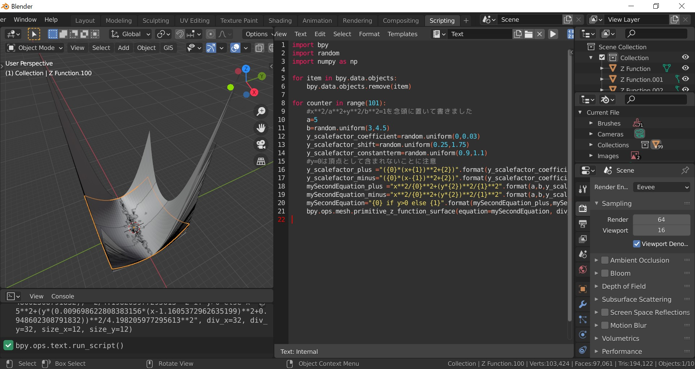

#### 2/3 閉曲線の作成

ここではcopy attributesというaddonや、`ctrl+A`で出てくるApplyのVisual Geometry to Meshという機能を使って一括にbooleanを設定、適用していきます。後者の機能に関してはややマイナーかも知れませんが、非常に便利です。

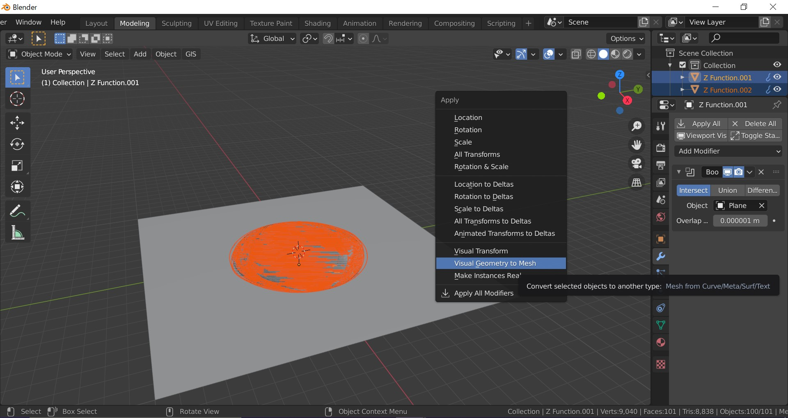

#### 3/3 型の作成

最後にsolidifyで柱体にし、

```python
import bpy

for i in range(100):
    bpy.ops.object.select_all(action='DESELECT')
    obj=bpy.data.objects['Z Function.{:0=3}'.format(i+1)]
    bpy.context.view_layer.objects.active = obj
    
    bpy.ops.object.editmode_toggle()
    bpy.ops.mesh.select_all(action='SELECT')
    bpy.ops.mesh.solidify(thickness=20)
    bpy.ops.mesh.select_all(action='SELECT')
    bpy.ops.transform.translate(value=(0, 0, 10))
    bpy.ops.object.editmode_toggle()
```

名前を変更して終了です。

```python
import bpy

for i,obj in enumerate(bpy.context.selected_objects):
    obj.name = "mold.{:0=3}".format(i+1)
```

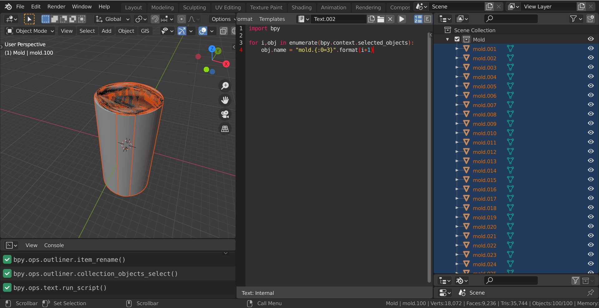

これでMoldという名前の、型を集めたcollectionが出来ました。

### STEP3 ポテトの切り抜き

ここまでくればあと一息です。今までに作成したpotato surfaceとMoldの二つのcollectionを新しいBlenderファイルにappendし、boolean modifierで切り抜いていきます。

#### 1/2 下準備

potato surface内のオブジェクトを軽く位置をずらしておきます。そうすることで、切り抜きによりランダムさが加わります。
Randomize Transformでそれを実現します。

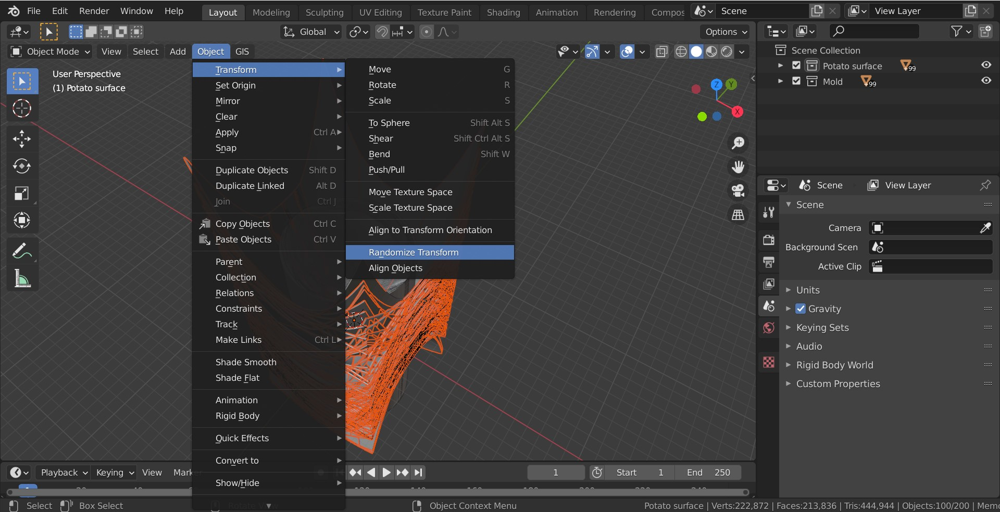

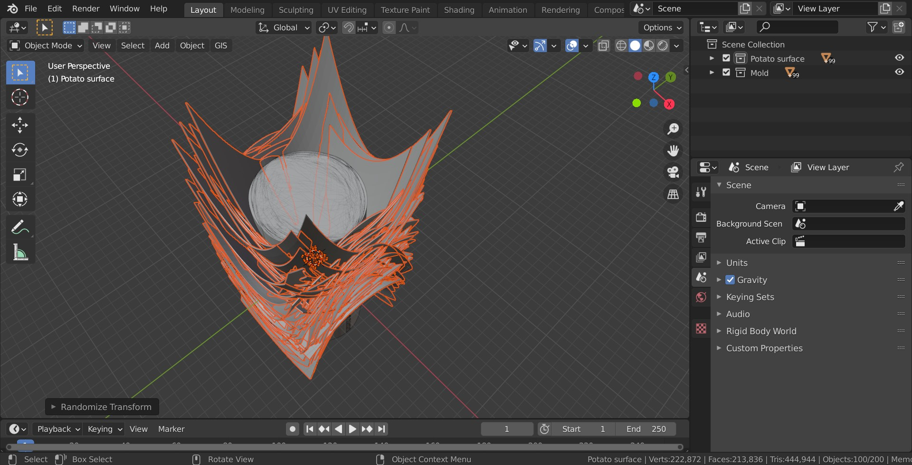

#### 2/2 切り抜き

最後の工程です。切り抜いていきます。

```python
import bpy

for i in range(100):
    bpy.ops.object.select_all(action='DESELECT')
    obj=bpy.data.objects['Z Function.{:0=3}'.format(i+1)] #ポテト曲面を選択し
    bpy.context.view_layer.objects.active = obj
    bpy.ops.object.modifier_add(type='BOOLEAN') #boolean modifierをつけて
    bpy.context.object.modifiers["Boolean"].operation = 'INTERSECT'
    bpy.context.object.modifiers["Boolean"].object = bpy.data.objects["mold.{:0=3}".format(i+1)] #型を指定し
    bpy.ops.object.modifier_apply(modifier="Boolean") #適用していきます。
```

これを実行します。

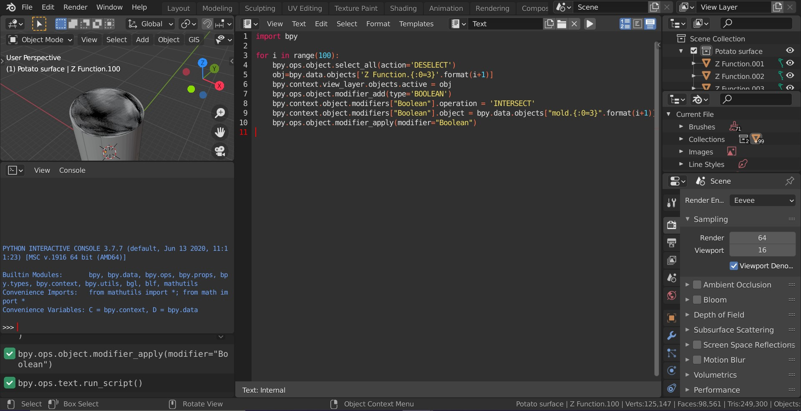

上手く出来たでしょうか?

moldを全て非表示にして、Randomize Transformでポテトを見やすく配置します
すると、おお! ポテチらしきものが!!!

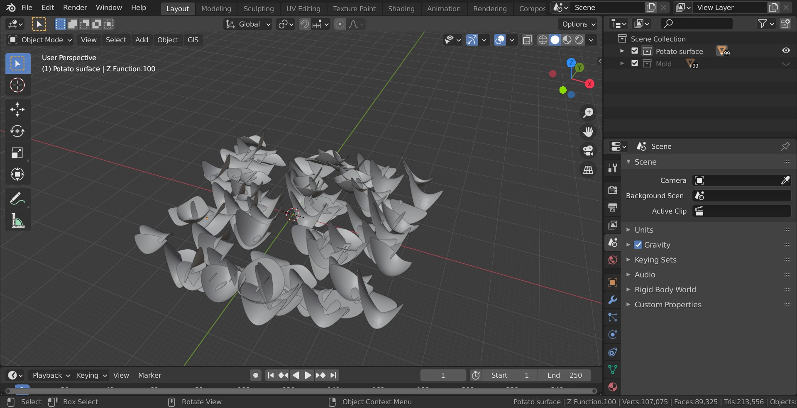

ただ数値設定をミスっていたせいでやや丸まりすぎなので、z方向に0.4倍してやって、、、

今度こそ、揚げたてポテトの完成です。

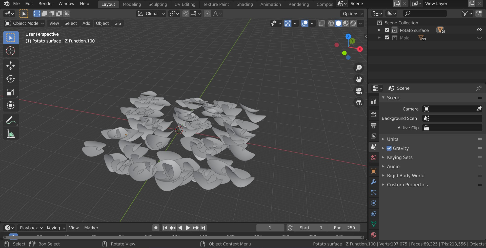

この中の数枚を取り出してみて見ましょう。
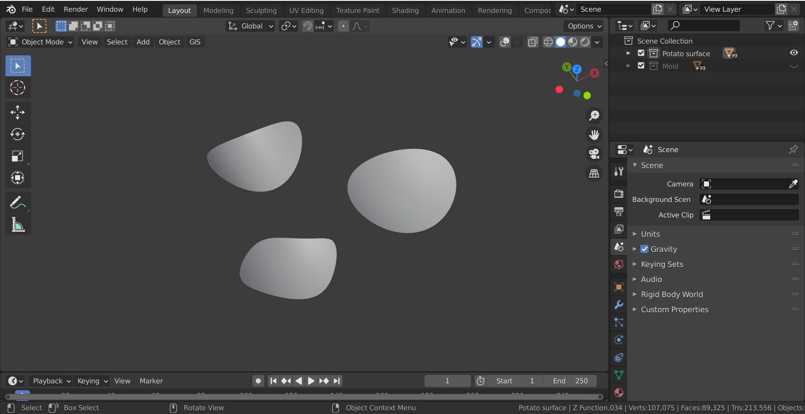

かなりポテチらしき形を有していませんか? 私は満足です。

## 作品の完成へ

最後に仕上げとして作品にしていきます。

Shade smoothを掛けてauto smoothを有効にします。ポテチ100枚だと私のパソコンのスペックではきついので、50枚に減らし、z軸方向に散らします。(この時同時に回転とサイズもランダマイズさせました)

机と皿を適当にモデリングし、それらにはrigid bodyのpassiveを、ポテチにはactiveを付与します。 Meshで物理演算をするとfpsが0.3辺りまで落ちてしまったので（スペックによるとは思いますが）convex hullでcollisionは妥協し、上からポテチを皿に散らします。

いい感じのタイミングで時間を止め、一度fbxで出力し、再度読み込むことで意図しない方向に跳ねたポテチを除きます。最後にマテリアル設定とコンポジット設定を変えて出力して完成です。

マテリアルは以下の通りです。

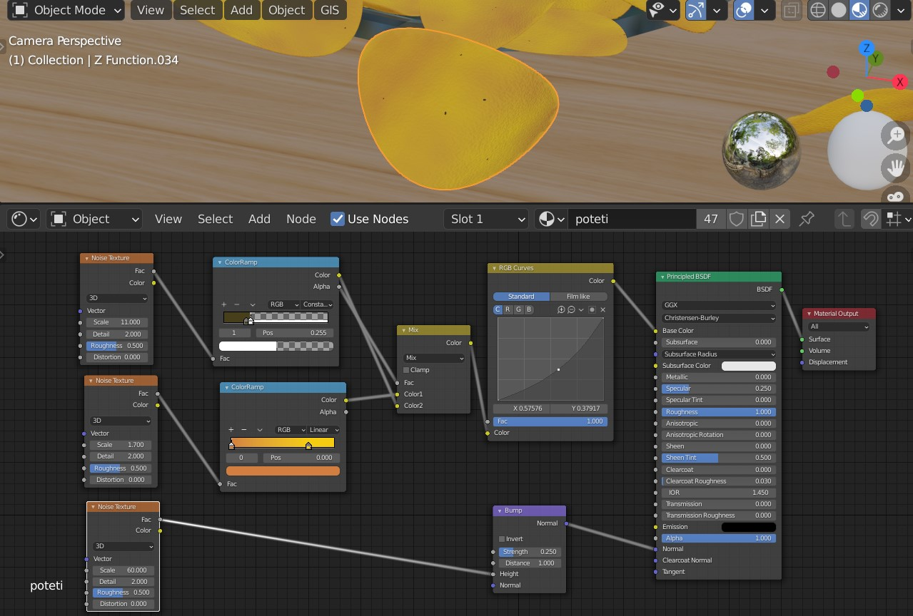

コンポジットは以下の通りです。

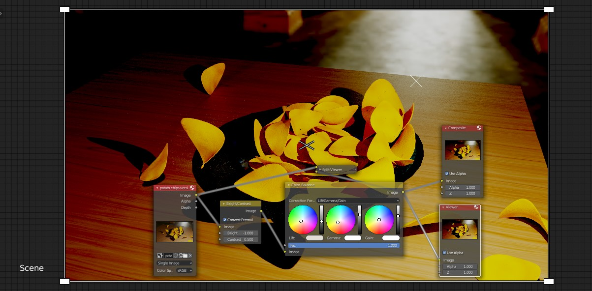

そうして完成したのが、冒頭でもお見せしたこちらになります。


ご覧いただきありがとうございました。

## 追記(Geometry Node)

この記事を書いて一年以上が経過した現在でも、時々反応を下さる方がいらっしゃり、ありがたい限りです。そんな訳で、情報のアップデートが必要かと思い、簡単にですが**Geometry Node**に関する追記をさせて頂きました。

Geometry Nodeは主にBlender3.0から追加された新機能で、これまでadd-onやPythonに頼らなければ少し厳しい、といった操作もより簡単にできるようになりました。
今回紹介した数式による曲面の生成もその一つです。

以下にpotato surfaceを作成する部分だけではありますが、Geometry Nodeを用いた例をご紹介します。


基本的にはこの[StackExchangeの記事](https://blender.stackexchange.com/questions/248789/using-geometry-nodes-to-create-and-plot-equations-functions)と同じことをしているだけですが、$z=x^2-y^2$ という操作が、Mesh Primitivesの<font color="LimeGreen">Grid</font>、そしてVectorの<font color="DeepSkyBlue">Separate XYZ</font>と<font color="DeepSkyBlue">Combine XYZ</font>によって実現可能です。

具体的には先述のコードの、この部分に対応しています。係数は都合上少し変えています。

```python
x_coefficient=random.uniform(0,0.3) #xの係数を0から0.3までの範囲で選びます
y_coefficient=random.uniform(0,0.3) #yの係数を0から0.3までの範囲で選びます
sign=random.choice(["+","-","-"]) #符号を決めます 今回は1対2の割合で鞍点を持つもの(-)を採用します
myEquation="{0}*x**2{2}{1}*y**2".format(x_coefficient,y_coefficient,sign) 
```

Blender、本当に便利になりましたね……。何だか感慨深いです。

Geometry Nodeを用いた作例は、ネット上で他にも沢山あるので、興味のある方はネットで調べて頂ければ、面白いものがたくさん見つかるかと思います。ご参考になれば幸いです。
