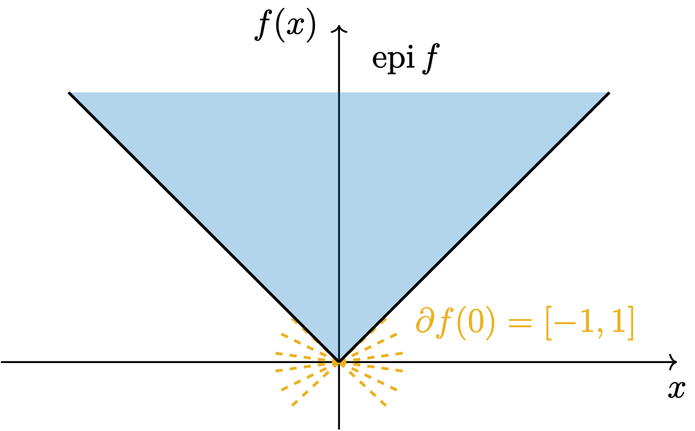
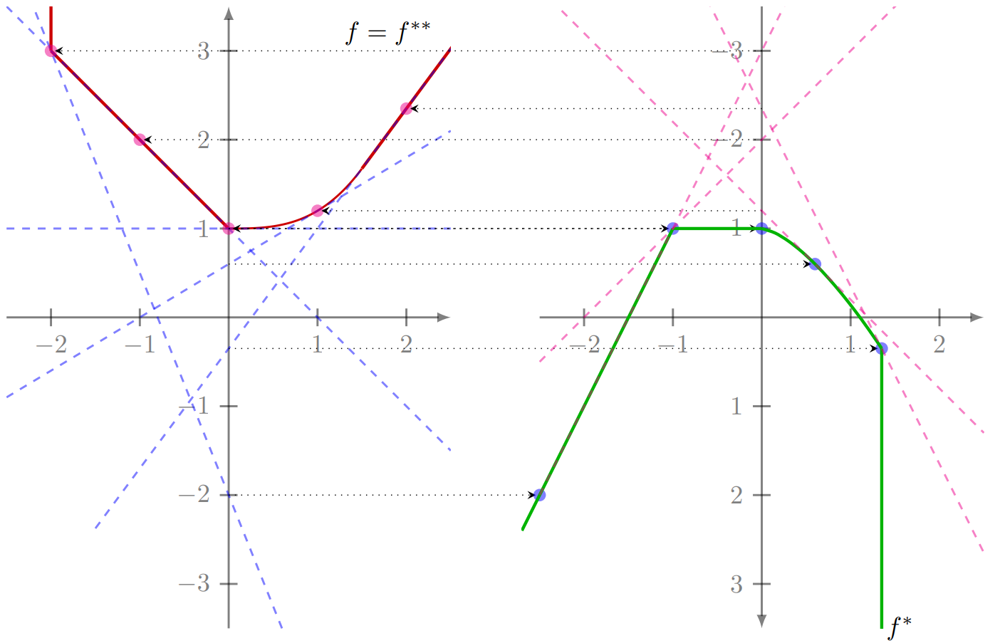
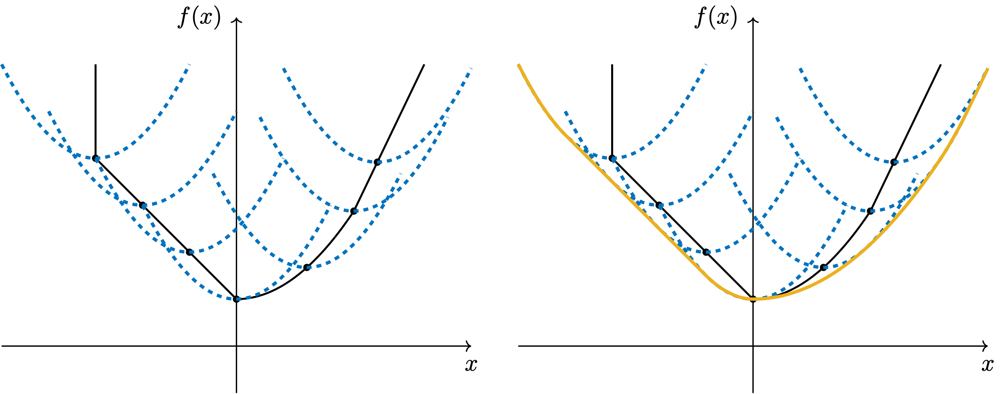
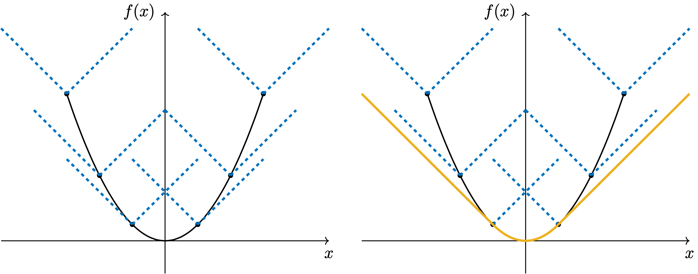
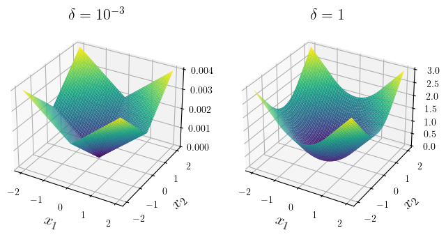
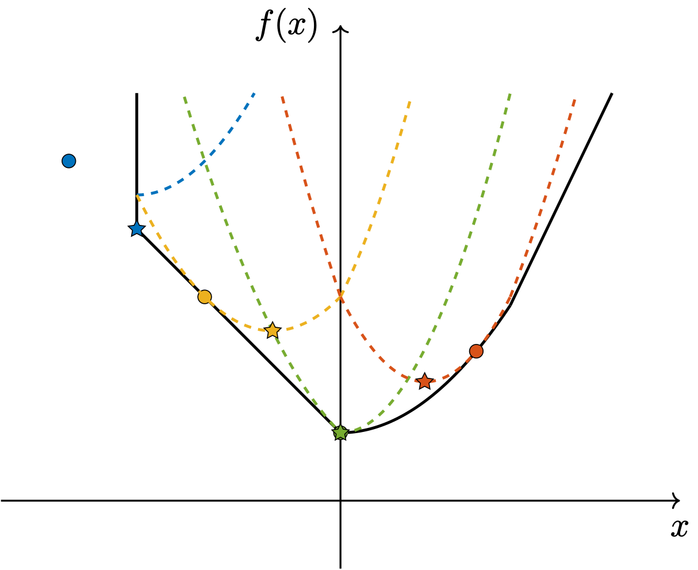
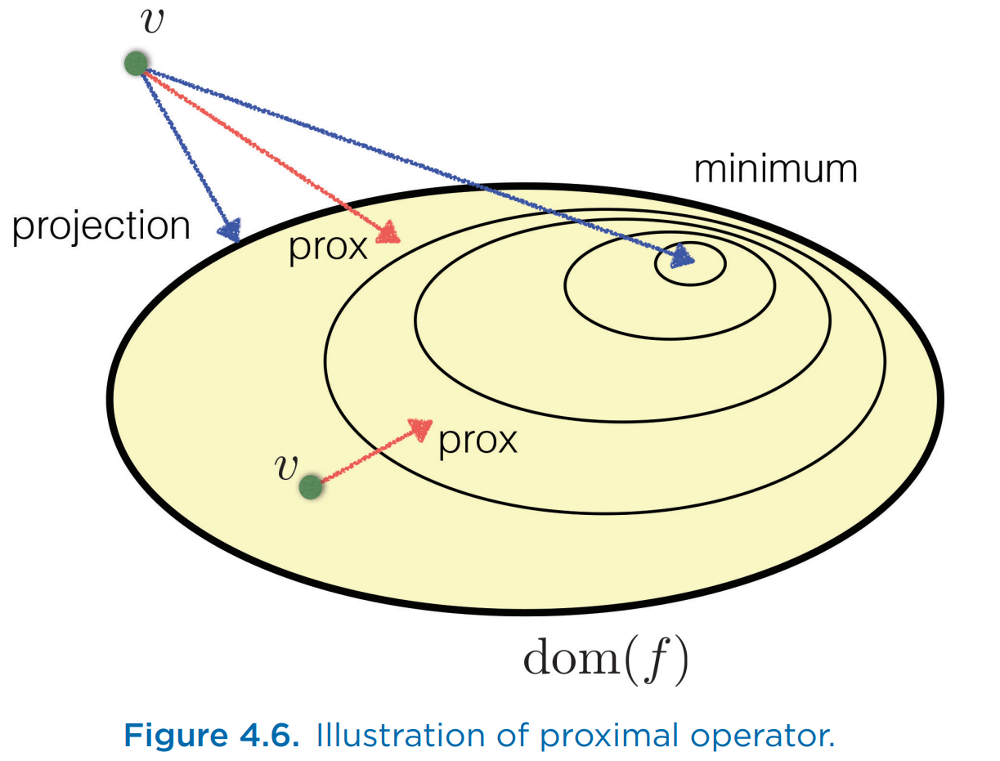
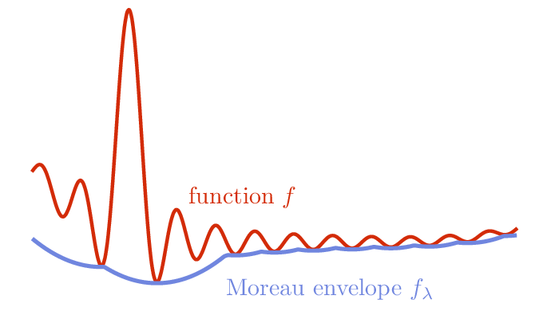
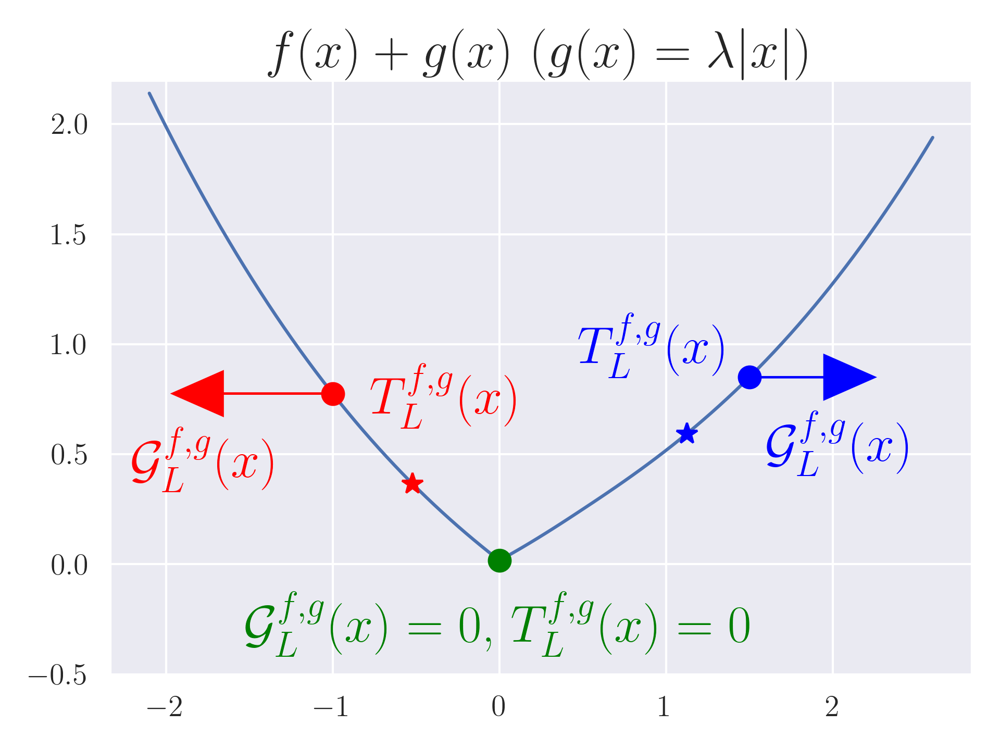
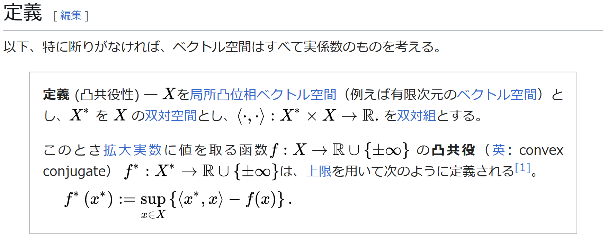

# 近接勾配法に関する基礎知識

本記事では、近接勾配法に関する数学的な基礎知識の一部をまとめます。

近接勾配法のアルゴリム自体は少ししか扱わないので、そちらを探される方は文献[^proximalGradientRef1],[^proximalGradientRef2],[^proximalGradientRef3]などを参照して下さい。

## Epigraph and Subgradient

$f$ の[エピグラフ](https://ja.wikipedia.org/wiki/%E3%82%A8%E3%83%94%E3%82%B0%E3%83%A9%E3%83%95_(%E6%95%B0%E5%AD%A6)) (epigraph) は
$$
\begin{equation*}
    \mathrm{epi}\ f \coloneqq \left\{ (y, t) \in \mathbb{R}^{n+1} \mathrel{\big|} f(y) \leq t \right\}
\end{equation*}
$$
と定義されます。

また、$f$ の点 $x_0 \in \mathrm{dom}\ f$ において、
$$
\begin{equation*}
f(x) - f(x_0) \geq  \langle v, x - x_0 \rangle \quad \text{for all } x \in \mathrm{dom}\ f
\end{equation*}
$$
を満たす $v \in \mathbb{R}^n$ は $f$ の[劣勾配](https://en.wikipedia.org/wiki/Subderivative#The_subgradient) (subderivative, subgradient) と呼ばれ、その集合 $\partial f(x)$ は [劣微分](https://en.wikipedia.org/wiki/Subderivative) (subdifferential) と呼ばれます。

## Convex Conjugate

凸とは限らない関数 $f\colon \mathbb{R}^n \to \mathbb{R} \cup \{+\infty\}$ に対し、[凸共役](https://en.wikipedia.org/wiki/Convex_conjugate)（convex conjugate, Fenchel conjugate, Legendre--Fenchel transformation）$f^*\colon \mathbb{R}^n \to \mathbb{R} \cup \{+\infty\}$ は、次のように定義されます:

$$
\begin{align*}
    f^*(x) &\coloneqq \sup_{y \in \mathbb{R}^n} \left\{ \langle x, y \rangle - f(y) \right\}\\
           &= -\inf_{y \in \mathbb{R}^n} \left\{ f(y) - \langle x, y \rangle \right\}
\end{align*}
$$

下図のように $n=1$ の場合、$f$（赤線）に対する傾き $x$ の接線（青点線）の最小切片に $-1$ をかけたものが $f^*$ （緑線）です。図の右側で $y$ 軸が下向きなことに注意して下さい。

（文献[^conjugate]より引用）

この最小切片の話を一般化すると、法線ベクトルが $\begin{bmatrix} x \\ -1 \end{bmatrix}$ で $y=(0,\dots,0)$ で $\alpha$ となる超平面 $(y,t)\in \mathbb{R}^{n+1}$ は
$$
\begin{align*}
    &\left\{ (y, t) \in \mathbb{R}^{n+1} \mathrel{\bigg|} \left\langle \begin{bmatrix} x \\ -1 \end{bmatrix}, \begin{bmatrix} y \\ t-\alpha \end{bmatrix} \right\rangle = 0 \right\}\\
={}& \left\{ (y, t) \in \mathbb{R}^{n+1} \mathrel{\big|} \langle x, y \rangle + \alpha = t \right\}
\end{align*}
$$
であるので、
$$
\begin{align*}
    &f^*(x) \\
={}& \sup_{y \in \mathbb{R}^n} \left\{ \langle x, y \rangle - f(y) \right\}\\
={}& \min\{ \alpha \in \mathbb{R} \mathrel{|} \langle x, y \rangle \leq f(y) + \alpha \text{ for all } y \in \mathbb{R}^n \} \\
={}& -\max\{ \alpha \in \mathbb{R} \mathrel{|} \langle x, y \rangle + \alpha \leq f(y) \text{ for all } y \in \mathbb{R}^n \}\\
={}& -\max\{ \alpha \in \mathbb{R} \mathrel{|} \text{ 上記を満たす $\mathrm{dom}\ f$ の支持超平面} \}
\end{align*}
$$
と[支持超平面](https://en.wikipedia.org/wiki/Supporting_hyperplane)（青点線）を用いて同様の解釈ができます。

ちなみに、上図では $f$ が下半連続な真凸関数なので $f = f^{**}$ となることが示されており、これは[Fenchel--Moreau theorem](https://ja.wikipedia.org/wiki/%E3%83%95%E3%82%A7%E3%83%B3%E3%82%B7%E3%82%A7%E3%83%AB%EF%BC%9D%E3%83%A2%E3%83%AD%E3%83%BC%E3%81%AE%E5%AE%9A%E7%90%86)として知られる結果です。

なお、次のKenjiro Sugimotoさんの記事には直感的に分かりやすい動画形式の説明もあります。

https://qiita.com/wosugi/items/8d5a407a0a0434aaabeb

## Infimal Convolution

続いて、[極小畳み込み](https://en.wikipedia.org/wiki/Convex_conjugate#Infimal_convolution)（infimal convolution）について述べます。

"infimal"とは[下限の](https://eow.alc.co.jp/search?q=infimal)という意味を持つ英単語で、この概念に関する["Earliest(?) work"](https://angms.science/doc/CVX/Epigraph.pdf)は1919年ともされています。

Infimal convolution は、次のように定義されます。

$$
\begin{align*}
  (f \mathrel{\square} g)(x) &\coloneqq \inf_{y \in \mathbb{R}^n} \left\{ f(y) + g(x - y) \right\}\\
&= \inf_{x_1 + x_2 = x} \left\{ f(x_1) + g(x_2) \right\}
\end{align*}
$$

図は、$f$ (黒線) と $g=\frac{1}{2}\| \cdot \|_2^2$ のinfimal convolutionを示しています。各黒点が $(y,f(y))$ に対応しており、infimal convolutionでは $f(y)+g(x-y)$ (青点線) の $\inf$ を取ります。

また、文献[^epi_sum]などでは、有限個の関数に対しても拡張されています。

更に、$f,g$ が共に真凸関数であっても、$f \mathrel{\square} g$ が[真凸関数とは限りません](https://ja.wikipedia.org/wiki/%E6%9C%89%E5%8A%B9%E9%A0%98%E5%9F%9F)。ぱっと見だと非自明ですが、$f,g$ が傾きの異なる線形関数の場合、$x \to \pm\infty$ で発散するので、$\inf$ が常に $-\infty$ になり、真凸関数とはなりません。

### epi-sum

まず、前提として加法群の2つの部分集合 $A,B$ に対する[ミンコフスキー和](https://ja.wikipedia.org/wiki/Sumset) (Minkowski sum) $A \oplus B$ は、次のように定義されます。

$$
A \oplus B \coloneqq \left\{ a + b \mathrel{|} a \in A, b \in B \right\}
$$

この前提の下で上図を見ると、$f$ と $g$ の epigraph のMinkowski sum が $f \mathrel{\square} g$ の epigraph と一致、つまり、

$$
\mathrm{epi}\ f \oplus \mathrm{epi}\ g = \mathrm{epi}\ (f \mathrel{\square} g)
$$

が**この図では**成立しています。

ただし、常に $\mathrm{epi}\ f \oplus \mathrm{epi}\ g = \mathrm{epi}\ (f \mathrel{\square} g)$ が成り立つ訳ではありません。以下に一般の場合を議論します。

$(x,t) = (x_f+x_g, t_f+t_g) \in \mathrm{epi}\ f \oplus \mathrm{epi}\ g$ に対し、

$$
\begin{align*}
(f \mathrel{\square} g)(x) &= \inf_{x_1 + x_2 = x} \left\{ f(x_1) + g(x_2) \right\}\\
&\leq f(x_f) + g(x_g)\\
&\leq t_f + t_g \quad (\because \mathrm{epi}\text{ の定義})\\
&= t
\end{align*}
$$

なので、定義より $(x,t) \in \mathrm{epi}\ (f \mathrel{\square} g)$ が成り立ちます。つまり、$\mathrm{epi}\ f \oplus \mathrm{epi}\ g \subseteq \mathrm{epi}\ (f \mathrel{\square} g)$ が**常に**成り立ちます。

また、$(x,t) \in \mathrm{epi}\ (f \mathrel{\square} g)$ に対し、$(f \mathrel{\square} g)(x)$ **を定義する下限が有限で達成される限り** (文献[^RockafellarVariational] Section 1.H Exercise 1.28)、

$$
\begin{align*}
  &(f \mathrel{\square} g)(x) \\
  ={}& \inf_{x_1 + x_2 = x} \left\{ f(x_1) + g(x_2) \right\}\\
={}& f(x_1) + g(x_2) \quad (\text{この} x_1, x_2 \text{の存在が仮定内容})\\
\coloneqq{}& t_1 + t_2 \quad (\text{このようにそれぞれ定義})\\
\leq{}& t \quad (\because \mathrm{epi}\ (f \mathrel{\square} g)\text{ の定義})
\end{align*}
$$

となるので、$g(x_2) = t_2 \leq t-t_1$ となることから $(x_1,t_1) \in \mathrm{epi}\ f$ かつ $(x_2,t-t_1) \in \mathrm{epi}\ g$ となります。

以上より、$(x,t) = (x_1+x_2, t_1+(t-t_1)) \in \mathrm{epi}\ f \oplus \mathrm{epi}\ g$ が成り立ち、上記の条件を満たす場合には $\mathrm{epi}\ f \oplus \mathrm{epi}\ g = \mathrm{epi}\ (f \mathrel{\square} g)$ とこの関係は等号で成立します。

なお、厳密な意味でのepigraph、即ち、epigraphの定義における "$\leq$" を "$<$" に置き換えると、特段の仮定無しに

$$
\begin{equation*}
\begin{split}
   &\{ (x_1, t_1) \in \mathbb{R}^{n+1} \mathrel{|} f(x_1) < t_1 \} \\
\oplus{}& \{ (x_2, t_2) \in \mathbb{R}^{n+1} \mathrel{|} g(x_2) < t_2 \}\\
={}&\{ (x,t) \in \mathbb{R}^{n+1} \mathrel{|} (f \mathrel{\square} g)(x) < t \}
\end{split}
\end{equation*}
$$

は簡単に示せます。（文献[^RockafellarVariational] Section 1.H Exercise 1.28, 文献[^TheProximalAverage]）

このことからinfimal convolution $f \mathrel{\square} g$ は **epi-sum (epi-addition)** とも呼ばれます。なお、epi-multiplication という操作も同じ文献などで記述されています。

### Convex Conjugate に対する性質

文献[^Beck] Theorem 4.16 などで述べられている有名な性質として、proper な（凸とは限らない）関数 $f,g$ に対し、
$$
(f \mathrel{\square} g)^* = f^* + g^*
$$
が成立します。

$$
\begin{align*}
       &(f \mathrel{\square} g)^*(x)\\
    ={}& \sup_{y \in \mathbb{R}^n} \left\{ \langle x, y \rangle - (f \mathrel{\square} g)(y) \right\}\\
    ={}& \sup_{y \in \mathbb{R}^n} \left\{ \langle x, y \rangle - \inf_{z \in \mathbb{R}^n} \left\{ f(z) + g(y - z) \right\} \right\}\\
    ={}& \sup_{y \in \mathbb{R}^n, z \in \mathbb{R}^n} \left\{ \langle x, y \rangle - \left( f(z) + g(y - z) \right) \right\}\\
    ={}& \sup_{y \in \mathbb{R}^n, z \in \mathbb{R}^n} \left\{ \left(\langle x, z \rangle - f(z)\right) + \left( \langle x,y-z \rangle - g(y - z)\right) \right\}\\
    ={}& \sup_{z \in \mathbb{R}^n} \left\{ \langle x, z \rangle - f(z) \right\} + \sup_{y \in \mathbb{R}^n} \left\{ \langle x, y \rangle - g(y) \right\}\\
    ={}& \left(f^* + g^*\right)(x)
\end{align*}
$$

この等式の意味を $n=1$ で考えると、

- $(f \mathrel{\square} g)^* (x)$: $f$ と $g$ のepigraphのMinkowski和に対する接線の内、傾き $x$ で切片が最小のもの
- $(f^* + g^*)(x)$: $f$ のepigraphに対する接線の内、傾き $x$ で切片が最小のものと、$g$ のepigraphに対する接線の内、傾き $x$ で切片が最小のものの、和

が等しいということを主張しており、直感的には非常に自明です。

他にもいくつかの似たようなinfimal convolutionとconvex conjugateの関係が文献[^Beck]に記述されています。

### Huber Loss Function

[Huber損失](https://en.wikipedia.org/wiki/Huber_loss) (Huber loss function) は、成分毎に定義され、次のように表現されます。（[参考](https://learningds.org/ch/20/gd_example.html)）

$$
\begin{equation*}
    L_{\delta}(x) = \begin{dcases}
        \frac{1}{2} x^2 & \text{for } \lvert x \rvert \leq \delta, \\
        \delta \cdot \left(\lvert x \rvert - \frac{1}{2} \delta\right) & \text{otherwise}.
    \end{dcases}
\end{equation*}
$$

簡単のため $\delta = 1$ とすると、
$$
\begin{equation*}
    L_1(x) = \begin{dcases}
        \frac{1}{2} x^2 & \text{for } \lvert x \rvert \leq 1, \\
        \lvert x \rvert - \frac{1}{2} & \text{otherwise}.
    \end{dcases}
\end{equation*}
$$
となり、下図のオレンジ線のようになります。

図から明らかなように、Huber loss function は、$\| \cdot \|_1$ と $\frac{1}{2} \| \cdot \|_2^2$ の infimal convolution として表現できます。

$$
\begin{align*}
   &\left(\| \cdot \|_1 \mathrel{\square} \frac{1}{2} \| \cdot \|_2^2\right)(x)\\
={}& \inf_{y \in \mathbb{R}^n} \left\{ \| y \|_1 + \frac{1}{2} \| x - y \|_2^2 \right\}\\
={}& \sum_{i=1}^n \inf_{y_i \in \mathbb{R}} \left\{ \lvert y_i \rvert + \frac{1}{2} (x_i - y_i)^2 \right\} \\
={}& \sum_{i=1}^n L_1(x_i)
\end{align*}
$$

となります。

最後の等式の導出を以下にします。まず、

$$
\begin{align*}
  & \lvert y \rvert + \frac{1}{2} (x - y)^2 \\
={} &\begin{dcases}
    +y+ \frac{1}{2} (x - y)^2 & \text{for } y \geq 0, \\
    -y + \frac{1}{2} (x - y)^2 & \text{for } y < 0
\end{dcases}
\end{align*}
$$

であり、この最小値は

$$
\begin{equation*}
\begin{dcases}
    +x-\frac{1}{2} \quad (y=x-1)& \text{for } 1 \leq x, \\
    \frac{1}{2} x^2 \quad\quad\;\; (y=0) & \text{for } -1 < x < 1, \\
    -x-\frac{1}{2} \quad (y=x+1) & \text{for } x \leq -1
\end{dcases}
\end{equation*}
$$

です。これは $L_1(x)$ と一致するので、結局、

$$
\inf_{y \in \mathbb{R}} \left\{ \lvert y \rvert + \frac{1}{2} (x - y)^2 \right\} = L_1(x)
$$

です。

なお、これら最小値を達成するときの $y$ を表す関数

$$
\begin{equation*}
S(x) \coloneqq
\begin{dcases}
    x-1 & \text{for } 1 \leq x, \\
    0 & \text{for } -1 < x < 1, \\
    x+1 & \text{for } x \leq -1
\end{dcases}
\end{equation*}
$$

は、[Soft Thresholding Operator](https://en.wikipedia.org/wiki/Proximal_gradient_methods_for_learning#Solving_for_L1_proximity_operator) と呼ばれます。

また、「成分毎に定義」と書いたように、2次元の場合も定義できて、下図のようになります。

## Proximal Operator

$f\colon \mathbb{R}^n \to \mathbb{R} \cup \{+\infty\}$ を閉真凸関数とします。[近接写像](https://en.wikipedia.org/wiki/Proximal_operator) (proximal operator) （参考[1](https://www.akshayagrawal.com/lecture-notes/html/proximal.html),[2](https://people.orie.cornell.edu/dsd95/teaching/orie6300/lec25.pdf)）は、次のように定義されます。

$$
\mathrm{prox}_{f}(v) \coloneqq \arg\min_{x \in \mathrm{R}^n} \left\{ f(x) + \frac{1}{2} \| x - v \|_2^2 \right\}
$$

この図では、各色の丸点が $(v,f(v))$ を、その色の点線が $f(x)+\frac{1}{2}\| x-v \|_2^2$ を示しています。proximal operator は、この関数の最小解である、星印の位置を返します。

### Well-Definedness の証明

これが well-defined である ($\mathrm{prox}_f(v)$ が単集合(singleton)である) ことは次のように示されます。（文献[^Beck] Theorem 6.3 および文献[^Beck] Theorem 5.25に厳密な証明があります）

$\mathrm{prox}_f(v)$ の定義より、
$$
f(x)+ \frac{1}{2} \| x - v \|_2^2
$$

が、唯一の最小解を持つことを示せば良いです。

$f(x)$ が閉真凸関数であることから、この関数は閉真[強凸](https://en.wikipedia.org/wiki/Convex_function#Strongly_convex_functions)関数です。故に、閉真強凸関数が唯一の最小解を持つことを示せば良いです。

真凸性より、ある $r$ が存在して level set $\{ x \mathrel{\mid} f(x) \leq r\}$ は非空となります。[閉性](https://ja.wikipedia.org/wiki/%E9%96%89%E5%87%B8%E5%87%BD%E6%95%B0)よりこれは閉集合で、強凸性より有界集合です。よって、[ボルツァーノ゠ワイエルシュトラスの定理](https://ja.wikipedia.org/wiki/%E3%83%9C%E3%83%AB%E3%83%84%E3%82%A1%E3%83%BC%E3%83%8E%EF%BC%9D%E3%83%AF%E3%82%A4%E3%82%A8%E3%83%AB%E3%82%B7%E3%83%A5%E3%83%88%E3%83%A9%E3%82%B9%E3%81%AE%E5%AE%9A%E7%90%86)から、この level set は非空なコンパクト集合です。

また、この関数は[閉真凸関数であるので下半連続](https://ja.wikipedia.org/wiki/%E9%96%89%E5%87%B8%E5%87%BD%E6%95%B0)で、[半連続関数へ拡張された最大値最小値定理](https://ja.wikipedia.org/wiki/%E6%9C%80%E5%A4%A7%E5%80%A4%E6%9C%80%E5%B0%8F%E5%80%A4%E5%AE%9A%E7%90%86#%E5%8D%8A%E9%80%A3%E7%B6%9A%E5%87%BD%E6%95%B0%E3%81%B8%E3%81%AE%E5%AE%9A%E7%90%86%E3%81%AE%E6%8B%A1%E5%BC%B5) ([別途参照](https://math.stackexchange.com/questions/4389350/lower-semi-continuous-function-attains-minimum-on-a-compact-set)) から最小値および最小解を持ちます。最小解が唯一なのは強凸性より自明です。

以上より、この関数は唯一の最小値を持ち、$\mathrm{prox}_{f}(v)$ は well-defined です。

この証明で、それぞれの仮定が何の為にあるのか、ということを1次元の場合で考えると、

- $f$ が閉でないと、$x<0$ で $+\infty$, $x=0$ で $1$, $x>0$ で $\frac{1}{2}x^2$ という関数
- $f$ が真(凸)でないと、$f(x)=+\infty$ という定数関数
- $f$ が凸でないと、$f(x)=-x^2$ という関数
- $f+\frac{1}{2}\lvert \cdot \rvert_2^2$ が強凸でないと、$(f+\frac{1}{2}\lvert \cdot \rvert_2^2)(x)=1/x \ (x>0)$ のように単調減少していて level set が非有界な関数

がそれぞれ最小値を持たず反例となります。

なお、$\mathrm{dom}\ f = \mathbb{R}^n$ である場合は、[Wiki](https://en.wikipedia.org/wiki/Convex_function#Properties_of_strongly-convex_functions)にあるようにもっと自明です。

### Proximal Operator の直感的な理解

$f$ に定数倍のパラメータ $\lambda$ を掛けたものに対する proximal operator は、

$$
\begin{align*}
   &\mathrm{prox}_{\lambda f}(v) \\
={}& \arg\min_{x \in \mathbb{R}^n} \left\{ \lambda f(x) + \frac{1}{2} \| x - v \|_2^2 \right\} \\
={}&\arg\min_{x \in \mathbb{R}^n} \left\{ f(x) + \frac{1}{2\lambda} \| x - v \|_2^2 \right\}
\end{align*}
$$

です。

この時、$\lambda \to \infty$ では、

$$
\begin{equation*}
    \mathrm{prox}_{\lambda f}(v) \to \arg\min_{x \in \mathbb{R}^n} f(x)
\end{equation*}
$$

と、$f$ の最小解に近づきます。一方、$\lambda \to 0$ では、

$$
\begin{align*}
     &\mathrm{prox}_{\lambda f}(v) \\
\to{}& \begin{dcases}
        v & \text{for } x \in \mathrm{dom}\ f \\
        \arg\min_{x \in \mathrm{dom}\ f} \| x-v \|_2 & \text{otherwise}
       \end{dcases}
\end{align*}
$$

と射影演算子の振る舞いを示します。

このことから、proximal operator はこれらの中間的な操作だと解釈できます。

（文献[^proximalOperatorRef]より引用）

### Proximal Operator での劣勾配

また、$p_v = \mathrm{prox}_{\lambda f}(v)$ とすると、次の性質が成り立ちます。

$$
\begin{align*}
          &p_v = \arg\min_{x \in \mathbb{R}^n} \left\{ f(x) + \frac{1}{2\lambda} \| x - v \|_2^2 \right\}\\
    \iff{}& 0 \in \partial f(p_v) + \frac{1}{\lambda} (p_v - v) \quad (\because \text{凸性})\\
    \iff{}& \frac{1}{\lambda} (v - p_v) \in \partial f(p_v)
\end{align*}
$$

ここで、

$$
\begin{equation*}
  p_y \coloneqq \mathrm{prox}_{\lambda f}(y), \quad p_x \coloneqq \mathrm{prox}_{\lambda f}(x)
\end{equation*}
$$

とすると、[本記事冒頭](#epigraph-and-subgradient)で述べたように、

$$
\begin{equation*}
    f(p_y) - f(p_x) \geq \left\langle \frac{1}{\lambda} (x - p_x), p_y - p_x \right\rangle
\end{equation*}
$$

が成立します。

### Firm Nonexpansiveness

Proximal operator は、firm nonexpansiveness と呼ばれる次の性質を持ちます（参考[1](https://math.stackexchange.com/questions/910803/firm-non-expansiveness-in-the-context-of-proximal-mapping-proximal-operators), [2](https://web.stanford.edu/~boyd/papers/pdf/prox_algs.pdf#page=11.20), [3](https://www.math.cuhk.edu.hk/course_builder/1920/math4230/Note10.pdf)）:

$$
\begin{equation*}
\| p_y - p_x \|_2^2 \leq \langle y - x, p_y - p_x \rangle
\end{equation*}
$$

$n=1$ の場合を上に再掲しました。これは $y>x$ に対して $p_y - p_x \leq y-x$、つまり、☆間の距離は○間の距離より短いことを示しており、全体が縮小写像のようになっていることに対応します。

Firm nonexpansiveness の証明をします。[Proximal Operatorでの劣勾配](#proximal-operator-での劣勾配)で示したように、

$$
\begin{align*}
    f(p_y) - f(p_x) &\geq \left\langle \frac{1}{\lambda} (x - p_x), p_y - p_x \right\rangle \\
    f(p_x) - f(p_y) &\geq \left\langle \frac{1}{\lambda} (y - p_y), p_x - p_y \right\rangle
\end{align*}
$$

であるので、両辺を足して

$$
\begin{align*}
    &0 \geq \frac{1}{\lambda} \langle x-p_x-y+p_y, p_y - p_x \rangle\\
\iff&0 \geq \| p_y - p_x \|_2^2 - \langle y - x, p_y - p_x \rangle\\
\iff& \| p_y - p_x \|_2^2 \leq \langle y - x, p_y - p_x \rangle
\end{align*}
$$

が成立します。

なお、この結果は [Kachurovskiiの定理](https://en.wikipedia.org/wiki/Kachurovskii%27s_theorem)の劣勾配版として解釈できます。特に、このような性質を持つ写像は monotone mapping とも呼ばれるようです。

## Moreau Envelope

続いて、Moreau envelope について述べます。

Jean-Jacques Moreauはフランスの数学者で、「モロー」と読むのが一般的と思われます。Envelopeは封筒などの意味が有名ですが、包絡線の意味もあります。

下半連続な真凸関数 $f\colon \mathbb{R}^n \to \mathbb{R} \cup \{+\infty\}$ に対して、[Moreau envelope]((https://en.wikipedia.org/wiki/Moreau_envelope)) (Moreau--Yoshida regularization) は次のように定義されます（[参考](https://candes.su.domains/teaching/math301/Lectures/Moreau-Yosida.pdf)）:

$$
M_{\lambda f}(v) \coloneqq \inf_{u \in \mathbb{R}^n} \left\{ f(u) + \frac{1}{2\lambda} \| u - v \|^2 \right\}
$$

ところで、この定義の $\inf$ は $\min$ に変えても問題ありませんが、Moreau envelopeは下半連続な真凸 (つまり、閉真凸) 関数以外にも定義されることがあるので、$\inf$ とされているものと思われます。

（Proximal operatorで $\arg\min$ が使われている為、私は混乱しました。文献によってもこの辺りは $\min$ を使うか $\inf$ を使うか揺れているようです。）

（文献[^generalMoreauEnvelope]より引用）

### Infimal Convolution との関係

Moreau envelope $M_{\lambda f}$ は、$\lambda f$ と $\frac{1}{2} \| \cdot \|_2^2$ の infimal convolution として表現できます。

実際、

$$
\begin{align*}
    &\left(\lambda f \mathrel{\square} \frac{1}{2} \| \cdot \|_2^2 \right)(x) \\
={} & \inf_{y \in \mathbb{R}^n} \left\{ \lambda f(y) + \frac{1}{2} \| x - y \|^2 \right\} \\
={} & \inf_{y \in \mathbb{R}^n} \left\{ f(y) + \frac{1}{2\lambda} \| x - y \|^2 \right\}
\end{align*}
$$

です。

### Moreau Envelope の勾配

下半連続な真凸関数 $f$ に対して、Moreau envelope $M_{\lambda f}$ の勾配は、次のように表現できます。

$$
\begin{align*}
   & \nabla M_{\lambda f}(v) \\
={}& \frac{1}{\lambda} (x- \mathrm{prox}_{\lambda f}(x))\\
={}& \frac{1}{\lambda} \left(x - \inf_{u \in \mathbb{R}^n} \left\{ f(u) + \frac{1}{2\lambda} \| u - v \|^2 \right\}\right)
\end{align*}
$$

このことを以下に導出します。
<!-- TODO もう少し簡単な導出がないか確認 -->

導出

[こちらの講義資料](https://people.orie.cornell.edu/dsd95/teaching/orie6300/lec26.pdf)を参考に、[フレシェ微分](https://ja.wikipedia.org/wiki/%E3%83%95%E3%83%AC%E3%82%B7%E3%82%A7%E5%BE%AE%E5%88%86)可能であることを示し、$M_{\lambda f}$ の勾配を導きます。

やや天下り的ですが、この証明では

$$
\begin{equation*}
       \lim_{y \to x} \frac{M_{\lambda f}(y) - M_{\lambda f}(x) - \left\langle y-x, \frac{1}{\lambda} (x-\mathrm{prox}_{\lambda f}(x)) \right\rangle}{\| y - x \|} = 0
\end{equation*}
$$

を示します。これはフレシェ微分の定義そのものの形式であり、一般に[勾配はフレシェ導関数と一致する](https://ja.wikipedia.org/wiki/%E5%8B%BE%E9%85%8D_(%E3%83%99%E3%82%AF%E3%83%88%E3%83%AB%E8%A7%A3%E6%9E%90)#%E5%BE%AE%E5%88%86%E3%81%A8%E3%81%97%E3%81%A6%E3%81%AE%E6%80%A7%E8%B3%AA)ので、

$$
\nabla M_{\lambda f}(x) = \frac{1}{\lambda} (x-\mathrm{prox}_{\lambda f}(x))
$$

が結果として導かれます。

では、極限値が $0$ であることを示します。まず、

$$
\begin{align*}
    p_y &\coloneqq \mathrm{prox}_{\lambda f}(y) = \arg\min_{u \in \mathbb{R}^n} \left\{ f(u) + \frac{1}{2\lambda} \| u - y \|^2 \right\}, \\
    p_x &\coloneqq \mathrm{prox}_{\lambda f}(x) = \arg\min_{u \in \mathbb{R}^n} \left\{ f(u) + \frac{1}{2\lambda} \| u - x \|^2 \right\}
\end{align*}
$$

とおくと、

$$
\begin{align*}
       & M_{\lambda f}(y) - M_{\lambda f}(x) \\
    ={}& \inf_{u \in \mathbb{R}^n} \left\{ f(u) + \frac{1}{2\lambda} \| u - y \|^2 \right\} - \inf_{u \in \mathbb{R}^n} \left\{ f(u) + \frac{1}{2\lambda} \| u - x \|^2 \right\}\\
    ={}& f(p_y)+\frac{1}{2\lambda} \| p_y - y \|^2 - f(p_x) - \frac{1}{2\lambda} \| p_x - x \|^2 \\
    \geq{}& \left\langle p_y - p_x, \frac{1}{\lambda} (x - p_x) \right\rangle + \frac{1}{2\lambda} \| p_y - y \|^2 - \frac{1}{2\lambda} \| p_x - x \|^2 \\
    ={}& \frac{1}{2\lambda} \left(\| (p_y - y) - (p_x - x) \|^2 + 2 \langle y-x, x-p_x \rangle \right)\\
    \geq{}& \frac{1}{\lambda} \langle y-x, x-p_x \rangle
\end{align*}
$$

となります。最初の不等式は[Proximal Operator](#proximal-operator)で示した式です。その次の等式変形は非自明ですが、地道に展開整理すると導けます。この不等式より極限値が $0$ 以上であることは直ちに従います。

次に、極限値が $0$ 以下であることを示します。上記不等式で $x,y$ を入れ替えると、

$$
\begin{align*}
    &M_{\lambda f}(x) - M_{\lambda f}(y) \geq \frac{1}{\lambda} \langle x-y, y-p_y \rangle\\
    \iff&M_{\lambda f}(y) - M_{\lambda f}(x) \leq \frac{1}{\lambda} \langle y-x, y-p_y \rangle
\end{align*}
$$

となります。よって、

$$
\begin{align*}
    & M_{\lambda f}(y) - M_{\lambda f}(x) - \frac{1}{\lambda} \langle y-x, x-p_x \rangle\\
\leq {}& \frac{1}{\lambda} \langle y-x, y - p_y - x + p_x \rangle \\
   = {}& \frac{1}{\lambda} \| y - x \|^2 - \frac{1}{\lambda} \langle y-x, p_y - p_x \rangle \\
   \leq {}& \frac{1}{\lambda} \| y - x \|^2 \quad (\because \text{Firm Nonexpansiveness})
\end{align*}
$$

です。最後の不等式は、[Firm Nonexpansiveness](#firm-nonexpansiveness)で示した事実より、内積 $\langle y-x, p_y - p_x \rangle$ が非負であることを用いています。

以上より、勾配が導出されました。

## Proximal Gradient Method

近接勾配法(Proximal Gradient Method)と、それに関連する諸定義を少しだけ記述します。文献[^Beck] Chapter 10で紹介されている内容です。

### Proximal Gradient Method の更新則

まず、以下のcomposite minimization problem を考えます。

$$
\begin{equation*}
    \min_{x \in \mathbb{R}^n} \left\{ f(x) + g(x) \right\}
\end{equation*}
$$

ただし、

- $g \colon \mathbb{R}^n \to (-\infty, +\infty]$ は閉真凸関数
- $f \colon \mathbb{R}^n \to (-\infty, +\infty]$ は閉真関数かつ、$\mathrm{dom}\ f$ が凸集合で、$\mathrm{dom}\ g \subseteq \mathrm{int}(\mathrm{dom}\ f)$ を満たす
- $f$ はリプシッツ連続である

とします。

ここで、この問題を解く為に生成する点列を考えます。$x^k$ を現在の点、$t_k$ を正の定数として、次のように更新則を定義します。
$$
    x^{k+1} = \arg\min_{x \in \mathbb{R}^n} \left\{ f(x^k) + \left\langle \nabla f(x^k), x - x^k \right\rangle + g(x) + \frac{1}{2t_k} \| x - x^k \|^2 \right\}
$$

右辺の中身に注目すると、

- $f(x^k)+ \left\langle \nabla f(x^k), x - x^k \right\rangle$ は $f$ の線形近似です。
- $g(x)$ は そのまま持ってきただけです。
- 最後の $\frac{1}{2t_k} \| x - x^k \|^2$ は、$x^k$ からの距離を小さくするような働きを持ち、**近接項**(prox term)と呼ばれます。一種の正則化項です。

一階微分の情報を基にこのような部分問題を考えるのは、かなり自然な発想です。

**近接勾配法** (proximal gradient method) とは一般に、初期点 $x^0 \in \mathrm{int}(\mathrm{dom}\ f)$ を与え、$k=0,1,\ldots$ に対して、上記の更新則で最適化していく手法のことを指します。直線探索と組合せることも勿論可能です。

### Prox-Grad Operator

ここで、$x^{k+1}$ は次のように表現できます。

$$
\begin{align*}
    x^{k+1} &= \arg\min_{x \in \mathbb{R}^n} \left\{ t_k g(x) + \frac{1}{2} \| x - (x^k - t_k \nabla f(x^k)) \|^2 \right\} \\
            &= \mathrm{prox}_{t_k g}\left(x^k - t_k \nabla f(x^k)\right)
\end{align*}
$$

ここに、近接写像である $\mathrm{prox}_{t_k g}$ が出てきました。
これを踏まえると、確かに近接項・近接勾配法・近接写像はそれぞれ深い関係にあることがよく分かります。

また、一般に、

$$
  T_L^{f,g} (x) \coloneqq \mathrm{prox}_{\frac{1}{L} g}\left(x - \frac{1}{L} \nabla f(x)\right)
$$

と定義することで、$L_k = 1/t_k$ とすると、近接勾配法の更新則は

$$
x^{k+1} = T_{L_k}^{f,g}(x^k)
$$

とも簡潔に表現できます。この $T_L^{f,g}$ は、**prox-grad operator** と呼ばれます。

### Gradient Mapping

この $T_L^{f,g}$ を用いると、次の **gradient mapping** $\mathcal{G}_L^{f,g} \colon \mathrm{int}(\mathrm{dom}\ f) \to \mathbb{R}^n$ を定義できます。

$$
\mathcal{G}_L^{f,g}(x) \coloneqq L \left(x - T_L^{f,g}(x)\right)
$$

先程の話と合わせると、

$$
\begin{align*}
    x^{k+1} &= \mathrm{prox}_{t_k g}\left(x^k - t_k \nabla f(x^k)\right) \\
            &= T_{L_k}^{f,g}(x^k) \\
            &= x^k - \frac{1}{L_k} \mathcal{G}_{L_k}^{f,g}(x^k)
\end{align*}
$$
となっており、一般の最急降下法では $x^{k+1} = x^k - \frac{1}{L_k} \nabla f(x^k)$ であることを踏まえると、このgradient mapping は、通常の勾配演算子 $\nabla f(x^k)$ の一般化に対応していると見做せます。

実際、$g(x)=0$ の場合、

$$
\begin{align*}
\mathcal{G}_L^{f,0}(x) &= L \left(x - T_L^{f,0}(x)\right) \\
                    &= L \left(x - \left(x - \frac{1}{L} \nabla f(x)\right)\right) \\
                    &= \nabla f(x)
\end{align*}
$$

なので、勾配に一致します。

1次元の場合の図も示しておきます。$T_L^{f,g}$ が次の点 $x^{k+1}$ に、$\mathcal{G}_L^{f,g}$ が勾配の一般化にそれぞれ対応していることが見て取れるかと思います。

余談ですが、このGradient Mappingは [Zhu, H. (2025). An Inexact Proximal Newton Method for Nonconvex Composite Minimization. Journal of Scientific Computing, 102(3), 79.](https://doi.org/10.1007/s10915-025-02805-4) という最近の論文の理論解析でも用いられています。すごい!

そして更なる余談として、私が2か月間くらいやっていた研究は、この論文により完全に破壊されました、悲しい!

## Duality

本記事の最後に、少し近接勾配法と関連が薄い話もありますが、双対を取り上げます。

### 代数的双対

初めに[代数的双対](https://ja.wikipedia.org/wiki/%E5%8F%8C%E5%AF%BE%E3%83%99%E3%82%AF%E3%83%88%E3%83%AB%E7%A9%BA%E9%96%93#%E5%8F%8C%E5%AF%BE%E7%A9%BA%E9%96%93)（文献[^LinearAlgebra] Definition 3.110）を取り上げます。

ざっくりとした説明としては、線形写像は行列を用いた $\phi_A(v)=Av=u$ でいう $\phi_A$ のことですが、線形汎関数は $\phi_a(v)=\langle v, a \rangle =u$ でいう $\phi_a$ のことを指し、この $\phi_a$ 全体が $V (\ni v)$ の代数的双対空間 $V^*$ を構成します。

線形汎関数 (linear functional) は、線形空間 $V$ から体 $F$（本記事では $\mathbb{R}$ または $\mathbb{C}$ とする）への線形写像と定義されます。体 $F$ 上の線形空間 $V$ の**代数的双対空間 (algebraic dual space)** $V^*$ は $V$ 上の線形汎関数 $\phi \colon V \to F$ 全体の成す集合 $\mathcal{L}(V,F)$ です。

$F$ が体であることから、

$$
\begin{align*}
\begin{dcases}
    (\phi+\psi)(v) &\coloneqq \phi(v) + \psi(v)\\
    (a \phi)(v) &\coloneqq a \phi(v)
\end{dcases}
\\
(\phi \in V^*, \psi \in V^*, v \in V, a \in F)
\end{align*}
$$

がそれぞれ定義できるので、$V^*$ も線形空間となります。

具体例として、二乗総和可能な無限複素数列の集合 $\ell^2$

$$
\begin{equation*}
\ell^2 \coloneqq \left\{ (x_n)_{n=1}^{\infty} \mathrel{|} \sum_{n=1}^{\infty} \lvert x_n \rvert^2 < \infty \right\}
\end{equation*}
$$

を $V$ として考えます。なお、$\ell^2$ は[数列空間](https://ja.wikipedia.org/wiki/%E6%95%B0%E5%88%97%E7%A9%BA%E9%96%93)と呼ばれ、線形空間となります。

$\ell^2$ 上の線形汎関数 $\phi \in V^* = \mathcal{L}(\ell^2,\mathbb{C})$ は、$e_n \coloneqq (0,\ldots,1,\ldots,0)$ を標準基底として

$$
\begin{align*}
\phi(x) &= \phi((x_1, x_2, x_3, \ldots))\quad (\text{成分表示}) \\
        &= \sum_{n=1}^{\infty} x_n \phi(e_n) \quad (\text{線形性}) \\
        &= \sum_{n=1}^{\infty} x_n a_n \quad (a_n \coloneqq \phi(e_n))
\end{align*}
$$

と $(a_n)_{n=1}^{\infty}$ で定まります。

また、（二乗総和可能などとは関係なく）任意の $(a_n)_{n=1}^{\infty}$ で線形汎関数を構築できるので、$V=\ell^2$ の代数的双対空間は $V^* \cong \ell^{\infty}$（複素数列全体）となります。

ここで、上記数式の最終行は内積として解釈できますが、実際、$V$ と $V^*$ は[双対対](https://ja.wikipedia.org/wiki/%E5%8F%8C%E5%AF%BE%E7%A9%BA%E9%96%93)と呼ばれる関係にあり、これにより標準内積（双線形形式）が定まります。

有限次元に慣れていると、$\langle x,a \rangle$ が $\phi_a(x) \coloneqq (\langle \cdot, a \rangle)(x)$ であるなどとはあまり意識しませんが、この辺が Fenchel双対などの話の前提になります。

### 連続的双対

続いて、[連続的双対](https://ja.wikipedia.org/wiki/%E9%80%A3%E7%B6%9A%E7%9A%84%E5%8F%8C%E5%AF%BE%E7%A9%BA%E9%96%93)（文献[^LinearAlgebra] Section 7.A）を取り上げます。

位相線形空間 $V$ の**連続的双対空間 (continuous dual space, topological dual space)** は、その係数体 $F$ （本記事では $\mathbb{R}$ または $\mathbb{C}$ とする）への連続線形汎関数 $\phi\colon V \to F$ 全体の集合であり、$V'$ と書きます。連続という条件が加わるので、$V' \subseteq V^*$ です。

同じく二乗総和可能な無限複素数列の集合 $\ell^2$

$$
\begin{equation*}
\ell^2 \coloneqq \left\{ (x_n)_{n=1}^{\infty} \mathrel{\Bigl|} \sum_{n=1}^{\infty} \lvert x_n \rvert^2 < \infty \right\}
\end{equation*}
$$

を $V$ として考えます。

$\ell^2$ は体 $\mathbb{C}$ 上の線形空間で $\lVert (x_n) \rVert_2 \coloneqq \sqrt{\sum_{n=1}^{\infty} \lvert x_n \rvert^2}$ というノルムが定義されており、特に位相線形空間となります。

ここで、連続線形汎関数 $\phi$ が一体どのような形で書けるのか? という問いに対する答えは非自明です。今回は、$\ell^2$ がヒルベルト空間（完備な内積空間）であることを踏まえると、[Rieszの表現定理](https://mathlandscape.com/riesz-repre/)により、$V' \cong V$ となることが分かります。

Rieszの表現定理の主張内容は、ヒルベルト空間 $V$ と、任意の $\phi \in V^*$ に対し、ある $y \in V$ が一意的に存在して、

$$
\begin{equation*}
   \phi(x) = \langle x, y \rangle, \quad x \in V
\end{equation*}
$$

とできるということであり、即ち $V \cong V^*$ を意味します。

（なお、$\ell^2$ は $\ell^p$ 空間の内[ヒルベルト空間であるような唯一の空間](https://ja.wikipedia.org/wiki/%E6%95%B0%E5%88%97%E7%A9%BA%E9%96%93#%E2%84%93p_%E7%A9%BA%E9%96%93%E3%81%A8%E7%A9%BA%E9%96%93_c0_%E3%81%AE%E6%80%A7%E8%B3%AA)であり、また $\mathbb{R}^n$ はヒルベルト空間なので、$(\mathbb{R}^n)' \cong \mathbb{R}^n$ です。）

この $X$ がさらにノルム線形空間である場合には、$X$ の双対空間にもノルムが

$$
\begin{equation*}
\lVert \phi \rVert = \sup_{\lVert x \rVert \leq 1} \lvert \phi(x) \rvert
\end{equation*}
$$

で定まります。これは[双対ノルム (dual norm)](https://en.wikipedia.org/wiki/Dual_norm)と呼ばれ、連続的双対空間はそのような場面で最適化文脈でも登場します。

### 凸共役

上記を前提とすると、[凸共役](#convex-conjugate)の話がほんの少し深く理解できて面白いです。

[Wiki](https://ja.wikipedia.org/wiki/%E5%87%B8%E5%85%B1%E5%BD%B9%E6%80%A7)では、次のような記述がされています。

ここで、定義に代数的双対空間 $X^\*$ が登場しています。

本記事では[凸共役](#convex-conjugate)において、$X=X^\*=\mathbb{R}^n$ として話をしました。これは連続的双対空間でも述べた通り、$(\mathbb{R}^n)^\*=(\mathbb{R}^n)' \cong \mathbb{R}^n$ であることに由来します。

しかし、その意味する内容は、単に $x^\*$ であるというよりも、寧ろ $\langle \cdot, x^\* \rangle$ という線形汎関数であって、文献[^Nesterov]でもこの違いは明確に区別されるなど、理解に重要な点となります。

### その他の双対

最も記したかった双対の話は以上で終わりですが、「双対」には、他にも様々あります。[List of dualities](https://en.wikipedia.org/wiki/List_of_dualities) では、70種以上の双対が挙げられており（平面グラフの双対、全称記号と存在記号の双対など）、その内のいくつかは上記のような最適化と近い話題も多いです。

例えば関連する話題としては、

- [ルジャンドル変換](https://ja.wikipedia.org/wiki/%E3%83%AB%E3%82%B8%E3%83%A3%E3%83%B3%E3%83%89%E3%83%AB%E5%A4%89%E6%8F%9B)
  - 解析力学や熱力学でおなじみ
  - 凸共役の特殊な場合に相当 （あるいは、ルジャンドル変換の一般化が凸共役）
  - [微分を用いた表現](https://manabitimes.jp/math/1179#4)も有名
- [Lagrange Duality](https://en.wikipedia.org/wiki/Duality_(optimization))
  - [LP双対](https://en.wikipedia.org/wiki/Dual_linear_program)
  - [Quadratic Programming](https://en.wikipedia.org/wiki/Quadratic_programming#Lagrangian_duality)の双対
- [Fenchel Duality](https://ja.wikipedia.org/wiki/%E3%83%95%E3%82%A7%E3%83%B3%E3%82%B7%E3%82%A7%E3%83%AB%E3%81%AE%E5%8F%8C%E5%AF%BE%E6%80%A7%E5%AE%9A%E7%90%86)
  - Fenchel's Duality Theorem とも
  - 文献[^Beck] Theorem4.15、文献[^RockafellarConvex] Theorem 31.1 など
  - [分かりやすい1次元の場合の図解](https://en.wikipedia.org/wiki/Fenchel%27s_duality_theorem#One-dimensional_illustration)
- [Wolfe Duality](https://en.wikipedia.org/wiki/Wolfe_duality)

などがあります。

今後またきちんと勉強して整理できればと思います。

## Acknowledgement

本記事は修士課程における勉強目的で作成しており、指導教員の方々に感謝申し上げます。

[^RockafellarVariational]: [Rockafellar, R. T., & Wets, R. J. B. (2009). Variational analysis (Vol. 317). Springer Science & Business Media.](https://books.google.co.jp/books?hl=en&lr=&id=JSREAAAAQBAJ&oi=fnd&pg=PA1&dq=VARIATIONAL+ANALYSIS&ots=wL7P6H3p60&sig=sMhjlVD7brGuk7DVEXf2BcNP8bI&redir_esc=y#v=onepage&q=VARIATIONAL%20ANALYSIS&f=false)

[^conjugate]: [Ochs, P. (2015). Long term motion analysis for object level grouping and nonsmooth optimization methods (Doctoral dissertation, PhD thesis, Albert-Ludwigs-Universität Freiburg).](https://www.researchgate.net/publication/279825155_Long_term_motion_analysis_for_object_level_grouping_and_nonsmooth_optimization_methods)

[^epi_sum]: [Ioffe, A. D., & Tihomirov, V. M. (2009). Theory of Extremal Problems: Theory of Extremal Problems. Elsevier.](https://books.google.co.jp/books?id=iDRVxznSxUsC&pg=PA168&redir_esc=y&hl=ja#v=onepage&q&f=false)

[^TheProximalAverage]: [Bauschke, H. H., Goebel, R., Lucet, Y., & Wang, X. (2008). The proximal average: basic theory. SIAM Journal on Optimization, 19(2), 766-785.](https://doi.org/10.1137/070687542)

[^Beck]: [Beck, A. (2017). First-order methods in optimization. Society for Industrial and Applied Mathematics.](https://doi.org/10.1137/1.9781611974997)

[^generalMoreauEnvelope]: [Tibshirani, R. J., Fung, S. W., Heaton, H., & Osher, S. (2024). Laplace Meets Moreau: Smooth Approximation to Infimal Convolutions Using Laplace's Method. arXiv preprint arXiv:2406.02003.](https://www.researchgate.net/figure/llustration-of-the-Moreau-envelope-f-l-f-2_fig1_381158237)

[^LinearAlgebra]: [Axler, S. (2015). Linear algebra done right. springer.](https://doi.org/10.1007/978-3-031-41026-0)

[^RockafellarConvex]: [Rockafellar, R. T. (1970). Convex analysis. Princeton university press.](https://books.google.co.jp/books?hl=en&lr=&id=J6uPzgEACAAJ&oi=fnd&pg=PR9&dq=rockafellar+convex+analysis&ots=3Z9J9Q6J9v&sig=8Q6Z9J9Q6)

[^Nesterov]: [Nesterov, Y. (2018). Lectures on convex optimization (Vol. 137, pp. 5-9). Berlin: Springer.](https://doi.org/10.1007/978-3-319-91578-4)

[^proximalOperatorRef]: [Nagahara, M. (2020). Algorithms for convex optimization. In Security risk management for the Internet of Things: Technologies and techniques for IoT security, privacy and data protection (Chapter 4).](https://www.researchgate.net/publication/345481682_4_Algorithms_for_Convex_Optimization)

[^proximalGradientRef1]: [Yamagen, Sakam. (2018). 近接勾配法とproximal operator. 甲斐性なしのブログ.](https://yamagensakam.hatenablog.com/entry/2018/02/14/075106)

[^proximalGradientRef2]: [Masashi, Sekino. (2018). 近接勾配法（Proximal Gradient Method）. Qiita.](https://qiita.com/msekino/items/9f217fcd735513627f65)

[^proximalGradientRef3]: [数理システム, NTT. (2024). 近接勾配法 - 数理最適化用語集.](https://www.msi.co.jp/solution/nuopt/docs/glossary/articles/ProximalGradientMethod.html)
