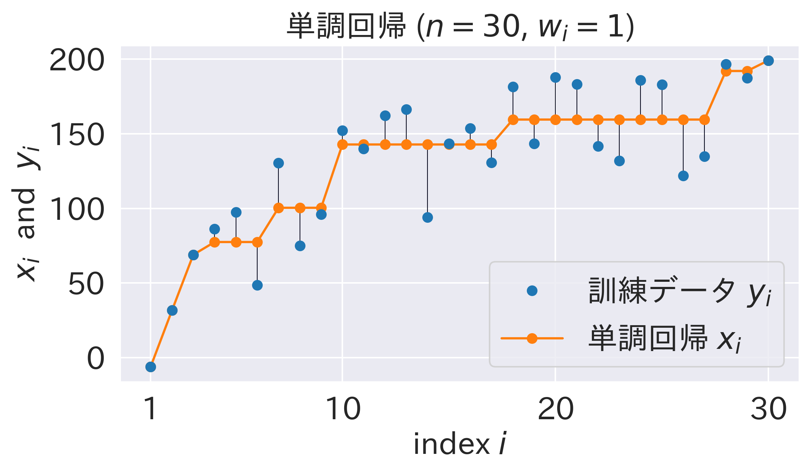
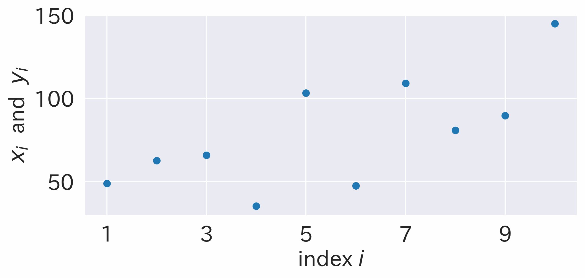
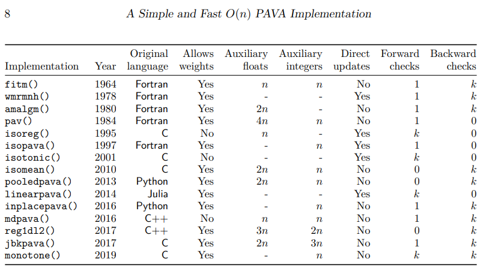
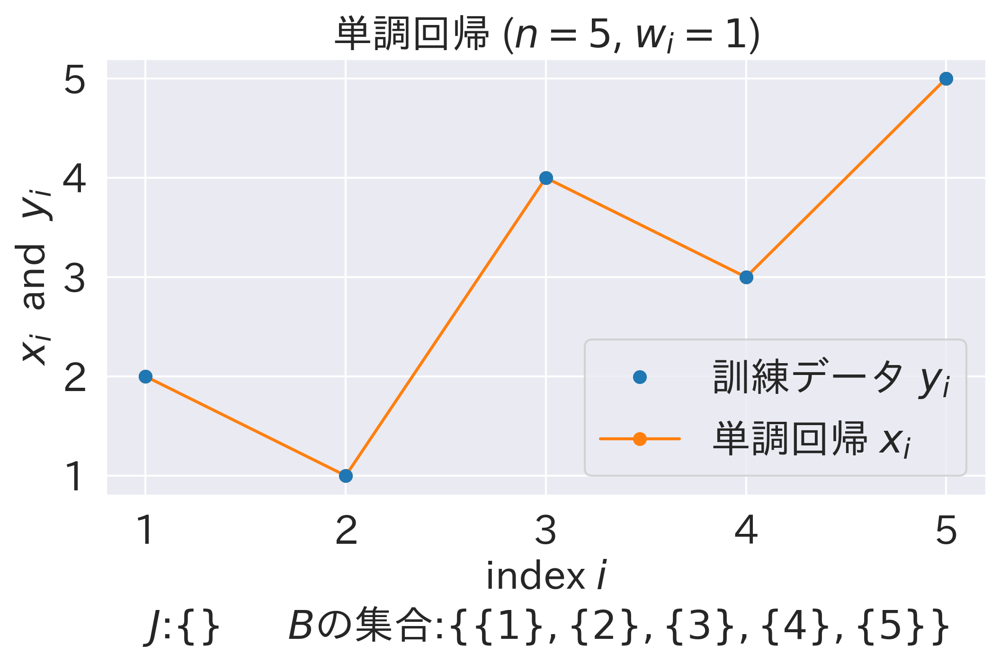
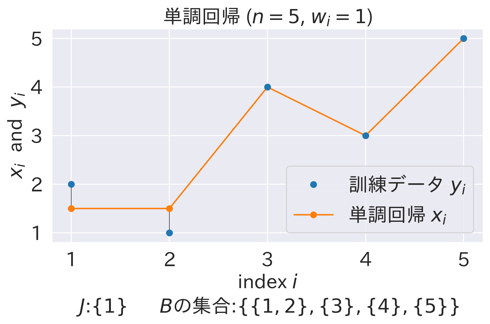
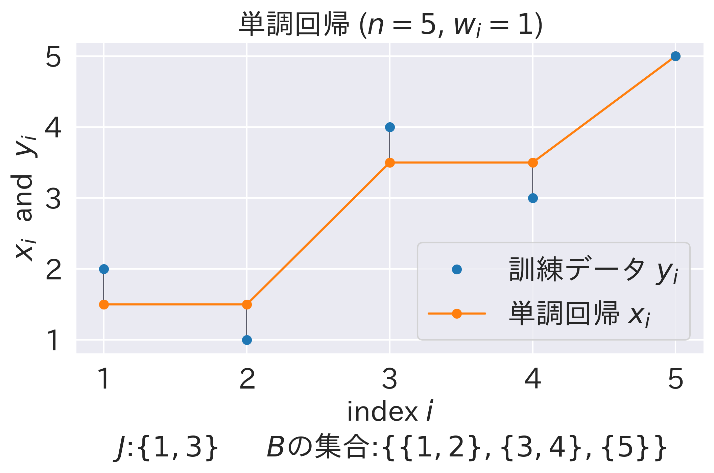

# Isotonic Regression (単調回帰) と Pool Adjacent Violators Algorithm (PAVA) について

## 概要

単調非減少という制約付きの最小二乗法である **Isotonic Regression** (**単調回帰**)について、本記事では解説します。



## 導入

**Isotonic Regression** または **Monotonic Regression** (**単調回帰**) とは、訓練データに対する重み付き最小二乗近似となる数列を、単調非減少という制約付きで求める手法です。

文献[^monotone] 及び [SciPy](https://docs.scipy.org/doc/scipy/reference/generated/scipy.optimize.isotonic_regression.html) では、$n$ 点からなるデータ $y=\{ y_i \}_{i=1}^{n}$ と正の重み $w=\{ w_i \}_{i=1}^{n}$ が与えられたとき、以下の最適化問題の解となる回帰値 $x=\{ x_i \}_{i=1}^{n}$ を求めることと定義されます。

$$
\begin{align*}
    \min_{x} \quad & \sum_{i=1}^n w_i (y_i - x_i)^2\\
    \text{s.t.} \quad & x_1 \leq x_2 \leq \dots \leq x_n
\end{align*}
$$

なお、[Wikipedia](https://en.wikipedia.org/wiki/Isotonic_regression) 及び [scikit-learn](https://scikit-learn.org/stable/modules/generated/sklearn.isotonic.IsotonicRegression.html#sklearn.isotonic.IsotonicRegression) では、観測されるデータの添字部分についてより一般化した定義を採用していますが、本記事では上記のみを扱います。

また、重み $w_i$ が全て1である、つまり、
$$
\begin{align*}
    \min_x \quad & \sum_{i=1}^n (y_i - x_i)^2\\
    \text{s.t.} \quad & x_1 \leq x_2 \leq \dots \leq x_n
\end{align*}
$$
と、目的関数自体は通常の最小二乗問題に帰着されることも多いです。本質的には特に変わりません。

このように定義される Isotonic Regression は、確率的分類（probabilistic classification）や、麻酔学や毒性学における連続的な用量反応関係（dose-response relationship）の推定という応用がある重要な手法となっています ([Wiki-Applications](https://en.wikipedia.org/wiki/Isotonic_regression#Applications))。


用量-反応曲線 [By Jamgoodman - Own work, CC BY-SA 4.0](https://commons.wikimedia.org/w/index.php?curid=79749638)

本記事では Isotonic Regression の基礎的内容に焦点を当てます。構成は以下の通りです。

* [手法](#手法)の節では、Isotonic Regression として著名な **PAVA (Pool Adjacent Violators Algorithm)** を紹介します。実装寄りの話をします。
* [正当性の証明](#正当性の証明)では、PAVA の正当性を証明します。理論寄りの話をします。
* [議論](#議論)では、関連事項を述べます。PAVAの発展と、本記事執筆の経緯(東大院試)に触れます。

## 手法

Isotonic Regression では一般に、最適化問題を解くのに **Pool Adjacent Violators Algorithm (PAVA)** というアルゴリズムを用います。導入でも述べたようにscikit-learn や SciPy という OSS でもこれは利用されています。

```python
from sklearn.isotonic import IsotonicRegression
from scipy.optimize import isotonic_regression
```

より詳細に述べると、執筆時点では、scikit-learn は内部で SciPy を[呼び出し](https://github.com/scikit-learn/scikit-learn/blob/98ed9dc73a86f5f11781a0e21f24c8f47979ec67/sklearn/isotonic.py#L159)、SciPy は内部で `pava` という Pybind を[呼び出し](https://github.com/scipy/scipy/blob/0f1fd4a7268b813fa2b844ca6038e4dfdf90084a/scipy/optimize/_isotonic.py#L141)、 `pava` は文献[^monotone] に基づき、文献[^monotone] はその実装を R の package である [monotone](https://cran.r-project.org/web/packages/monotone/index.html) として公開しています。

### 擬似コード

PAVA (Pool Adjacent Violators Algorithm) の擬似コードは以下のようになります。これは文献[^monotone]や文献[^Characterizing]でPAVAの初出とされている1955年の文献[^firstPAVA]、および文献[^MathProg] Section 3に基づきます。

1. データ $y=\{ y_i \}_{i=1}^n$ を $n$ 個のブロックに分割する。
2. 隣接する (**Adjacent**) 2つのブロックで、前者の $y_i$ に関する重み付き平均が、後者のそれより大きいもの (**Violators**) を、あれば見つける。
3. それらのブロックを結合する(**Pool**)。
4. 2と3の操作を繰り返す。

> in short: if there is a violation, pool.
>
> (つまり、違反があるなら、統合せよ。)

(文献[^monotone]より) (和訳は筆者による)

### ビジュアライズ

先にPAVAのビジュアライズ結果をお見せします。



<font color="#1f77b4">青い点が訓練データ $y=\{ y_i \}_{i=1}^{n}$</font> で、<font color="2ca02c">緑の点が順次定められていく単調回帰 $x=\{ x_i \}_{i=1}^{n}$</font> です。隣接するブロックどうしに<font color="red">制約違反(赤矢印)</font>がなくなったら終了で、<font color="ff7f0e">オレンジが出力される結果</font>を表しています。

### 実装

実装をしていきます。PAVAには非常に沢山のバリエーションがあり、基本的な流れは結局同じですが、実装の詳細は異なる点には注意が必要です。[monotone](https://cran.r-project.org/web/packages/monotone/index.html) の`src/legacyC.c`で全てのC言語実装が見られます。



(文献[^monotone]より。)

アルゴリズム毎の特徴的な違いとしては、以下が挙げられます。

* 違反の見つけ方
  * 古い手法だと最悪計算量が $O(n^2)$ になるものもあります。
  * 近年の手法は大抵 $O(n)$ で済みます。
* up-and-down-blocks implementation (文献[^UpDown] Section 8など) についての差異
  * ブロックをマージするときに、後のブロック(Forward Check)と前のブロック(Backward Check)が制約違反しているかどうかを最大何個までチェックするか。
* in-place かどうか
  * 空間計算量の定数倍改善に寄与します。
  * 補助メモリの有無も実装によって変わります。
* Blockクラスを実装するか
  * 単に実装だけの話ですが、この表内では`jbkpava`だけがBlockクラスを定義して用いています。可読性が高くて好きです。

ここではまず、SciPyでも用いられている`monotone`と呼ばれるPAVAの実装を示します。[monotone package](https://cran.r-project.org/web/packages/monotone/index.html) には以下のC言語のコードが包含されています ([GPL-3](https://cran.r-project.org/web/licenses/GPL-3)ライセンスですのでご注意下さい)。

<details><summary>既存研究のコード (クリックして展開)</summary>

```c
#include <stdlib.h>

void monotoneC( int *n, double* x, double* w )
// Function monotone(),
// performs simple linear ordered monotone regression
// Copyright (C) 2020 Frank M.T.A. Busing (e-mail: busing at fsw dot leidenuniv dot nl)
// This function is free software:
// you can redistribute it and/or modify it under the terms of the GNU Lesser General Public License
// as published by the Free Software Foundation.
// This program is distributed in the hope that it will be useful,
// but WITHOUT ANY WARRANTY;
// without even the implied warranty of MERCHANTABILITY or FITNESS FOR A PARTICULAR PURPOSE.
// See the GNU General Public License for more details.
// You should have received a copy of the GNU General Public License along with this function.
// If not, see <https://www.gnu.org/licenses/>.
{
  double* rx = &x[-1];
  double* rw = &w[-1];
  size_t* idx = ( size_t* ) calloc( *n + 1, sizeof( size_t ) );
  idx[0] = 0;
  idx[1] = 1;
  size_t b = 1;
  double xbm1 = rx[b];
  double wbm1 = rw[b];
  for ( size_t i = 2; i <= *n; i++ ) {
    b++;
    double xb = rx[i];
    double wb = rw[i];
    if ( xbm1 > xb ) {
      b--;
      double sb = wbm1 * xbm1 + wb * xb;
      wb += wbm1;
      xb = sb / wb;
      while ( i < *n && xb >= rx[i + 1] ) {
        i++;
        sb += rw[i] * rx[i];
        wb += rw[i];
        xb = sb / wb;
      }
      while ( b > 1 && rx[b - 1] > xb ) {
        b--;
        sb += rw[b] * rx[b];
        wb += rw[b];
        xb = sb / wb;
      }
    }
    rx[b] = xbm1 = xb;
    rw[b] = wbm1 = wb;
    idx[b] = i;
  }
  size_t from = *n;
  for ( size_t k = b; k > 0; k-- ) {
    const size_t to = idx[k - 1] + 1;
    const double xk = rx[k];
    for ( size_t i = from; i >= to; i-- ) rx[i] = xk;
    from = to - 1;
  }
  free( idx );
} // monotone
```

</details>

これをPythonに翻訳したのが以下です(こちらも翻訳の都合上、[GPL-3](https://cran.r-project.org/web/licenses/GPL-3)ライセンスです)。

<details><summary>Pythonに翻訳したコード (クリックして展開)</summary>

```python
import numpy as np
from typing import Union


def pava_translated(y: np.ndarray, w: Union[np.ndarray, None] = None) -> np.ndarray:
    # Original code Copyright (C) 2022 by Frank Busing, Juan Claramunt Gonzalez.
    # https://CRAN.R-project.org/package=monotone
    # Translated into Python by Hiroki Hamaguchi.
    # This code is licensed under the GNU GPL v3.
    x = np.asarray(y, dtype=np.float64).copy()
    if w is None:
        w = np.ones_like(x, dtype=np.float64)
    else:
        w = np.asarray(w, dtype=np.float64)

    n = len(x)
    idx = [0, 1] + [0] * (n - 1)
    b = 1
    xbm1 = x[b - 1]
    wbm1 = w[b - 1]
    i = 2

    while i <= n:
        xb = x[i - 1]
        wb = w[i - 1]
        if xbm1 > xb:
            sb = wbm1 * xbm1 + wb * xb
            wb += wbm1
            xb = sb / wb
            while i < n and xb >= x[i]:
                i += 1
                sb += w[i - 1] * x[i - 1]
                wb += w[i - 1]
                xb = sb / wb
            while b > 1 and x[b - 2] > xb:
                b -= 1
                sb += w[b - 1] * x[b - 1]
                wb += w[b - 1]
                xb = sb / wb
        else:
            b += 1
        x[b - 1] = xbm1 = xb
        w[b - 1] = wbm1 = wb
        idx[b] = i
        i += 1

    result = np.zeros(n, dtype=x.dtype)
    from_idx = n
    for k in range(b, 0, -1):
        to_idx = idx[k - 1] + 1
        for i in range(from_idx, to_idx - 1, -1):
            result[i - 1] = x[k - 1]
        from_idx = to_idx - 1
    return result
```

</details>

一方、本記事では説明の簡潔さの為、一番単純で可読性が高いと思われる`pooledpava`と同じロジックを、`jbkpava`のようにBlockクラスを用いて実装します。そして、これをPAVAとして採用します。先述の通り本質は殆ど何も変わりません。

前小節のビジュアライズ結果もこれに基づくので、このコードは先程の動作を達成する自然な実装だと理解出来ます。

なお、これ以降に登場するコードは全てPublic Domainとします。

```python
class Block:
    def __init__(self, value: float, weight: float, start_idx: int):
        self.total_value = weight * value
        self.total_weight = weight
        self.start_idx = start_idx
        self.end_idx = start_idx
        self.mean = self.total_value / self.total_weight

    def merge(self, other: "Block"):
        assert self.end_idx + 1 == other.start_idx
        self.total_value += other.total_value
        self.total_weight += other.total_weight
        self.end_idx = other.end_idx
        self.mean = self.total_value / self.total_weight


def pava_readable(y: np.ndarray, w: Union[np.ndarray, None] = None) -> np.ndarray:
    x = np.asarray(y, dtype=np.float64)
    if w is None:
        w = np.ones_like(x, dtype=np.float64)
    else:
        w = np.asarray(w, dtype=np.float64)

    blocks = []
    for i in range(len(x)):
        blocks.append(Block(x[i], w[i], i))
        while len(blocks) >= 2 and blocks[-2].mean >= blocks[-1].mean:
            last = blocks.pop()
            blocks[-1].merge(last)

    result = np.zeros_like(x)
    for block in blocks:
        result[block.start_idx : block.end_idx + 1] = block.mean
    return result
```

簡単に説明すると、

* `Block` の stack である `blocks` を用意する
* $i=0$ として、 `Block(x[i], w[i], i)` を `blocks` に追加する
* `blocks` の末尾2つが制約違反しているなら(`blocks[-2].mean >= blocks[-1].mean`)、両者をマージし、その重み付き平均をブロック内の答えとする
* $i \gets i+1$ として、最後まで上記の手続きを繰り返す

ということをしています。

なお、これらのコードはランダムテストにより検証済みです。

<details><summary>テスト・ビジュアライザ (クリックして展開)</summary>

```python
from sklearn.isotonic import IsotonicRegression
from sklearn.utils import check_random_state


def make_problem(n: int, seed: int) -> np.ndarray:
    rs = check_random_state(seed)
    y = rs.randint(-50, 50, size=(n,)) + 50.0 * np.log1p(np.arange(n))
    return y


def f(x: np.ndarray, y: np.ndarray) -> float:
    return np.sum(np.abs(x - y))


def trial(y: np.ndarray) -> None:
    ir = IsotonicRegression()

    x1 = ir.fit_transform(np.arange(len(y)), y)
    x2 = pava_translated(y)
    x3 = pava_readable(y)

    # print(f"SciPy: {f(x1,y):.3f} | Translated: {f(x2,y):.3f} | Readable: {f(x3,y):.3f}")

    assert np.allclose(x1, x2)
    assert np.allclose(x1, x3)


def test():
    for n in [1, 2, 5, 10, 100, 1000]:
        for seed in range(100):
            y = make_problem(n, seed)
            trial(y)

        # special case1: y is increasing
        y = np.arange(n)
        trial(y)

        # special case2: y is decreasing
        y = -np.arange(n)
        trial(y)
        print(f"n={n} passed")


test()
```

```python
import matplotlib.pyplot as plt
import seaborn as sns
import os
import japanize_matplotlib
from matplotlib.collections import LineCollection


sns.set_context("notebook")
sns.set_style("darkgrid")

# font size
plt.rcParams.update(
    {
        "font.size": 20,
        "axes.titlesize": 20,
        "axes.labelsize": 20,
        "xtick.labelsize": 20,
        "ytick.labelsize": 20,
        "legend.fontsize": 20,
        "figure.titlesize": 20,
    }
)

japanize_matplotlib.japanize()

data = []

ir = IsotonicRegression()
y = make_problem(30, 0)
x = ir.fit_transform(np.arange(len(y)), y)
data.append((x, y, "scipy_IR.png", None))

y = np.array([2, 1, 4, 3, 5])
x1 = np.array([2, 1, 4, 3, 5])
x2 = np.array([1.5, 1.5, 4, 3, 5])
x3 = np.array([1.5, 1.5, 3.5, 3.5, 5])

data.append(
    (x1, y, "p1.png", r"$J$:$\{\}$      $B$の集合:$\{\{1\},\{2\},\{3\},\{4\},\{5\}\}$")
)
data.append(
    (x2, y, "p2.png", r"$J$:$\{1\}$      $B$の集合:$\{\{1,2\},\{3\},\{4\},\{5\}\}$")
)
data.append(
    (x3, y, "p3.png", r"$J$:$\{1,3\}$      $B$の集合:$\{\{1,2\},\{3,4\},\{5\}\}$")
)

for x, y, name, desc in data:
    segments = [[[i, y[i]], [i, x[i]]] for i in range(len(y))]
    lc = LineCollection(segments, zorder=1)
    lc.set_array(np.ones(len(y)))
    lc.set_linewidths(np.full(len(y), 0.5))  # type: ignore

    fig, ax0 = plt.subplots(figsize=(8, 4))
    ax0.plot(np.arange(len(y)), y, "C0.", markersize=12, zorder=3)
    ax0.plot(np.arange(len(x)), x, "C1.-", markersize=12, zorder=2)
    ax0.add_collection(lc)
    ax0.legend(("訓練データ $y_i$", "単調回帰 $x_i$"), loc="lower right")
    ax0.set_title(f"単調回帰 ($n={len(x)}$, $w_i=1$)")
    ax0.set_xlabel("index $i$")
    ax0.set_ylabel("$x_i$  and  $y_i$")

    x_pos = list(range(len(x)))
    if len(x_pos) > 10:
        x_pos = [0, 9, 19, 29]
    x_labels = [str(i + 1) for i in x_pos]
    plt.xticks(ticks=x_pos, labels=x_labels)

    if desc:
        ax0.text(2, -0.3, desc, ha="center", va="top", fontsize=20)

    plt.savefig(os.path.join(os.getcwd(), name), bbox_inches="tight", dpi=300)
    plt.close()
```

```python
import imageio.v2 as imageio
from typing import List

frame_dir = "frames"
os.makedirs(frame_dir, exist_ok=True)
frame_count = 0


def plot_blocks(
    y: np.ndarray,
    w: np.ndarray,
    blocks: List[Block],
    show_violated: bool,
    result: Union[np.ndarray, None] = None,
    save_frame: bool = True,
) -> None:
    global frame_count
    fig, ax = plt.subplots(figsize=(8, 4))
    ax.plot(np.arange(len(y)), y, "C0.", markersize=12)

    if result is None:
        for block in blocks:
            xs = np.array(range(block.start_idx, block.end_idx + 1))
            ax.plot(xs, [block.mean] * len(xs), "C2.-", markersize=12, zorder=2)
    else:
        ax.plot(np.arange(len(result)), result, "C1.-", markersize=12, zorder=2)

        segments = [[[i, y[i]], [i, result[i]]] for i in range(len(y))]
        lc = LineCollection(segments, zorder=1)
        lc.set_array(np.ones(len(y)))
        lc.set_linewidths(np.full(len(y), 0.5))  # type: ignore
        ax.add_collection(lc)

    if show_violated and (len(blocks) >= 2 and blocks[-2].mean >= blocks[-1].mean):
        x1 = blocks[-2].end_idx
        x2 = blocks[-1].start_idx
        x1, x2 = x1 + (x2 - x1) * 0.1, x2 - (x2 - x1) * 0.1
        y1 = blocks[-2].mean
        y2 = blocks[-1].mean
        y1, y2 = y1 + (y2 - y1) * 0.1, y2 - (y2 - y1) * 0.1

        plt.annotate(
            "",
            xy=(x2, y2),
            xytext=(x1, y1),
            arrowprops=dict(arrowstyle="->", lw=2, color="red"),
        )
        plt.text(
            (x1 + x2) / 2,
            (y1 + y2) / 2 + 20,
            "Violated!",
            fontsize=20,
            color="red",
        )

    ax.set_xlabel("index $i$")
    ax.set_ylabel("$x_i$  and  $y_i$")
    x_pos = [0, 2, 4, 6, 8]
    x_labels = [str(i + 1) for i in x_pos]
    plt.xticks(ticks=x_pos, labels=x_labels)

    if save_frame:
        filename = os.path.join(frame_dir, f"frame_{frame_count:03d}.png")
        plt.tight_layout()
        plt.savefig(filename, bbox_inches="tight", dpi=300)
        frame_count += 1

    plt.close()


def pava_vis(y: np.ndarray, w: Union[np.ndarray, None] = None) -> np.ndarray:
    x = np.asarray(y, dtype=np.float64)
    if w is None:
        w = np.ones_like(y, dtype=np.float64)
    else:
        w = np.asarray(w, dtype=np.float64)

    n = len(x)
    blocks: List[Block] = []
    plot_blocks(x, w, blocks, False)

    for i in range(n):
        blocks.append(Block(x[i], w[i], i))
        plot_blocks(x, w, blocks, False)
        while len(blocks) >= 2 and blocks[-2].mean >= blocks[-1].mean:
            plot_blocks(x, w, blocks, True)
            last = blocks.pop()
            blocks[-1].merge(last)
            plot_blocks(x, w, blocks, False)

    result = np.zeros_like(x)
    for block in blocks:
        result[block.start_idx : block.end_idx + 1] = block.mean
    plot_blocks(x, w, blocks, False, result)
    return result


def make_gif(output_path: str) -> None:
    images = []
    files = sorted(os.listdir(frame_dir))
    files.append(files[-1])
    files.append(files[-1])
    for file in files:
        if file.endswith(".png"):
            img = imageio.imread(os.path.join(frame_dir, file))
            images.append(img)
    imageio.mimsave(output_path, images, fps=1.5, loop=0)


y = make_problem(10, 5)
result = pava_vis(y)
make_gif("pava.gif")
```

</details>

## 正当性の証明

本節では、前節の PAVA が確かに Isotonic Regression の最適解を求めることを証明します。1990年の Math. Program. に掲載された文献[^MathProg]を基調とする、**KKT条件**と**有効制約法**を用いた証明です。尤も、元証明はかなり煩雑なので、厳密性を失わない範囲内で簡略化します。

以下の説明ではある程度の基礎知識を仮定してしまいますが、場合によっては次の資料も参考にして下さい。特に1つ目は私の指導教員である武田先生の講義資料で分かりやすいと思います。

https://www.or.mist.i.u-tokyo.ac.jp/takeda/Surikogaku/mathprog_2016.pdf

https://qiita.com/taka_horibe/items/0c9b0993e0bd1c0135fa

### 解の一意性

証明の前に、Isotonic Regression が解く問題に、解の一意性があることを述べます。問題は以下でした。

$$
\begin{align*}
    \min_x \quad & \sum_{i=1}^n w_i (y_i - x_i)^2\\
    \text{s.t.} \quad & x_1 \leq x_2 \leq \dots \leq x_n
\end{align*}
$$

これは非空な閉凸集合(下図)上の狭義凸な二次関数を最小化する問題です。その為、最適解が存在し、かつ一意に定まることが分かります。以下ではこれを前提とします。


($n=3$ の場合の実行可能領域 $x_1 \leq x_2 \leq x_3$ の図示)

<details><summary>より詳細な証明 (クリックして展開)</summary>

「非空な閉凸集合上の狭義凸な二次関数を最小化する問題」に最適解が存在すると言うには、少し注意が必要です。

* 実行可能領域が閉でない(例: $x_1 < x_2$)と最適解が存在しない
* 狭義凸でない(例: $w_1=0$)と最適解が一意に定まらない
* 二次関数ではない(例: 目的関数が $1/x$ のように $\inf$ を達成しない)と最適解が一意に定まらない

ことがそれぞれあり得るからです。

ほぼ同値の命題の証明が文献[^Nesterov] Theorem 2.2.10 に載っており、本命題は以下のようにして証明されます。

狭義凸な二次関数は[強凸](https://en.wikipedia.org/wiki/Convex_function#Strongly_convex_functions)です。適当なレベルセットを取ると、強凸性よりそれは有界で、特に制約の閉性より有界閉集合となります。つまり、このレベルセットはコンパクトです。[コンパクト集合上の連続関数は最小値を持つ](https://ja.wikipedia.org/wiki/%E6%9C%80%E5%A4%A7%E5%80%A4%E6%9C%80%E5%B0%8F%E5%80%A4%E5%AE%9A%E7%90%86#%E4%BD%8D%E7%9B%B8%E7%A9%BA%E9%96%93%E8%AB%96%E3%81%AB%E3%81%8A%E3%81%91%E3%82%8B%E5%AE%9A%E5%BC%8F%E5%8C%96)ので、最適解は存在します。解の一意性は狭義凸性より明らかです。

よって、主張が成り立ちます。

なお、この証明における「強凸」というのは少し強すぎる十分条件となります。有界性を言うだけならば、coercive (文献[^coercive] Definition 11.11)、つまり、
$$
\begin{equation*}
    \lim_{\| x \| \to +\infty} f(x) = +\infty
\end{equation*}
$$
で十分です。今回はこれを用いてもあまり簡略化されませんが、もう少し一般的にも議論出来るということは記しておきます。

</details>

### KKT条件

続いて、最適解の構造を調べるために、[KKT条件](https://ja.wikipedia.org/wiki/%E3%82%AB%E3%83%AB%E3%83%BC%E3%82%B7%E3%83%A5%E3%83%BB%E3%82%AF%E3%83%BC%E3%83%B3%E3%83%BB%E3%82%BF%E3%83%83%E3%82%AB%E3%83%BC%E6%9D%A1%E4%BB%B6)を考えます。

今回解くべき最適化問題は、標準的な形式で表すと、
$$
\begin{align*}
    \min_x \quad & f(x) \coloneqq \sum_{i=1}^n w_i (y_i - x_i)^2\\
    \text{s.t.} \quad & g_i(x) \coloneqq x_i - x_{i+1} \leq 0 \quad (i=1,\dots,n-1)
\end{align*}
$$
となります。その双対問題はLagrange乗数 $v = \{ v_i \}_{i=1}^{n-1}$ を用いて、
$$
\begin{align*}
    \max_v \quad & \left(\min_x L(x,v) \coloneqq f(x) + \sum_{i=1}^{n-1} v_i g_i(x)\right)\\
    \text{s.t.} \quad & v_i \geq 0 \quad (i=1,\dots,n-1)
\end{align*}
$$
となります。

今回の凸最適化問題は[Slater条件](https://ja.wikipedia.org/wiki/%E3%82%B9%E3%83%AC%E3%83%BC%E3%82%BF%E3%83%BC%E3%81%AE%E6%9D%A1%E4%BB%B6)という制約想定を満たします。

一般に、微分可能な関数による制約想定を満した最適化問題において、ある $x^\* \in \mathbb{R}^n$ がその最適解ならば、あるLagrange乗数 $v^\*$ が存在して、$(x^\*, v^\*)$ はKKT条件を満たします。つまり、KKT条件は最適性の必要条件です(文献[^yabe] 定理5.3)。

さらに、$g_i(x) \leq 0$ と $v_i \geq 0$ より、
$$
\begin{align*}
    &\sum_{i=1}^{n-1} v_i g_i(x) = 0 \\
    \iff & \forall i \in \{1,\dots,n-1\}, \; v_i g_i(x) = 0
\end{align*}
$$
です。Slater条件を満たすならば双対ギャップが0、つまり主問題と双対問題の最適値が一致する(文献[^yabe] 定理5.8)ことより、目的関数を見比べると $(x^\*, v^\*)$ は相補性条件を満たすことが分かります。よって、KKT条件の充足が最適性の必要十分条件になります。

以上より、$x \in \mathbb{R}^n$ が最適解であることは、あるLagrange乗数 $v \in \mathbb{R}^{n-1}$ が存在して、以下の4条件を満たすことと同値です。

* **停留性**: 以下の条件を満たす:

$$
\begin{align*}
    -\nabla f(x) &= \sum_{i=1}^{n-1} v_i \nabla g_i(x)\\
    \text{i.e.,} &\\
    -2w_1 (x_1 - y_1) &= v_1,\\
    -2w_2 (x_2 - y_2) &= -v_1 + v_2,\\
    \vdots &  \\
    -2w_{n-1} (x_{n-1} - y_{n-1}) &= -v_{n-2} + v_{n-1},\\
    -2w_n (x_n - y_n) &= -v_{n-1}
\end{align*}
$$

* スラック変数に関する条件(**相補性条件**): $v_i g_i(x) = v_i (x_i - x_{i+1}) = 0$
* **主問題の実行可能条件**: $g_i(x) = x_i - x_{i+1} \leq 0$
* **双対問題の実行可能条件**: $v_i \geq 0$
* (ただし、$i=1,\dots,n-1$)

つまり、これまでの議論をまとめると、**PAVAの出力とそのLagrange乗数が上記の4条件を満たすことをチェックすれば証明が完了する**、ということです。

### 有効制約法

続いて、有効制約法 (active-set method) について述べます。結論から述べると、PAVAは **dual-feasible active-set method** であるというのが、PAVAの正当性証明の要点です(文献[^MathProg] Theorem 4)。

[有効制約法](https://www.msi.co.jp/solution/nuopt/docs/glossary/articles/ActiveSetMethod.html)は、主に二次計画問題を解くのに用いられる手法で、等号を達成する (active) 不等式制約の集合 (active-set) を更新して、最適解を求めます。

教科書[^activeSet] Section 16.5では、

> Active-set methods for QP come in three varieties: primal, dual, and primal-dual.
>
> (二次計画問題の有効制約法には、主、双対、主-双対の3種類があります。)

と記述されています。今回は、その `dual` にあたるものを考えています。

具体的には、

1. $g_i(x)=x_i - x_{i+1} = 0$ と等号を達成する (active) 不等式制約の集合 (active-set) を $J$ とする。
2. 有効制約が $J$ という条件下で、KKT条件を満たす解 $(x, v)$ を求める (quasi-stationary pointと文献[^MathProg]では呼ぶ)。特に、今回は解が常に双対問題の実行可能条件を満たす(ここが `dual` の由来)。
3. 解が主問題の実行可能条件 (primal) も満たすとき、双対ギャップが0なので、最適解が得られたと分かる。
4. そうでない場合、$J$ を更新して、1.に戻る。

というのが、今回の有効制約法の流れです。なお、Lagrange乗数 $v$ は陽には計算しないことに注意してください。$x$ のみをアルゴリズム中では計算します。

### 証明

では証明していきます。少し天下り的ですが、証明は3つのステップに分かれます。

1. あるブロック $B$ に対応する部分問題の解 $(x, v)$ がどのようなものかを調べる。
2. PAVAの各ステップで、有効制約 $J$ に対応する解 $(x, v)$ が、KKT条件に関する停留性・相補性条件・双対問題の実行可能条件を満たすことを示す。
3. PAVAが停止したとき、有効制約 $J$ に対応する解が主問題の実行可能条件も満たすこと、つまりKKT条件を完全に満たし最適解であることを示す。

以下の具体例も参考にして下さい。


(初期解)


(有効制約 $J$ の更新。停留性などの3条件は各ステップで満たしている。)


(PAVAが停止するとき、主問題の実行可能条件も満たしている。)

#### 証明-1

あるブロック $B$ に対応する部分問題の解を求めます(文献[^MathProg] Theorem 1)。ここでいうブロックとは、添字の連続部分列であり、$B = \{ p,p+1,\dots,q \}$ だとします。つまり、$x_p = x_{p+1} = \dots = x_q$ が条件です。

言い換えると、以下の問題を考えています。

$$
\begin{equation*}
    \min_{\bar{x} \in \mathbb{R}} \quad   \sum_{i=p}^q w_i (y_i - \bar{x})^2
\end{equation*}
$$

これは単なる二次式の最小化問題なので、最適解 $\bar{x}^*$ は
$$
\begin{equation*}
\bar{x}^* = \frac{\sum_{i=p}^q w_i y_i}{\sum_{i=p}^q w_i}
\end{equation*}
$$
と求まります。これはブロック $B$ 内における $y$ の重み付き平均であり、[実装の節](#実装)を参照して頂ければ分かる通り、PAVAは正にこれをブロックのマージで求めています。以下ではこの値を $\mathrm{Av}(B)$ と表記します。

また、Lagrange乗数 $v$ はKKT条件の停留性より、

$$
\begin{align*}
    -2w_p (x_p - y_p) &= v_p,\\
    -2w_{p+1} (x_{p+1} - y_{p+1}) &= -v_p + v_{p+1},\\
    \vdots &  \\
    -2w_{q-1} (x_{q-1} - y_{q-1}) &= -v_{q-2} + v_{q-1},\\
    -2w_q (x_q - y_q) &= -v_{q-1}
\end{align*}
$$

を満たします。ここで $x_p = x_{p+1} = \dots = x_q = \mathrm{Av}(B)$ を代入すると、
$$
\begin{align*}
    v_p &= 2w_p (y_p - \mathrm{Av}(B)), \\
    v_{p+1} &= 2(w_p+w_{p+1}) \left(\frac{y_p w_p + y_{p+1} w_{p+1}}{w_p+w_{p+1}} - \mathrm{Av}(B)\right), \\
    \vdots &
\end{align*}
$$
つまり、$B_{p,i}=\{ p,\dots,i \}$, $B_{i+1,q}=\{ i+1,\dots,q \}$ という記法のもと、
$$
\begin{align*}
    v_i &= 2 \left( \sum_{j=p}^i w_j \right) \left(\mathrm{Av}(B_{p,i}) - \mathrm{Av}(B)\right)\\
        &= 2 \left( \sum_{j=i+1}^q w_j \right) \left(\mathrm{Av}(B) - \mathrm{Av}(B_{i+1,q})\right)
\end{align*}
$$
と各 $i \in \{ p,\dots,q \}$ で一意に定まります。なお、上の2式目は $\mathrm{Av}(B)$ を代入する順序を逆向きにすると簡単に得られ、これは証明-2で必要な表式です。

以上で、ブロック $B$ に対応する部分問題の解が求まりました。

#### 証明-2

KKT条件に関する3条件が PAVA の各ステップで満たされることを示します。

まず、任意の有効制約 $J$ に対応する解を、各ブロック毎に[証明-1](#証明-1)で求めたものにセットし、かつこの時点で未定な $v_i$ を全て0にセットすることで定義します。例えば、先程の具体例で $J=\{ 1,3 \}$ のとき、

$$
\begin{gather*}
x_1 = x_2 = \mathrm{Av}(\{ 1,2 \}), \\
x_3 = x_4 = \mathrm{Av}(\{ 3,4 \}), \\
x_5 = y_5,\\
v_1 = 2w_1 (y_1 - \mathrm{Av}(\{ 1,2 \})), \quad  v_2 = 0, \\
v_3 = 2w_3 (y_3 - \mathrm{Av}(\{ 3,4 \})), \quad v_4 = 0, \\
v_5 = 2w_3 (y_5 - y_5) = 0
\end{gather*}
$$

となります。

すると、どのような $J$ であるかに関わらず、停留性はその定義より、また相補性条件 $v_i g_i(x) = 0$ もブロック内では $g_i(x)=0$ を、ブロックの境目および末尾の $i=n$ では $v_i = 0$ を満たすことより、それぞれの成立は明らかです。

よってあとは、PAVA の各ステップで陰に生成される有効制約 $J$ に対して、これが双対問題の実行可能条件 $v_i \geq 0$ も満たすこと(文献[^MathProg] Lemma 3)を示せば、3条件の成立が示せます。

---

まず、PAVA の初期解では、各 $y_i$ 毎にブロックになっていたので、$v_i=0$ が全ての $i$ に対して成立し、主張は自明です。

次に、PAVA の各マージ過程に注目します。[実装](#実装)におけるマージでは、最後から2番目のブロック $B_2 = \{ p_2, \dots, q_2 \}$ と最後のブロック $B_1 = \{ p_1, \dots, q_1 \}$ をマージして新しいブロック $B$ を生成していました。このとき、マージを行う条件より、
$$
\begin{equation*}
\mathrm{Av}(B_2) \geq \mathrm{Av}(B_1)
\end{equation*}
$$
が成立しています。特に、重みが正であることから、
$$
\begin{equation*}
\mathrm{Ab}(B_2) \geq \mathrm{Av}(B) \geq \mathrm{Av}(B_1)
\end{equation*}
$$
です。

ここで、マージ前のLagrange乗数を $v_i$、マージ後のLagrange乗数を $v'_i$ とすると、[証明-1](#証明-1)より以下のそれぞれの場合について、$v'_i \geq 0$ が成立することが分かります。

##### 最後から2番目のブロック内について

$$
\begin{equation*}
    v_i = 2 \left( \sum_{j=p_2}^{i} w_j \right) \left(\mathrm{Av}(B_{p_2,i}) - \mathrm{Av}(B_2)\right) \geq 0
\end{equation*}
$$
が元々言えていたので、マージ後の
$$
\begin{equation*}
    v'_i = 2 \left( \sum_{j=p_2}^i w_j \right) \left(\mathrm{Av}(B_{p_2,i}) - \mathrm{Av}(B)\right) \geq 0
\end{equation*}
$$
も、$\mathrm{Av}(B_2) \geq \mathrm{Av}(B)$ より成立します。

##### 最後のブロック内について

$$
\begin{equation*}
    v_i = 2 \left( \sum_{j=i+1}^{q_1} w_j \right) \left(\mathrm{Av}(B_1) - \mathrm{Av}(B_{i+1,q_1})\right) \geq 0
\end{equation*}
$$
が元々言えていたので、マージ後の
$$
\begin{equation*}
    v'_i = 2 \left( \sum_{j=i+1}^{q_1} w_j \right) \left(\mathrm{Av}(B) - \mathrm{Av}(B_{i+1,q_1})\right) \geq 0
\end{equation*}
$$
も、$\mathrm{Av}(B) \geq \mathrm{Av}(B_1)$ より成立します。

##### 2つのブロックの境目について

境目とはつまり $i=q_2$ であり、

$$
\begin{equation*}
   v'_i = 2 \left( \sum_{j=p_2}^{q_2} w_j \right) \left(\mathrm{Av}(B_2) - \mathrm{Av}(B)\right) \geq 0
\end{equation*}
$$
が、$\mathrm{Av}(B_2) \geq \mathrm{Av}(B)$ より成立します。

以上より、全ての場合で双対問題の実行可能条件 $v_i \geq 0$ が帰納的に成立することが分かります。

---

よって、PAVA の各ステップで、KKT条件に関する停留性・相補性条件・双対問題の実行可能条件が成立することが分かりました。

#### 証明-3

PAVA が停止した時の出力が最適解であることを示します。

PAVA の停止性自体はアルゴリズムより自明です。また、最終的な解が主問題の実行可能条件を満たすこと、つまり、各ブロックについてその重み付き平均が単調非減少であることは、帰納法より簡単に示せます。

以上より、証明-2と合わせると、出力される解はKKT条件を完全に満たすことが分かります。

これは[KKT条件の節](#kkt条件)で述べた通り、出力が最適解であることを意味するので、**PAVAの正当性が示されました**。

## 議論

本節では、いくつかの関連した話題を述べます。

### 発展

Isotonic Regression が扱う最適化問題はかなりシンプルでしたが、その発展が複数知られています。詳しくは文献を参照して頂きたいですが、以下に2つ例を挙げます。

1つ目が、**Centered Isotonic Regression** です。
平滑性を導入したもののようで([Wikipedia](https://en.wikipedia.org/wiki/Isotonic_regression#Centered_isotonic_regression))、R package の [cir](https://cran.r-project.org/web/packages/cir/index.html) で実装されているようです。[導入](#導入)で述べた用量反応関係に関する研究である文献[^CIR]でも扱われています。

2つ目が、**Bregman functions** による発展です。
[SciPyのコメント](https://github.com/scipy/scipy/blob/0f1fd4a7268b813fa2b844ca6038e4dfdf90084a/scipy/optimize/_isotonic.py#L70)に以下の記述を見つけたので引用します。

> Most interestingly, the solution stays the same if the squared loss is replaced by the wide class of Bregman functions which are the unique class of strictly consistent scoring functions for the mean, ...
>
> (最も興味深いことに、二乗損失がブレグマン関数という広範なクラスの関数に置き換えられても、解は変わりません。ブレグマン関数は、平均に対して厳密に一貫したスコアリング関数として一意に定まるクラスです。)

(和訳は筆者による)

詳しくは文献[^Characterizing]をご参照下さい。

### 院試

最後に、かなり個人的な事情となりますが、東京大学 大学院 情報理工学系研究科 数理情報学専攻の院試について触れます。

その過去問では、Isotonic Regressionが出題されたことがあります。執筆現在では[こちら](https://www.i.u-tokyo.ac.jp/edu/course/mi/admission.shtml)で公開されている、2020年度の入試問題の大問5です。本記事の議論より、観測データ $y$ に要素を1つ追加するとどうなるかを部分的に問うた(1)は、その証明が可能です。また回帰問題を解けと求めている(2)は、PAVAを解答すれば良いと分かります。

しかし、この誘導は不親切で、ミスリーディングと言わざるを得ません。アルゴリズムの説明で述べた通り、1点を追加するという行為に対する最適解の変化はかなり複雑で、(1)の方針から(2)を解答するにはかなりのギャップが存在します。ブロックの考え方を用いた誘導にするのがせめて自然です。このような事情から、部分的な作問ミスか、あるいは捨て問であることが疑われます。

……とは言え、PAVA を解答として想定されていた可能性を否定しきれないのもまた事実です。

本記事を以って、2年間以上の長きにわたり私が誤った[過去問解答](https://github.com/HirokiHamaguchi/GraduateSchoolEntranceExamination)を公開し続けてきたことに対する贖罪とし、この記事を結びます。

## 謝辞

本記事は、私の作成した過去問解答に対する友人からの指摘を契機として執筆しました。

また、本記事を公開前に読んで頂き、貴重なアドバイスを下さった方々に感謝申し上げます。

## 参考文献

日本語のネット記事で Isotonic Regression を詳細に扱ったものは殆どないと認識していますが、以下の記事では触れられており、参考にさせて頂きました。

https://qiita.com/dai08srhg/items/eb08fc98e7149748a9d5

https://jp.corp-sansan.com/mimi/2018/02/monotonic_constraints.html

また、以下のレポジトリでは PAVA の Julia の実装があります。

https://github.com/ajtulloch/Isotonic.jl

さらに、R のパッケージ isotone も PAVA などを取り扱っています。

https://cran.r-project.org/web/packages/isotone/index.html

https://cran.r-project.org/web/packages/isotone/vignettes/isotone.pdf

[^monotone]: [Busing, F. M. T. A. (2022). Monotone Regression: A Simple and Fast O(n) PAVA Implementation. Journal of Statistical Software, Code Snippets, 102(1), 1–25.](https://doi.org/10.18637/jss.v102.c01)

[^CIR]: [Oron, A. P., & Flournoy, N. (2017). Centered Isotonic Regression: Point and Interval Estimation for Dose–Response Studies. Statistics in Biopharmaceutical Research, 9(3), 258–267.](https://doi.org/10.1080%2F19466315.2017.1286256)

[^Characterizing]: [Jordan, A. I., Mühlemann, A., & Ziegel, J. F. (2022). Characterizing the optimal solutions to the isotonic regression problem for identifiable functionals. Annals of the Institute of Statistical Mathematics, 1-26.](https://doi.org/10.1007/s10463-021-00808-0) (なお、これは[Optimal solutions to the isotonic regression problem](https://doi.org/10.48550/arXiv.1904.04761)と同一と思われます)

[^MathProg]: [Best, M. J., & Chakravarti, N. (1990). Active set algorithms for isotonic regression; a unifying framework. Mathematical Programming, 47(1), 425-439.](https://doi.org/10.1007/BF01580873)

[^firstPAVA]: [Ayer, M., Brunk, H. D., Ewing, G. M., Reid, W. T., & Silverman, E. (1955). An empirical distribution function for sampling with incomplete information. The annals of mathematical statistics, 641-647.](https://doi.org/10.1214/aoms/1177728423)

[^UpDown]: [Kruskal, J. B. (1964). Nonmetric multidimensional scaling: a numerical method. Psychometrika, 29(2), 115-129.](https://doi.org/10.1007/BF02289694)

[^activeSet]: [Nocedal, J., & Wright, S. J. (Eds.). (1999). Numerical optimization. Springer.](https://doi.org/10.1007/978-0-387-40065-5)

[^Nesterov]: [Nesterov, Y. (2018). Lectures on convex optimization (Vol. 137, pp. 5-9). Springer.](https://doi.org/10.1007/978-3-319-91578-4)

[^coercive]: [Bauschke, H. H., & Combettes, P. L. (2017). Convex Analysis and Monotone Operator Theory in Hilbert Spaces. Springer.](https://doi.org/10.1007/978-3-319-48311-5)

[^yabe]: [矢部博. (2006). 最適化とその応用, 数理工学社.](https://www.saiensu.co.jp/search/?isbn=978-4-86481-111-8&y=2024)
