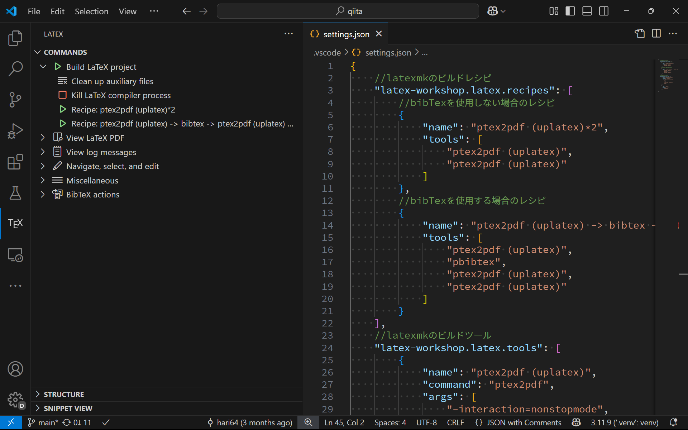

# VSCodeでファイル毎にLaTeXのレシピを設定する方法

VSCodeで[LaTeX Workshop](https://github.com/James-Yu/LaTeX-Workshop)を使用している場合、`.tex`ファイルの先頭に以下のようなコメントを追加することで、レシピを指定できます。

```tex
%!LW recipe=recipe-name
```

このmagic commentは[LaTeX Workshop](https://github.com/James-Yu/LaTeX-Workshop/wiki/Compile#latex-recipes)のWikiに記述されています。
**ただし、記事後半に記した[注意点](#注意点)には十分に留意してください。**

他にもいくつかmagic commentがありますが、それらは非推奨のようです。詳しくは[Wiki](https://github.com/James-Yu/LaTeX-Workshop/wiki/Compile#latex-recipes)の当該箇所をご覧ください。

## もう少し詳しい説明

一例として、検索上位に来るLaTeXの[環境構築記事](https://zenn.dev/hash_yuki/articles/31855fbdb5fdf7
)で使われているレシピを使い分けます。

以下がレシピの引用ですが、これら2つのレシピを登録しているとします。

```json
// ......(中略)......
    //latexmkのビルドレシピ
    "latex-workshop.latex.recipes": [
        //bibTexを使用しない場合のレシピ
        {
            "name": "ptex2pdf (uplatex)*2",
            "tools": [
                "ptex2pdf (uplatex)",
                "ptex2pdf (uplatex)"
            ]
        },
        //bibTexを使用する場合のレシピ
        {
            "name": "ptex2pdf (uplatex) -> bibtex -> ptex2pdf (uplatex) *2",
            "tools": [
                "ptex2pdf (uplatex)",
                "pbibtex",
                "ptex2pdf (uplatex)",
                "ptex2pdf (uplatex)"
            ]
        }
    ],
// ......(中略)......
```

この内容を当該記事のように設定することで、下図のように複数のレシピが登録されます。



`latex-workshop.latex.recipe.default`という[設定](https://github.com/James-Yu/LaTeX-Workshop/wiki/Compile#latex-workshoplatexrecipedefault)でデフォルトの"first"を指定していると、これらレシピのうち、先頭にある`ptex2pdf (uplatex)*2`がautoBuildにおいて使われます。

一応、この設定で`lastUsed`を指定すると、`LaTeX Workshop: Build with recipe`コマンドで最後に使用されたレシピが選択されますが、自由度は低いです。

そこで、基本は前者のレシピを使いながら、ある特定のファイルでは後者のレシピを使いたい場合、以下のように`.tex`ファイルの先頭にmagic commentを追加します。

```tex
%!LW recipe=ptex2pdf (uplatex) -> bibtex -> ptex2pdf (uplatex) *2

\documentclass[a4paper,12pt]{jlreq}

\title{サンプル}
\author{Hiroki Hamaguchi}

\begin{document}
\maketitle

常にbibtexを走らせたい\cite{sample}。

\bibliographystyle{jplain}
\bibliography{sample}

\end{document}
```

すると、確かにこのレシピが使用され、ファイル毎にレシピを使い分けることができます。

## 注意点

注意として、**localにしかレシピ名を保存していない場合、環境に依存するtexファイルが増えるなどの欠点**も存在します。

また、例えばTikZでは、

```tex
\documentclass{standalone}
```

を`ptex2pdf`でコンパイルすると正しく表示されないことがある一方、`pdflatex`でコンパイルすると正しく表示されることがあります。

この場合でも`%!LW recipe=`で`pdflatex`を指定することも可能ですが、

```tex
\documentclass[dvipdfmx]{standalone}
```

とすれば`ptex2pdf`でも正常にコンパイル可能です。このように**より簡潔かつ正攻法で解決できる場合にはmagic commentを使う必要はありません**。

しかし、この機能は様々なシチュエーションで便利かと思います。

本記事が`!LW recipe=`の存在の周知および、快適なLaTeX生活の一助になれば幸いです。
