# カラータイルの全消し戦略

カラータイルの全消し戦略について考察します。

## 概要

カラータイルとはゲーム菜園さんにより開発されたシンプルながら奥深いパズルゲームです。

https://www.gamesaien.com/game/color_tiles/

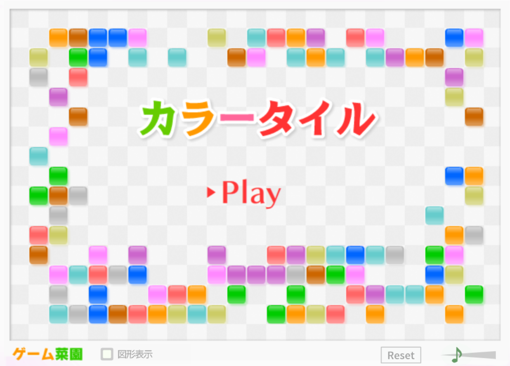

このゲームでは、$15 \times 23$ の盤面に10色のタイルが各20枚ずつランダムに配置されます。

プレイヤーは、タイルのないマスをクリックしていきます。クリックしたマスには、上下左右に最大4つの最も近いタイルがあります。そのタイル集合内で同色のものが2枚以上あれば、それらは全て消去されます。以上の手順を時間内まで繰り返し、最終的に消したタイルの枚数がスコアとなります。

一般に、タイルの「全消し」、つまり全てのタイルを消去することの達成は高難度ですが、コツを掴めばその確率は大幅に向上可能です。本記事では、[全消し動画](https://www.youtube.com/embed/4P429EM62rM)や複数のブログ記事、および個人の経験則を踏まえ、以下の3要素を全消しのコツとして提案します。

<!-- trick -->
* コツα: `3枚消しを回避する`
* コツβ: `2枚隣接を残さない`
* コツγ: `斜め双方向に消す`

具体的には、以下のような手順で消していくことを指しています。(以下はGIF画像です、もし動かなければ[こちら](https://youtu.be/cgEqy-4Hs3Y?t=111)からご覧ください)

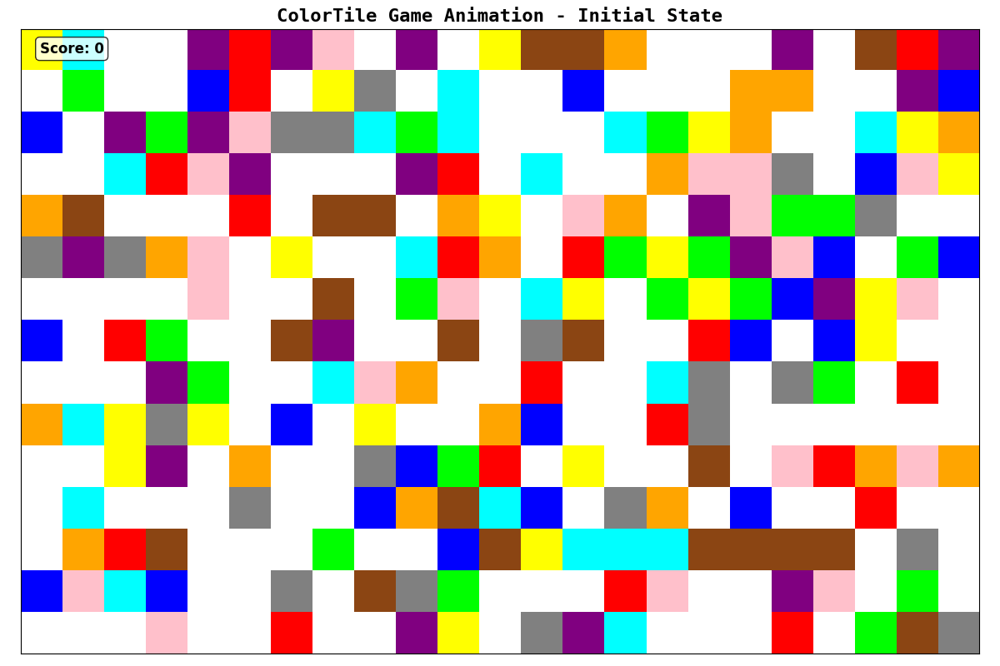

本記事では、シミュレーションによる実験をいくつか行いながら、全消し戦略について考察します。

## 全消し達成の為の要素

まず、そもそもどのようにすれば全消しを達成できるかについて整理します。その要素は大きく4つあると考えており、以下の通りです。

* 要素1: `スピード`
* 要素2: `正確性`
* 要素3: `偶奇由来の詰み回避`
* 要素4: `配置由来の詰み回避`

### 要素1,2について

要素1の `スピード` (制限時間2分で200枚のタイルを消せるか?)と要素2の `正確性` (ペナルティを避ける為にミスなく消していけるか?)はほぼプレイヤーの技量に依存する内容な為、本記事の範囲外とします。尤も、この2点こそがこのゲーム最大の難点です。基本的には、使用するデバイス(PC or iPad)を馴染むものにすること以外に、慣れるしか選択肢がないと思います。

### 要素3,4について

以上を踏まえ、本記事では`詰み回避`に関する要素3,4について考察します。

ここで、`詰み`とは、それ以上どのマスを押してもタイルが消せない状態と定義し、以下の2種類に分類します。

* 要素3の `偶奇由来の詰み` : 3枚消しを奇数回行ってしまうことで、タイルが奇数枚残った詰み状態
* 要素4の `配置由来の詰み` : 各色で偶数枚のタイルが残っているが、配置の関係上、1枚も消せない詰み状態

以下の表に具体例を載せています。初期時点でタイルが色毎に偶数枚あることと、全消しを目指していることから、これらの回避が要請されます。

| 3. `偶奇由来の詰み` | 4. `配置由来の詰み` |
|:--:|:--:|
| 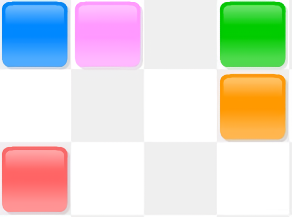 | 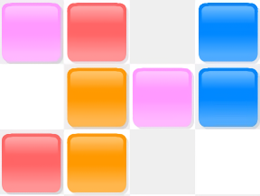 |

これらの回避にもプレイヤーの技量に左右される要素はあります。それがコツα `3枚消しを回避する` とコツβ `2枚隣接を残さない` であり、これらは他のブログ記事等でも紹介される内容となっています。

例えばこちらの[note](https://note.com/rrp22298630/n/nb383b777c01c)や[ブログ](https://ameblo.jp/abyssinian3/entry-11737094138.html)ではコツαと同様の内容が紹介され、phoernianさんという方の[ブログ](https://phoernian.hatenablog.com/entry/2020/07/31/211723)では、典型的なタイル配置と詰みを回避できる消し方が紹介されています。

コツα: ③の位置を最初にクリックしないことで、`3枚消しを回避する`

> 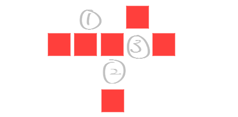

(画像は上記ブログ記事より引用, 最終閲覧日: 2025年8月27日)

コツβ: 1手目で一番上と一番右のペアを消さないことで、`2枚隣接を残さない`

> | 1手目 | 2手目 |
> | :--: | :--: |
> |  |  |

(画像は上記ブログ記事より引用, 最終閲覧日: 2025年8月27日)

同様に、こちらの[ブログ](https://keionkakimasen.hatenadiary.com/entry/colortile_beginners)でも、類似した内容を「詰めカラータイル」としてご紹介されています。

正しい「詰め方」はリンクよりご確認下さい。いずれもコツα,βを踏まえると正しく詰められることが分かります。

> | 第4問 | 第5問 |
> | :--: | :--: |
> | 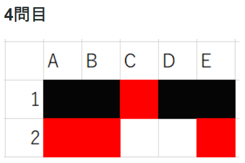 | 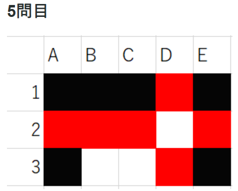 |

(画像はそれぞれ上記ブログ記事より引用, 最終閲覧日: 2025年8月27日)

### 戦略が果たすべき役割

さて、前節では要素3 `偶奇由来の詰み回避` と要素4 `配置由来の詰み回避` は、プレイヤーの技量によりコツα `3枚消しを回避する` とコツβ `2枚隣接を残さない` を意識することでも達成可能だということをブログ記事の引用により述べました。

一方で、これらを意識しながらタイルを消すことは、要素1 `スピード` と要素2 `正確性` を部分的に犠牲とします。詰み回避をしようと思えば、タイルを消す手に迷いが生じ、結果として遅くなったり不正確になったりするからです。

そこで本記事がメインで提案したいことは、**適切な戦略に基づき一定のルールに則って消し、コツαやコツβを自動的に実行することで、要素3,4に関する詰み回避確率を上げる**、ということです。

その戦略こそがコツγ `斜め双方向に消す` ということにあたります。

以降では、この戦略の評価を、実際にシミュレーションを行うことで定量的に行います。

## 実験方法

様々な戦略に対してシミュレーションを行い、全消し達成率および詰み要素の内訳を評価して、どのような戦略が有効かを考察します。

### シミュレーションプログラム

まず、カラータイルをプログラム上で再現しました。適当な手順を指定すると、実際にその手順に沿ってゲームの進行をシミュレーションが可能です。

プログラム自体は以下にGNU GPL v3ライセンスの下で公開しています。

https://github.com/HirokiHamaguchi/QiitaArticles/tree/main/20250827_ColorTile

権利上の注意点

これらのプログラムは、本家であるゲーム菜園さんのカラータイルを模倣して作成されたものであり、一般にそのようなプログラムは権利の問題を孕みます。

しかし、一般に著作権法における著作権保護の対象は「思想又は感情を創作的に表現したもの」であり、アイデアそれ自体、ここでいうゲームのルールは著作権保護の対象外であると考えています。

参考: [ゲームの「パクリ」と著作権](https://bengoshi-sakao.com/column/%E3%82%B2%E3%83%BC%E3%83%A0%E3%81%AE%E3%80%8C%E3%83%91%E3%82%AF%E3%83%AA%E3%80%8D%E3%81%A8%E8%91%97%E4%BD%9C%E6%A8%A9/)

以上の観点から、ゲーム的な創作要素を一切含まないようにして作られた本プログラムの公開は、著作権法上は問題ないと考え、実際に公開しています。

しかし、全ての権利はゲーム菜園さんに帰属すること、および、常識的な範囲を超えた利用はお控えいただきたいことを、念のため申し添えます。

また、そのような事情から本プログラムはコピーレフトを採用する為、GNU GPL v3に基づき公開しています。万一にも本プログラムを利用される場合は、これらを踏まえていただきますよう、お願い申し上げます。

### 戦略の種類

次に、いくつかの戦略に基づいてクリックする手順を生成し、実際にシミュレーションを行いました。

本記事では、以下の6つの戦略を比較しました。なお、クリック可能なマスとは、そのマスをクリックすることで、2枚以上のタイルが消えるマスと定義します。

GIF画像が動かなければ、[こちら](https://youtu.be/cgEqy-4Hs3Y)からご覧ください。

**ランダム戦略**: クリック可能なマスをランダムに選択。

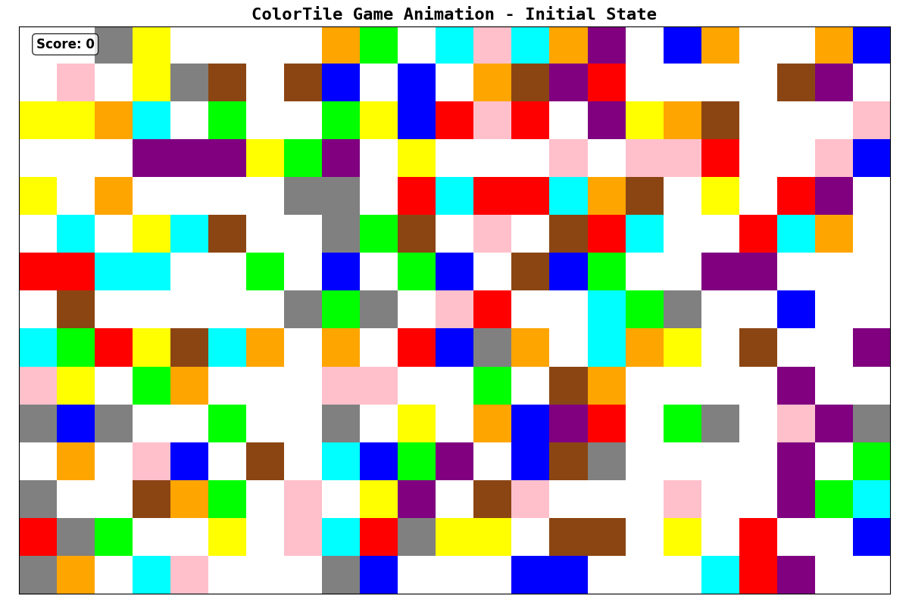

**垂直戦略**: クリック可能なマスのうち、最も上端のマスを選択。もし複数あれば、最も右端のマスを選択。

**水平戦略**: クリック可能なマスのうち、最も右端のマスを選択。もし複数あれば、最も上端のマスを選択。

**斜め戦略**: クリック可能なマスのうち、上からの何マス目か+右からの何マス目かの和が最小のマスを選択。

**四隅戦略**: クリック可能なマスのうち、斜め戦略と同様にして、各四隅(左上・右上・左下・右下)に最も近いマスを順に選択。

**斜め双方向戦略**: 前半1/3の手数では斜め戦略、続く1/3の手数では斜め戦略の逆、最後の1/3の手数では両方を交互に繰り返す。

また、各戦略では、以下の2つのバリエーションを考えました。

* コツα無意識: 3枚消しを一切避けない。
* コツα意識: 簡単に分かる3枚消しを避ける。つまり、クリックするマスに直接隣接するマスのうち、同色のタイルが3枚以上ある場合は、そのマスをクリック不可能とする。

コツα意識において、簡単には分からない3枚消し(クリックするマスに隣接するマスに2枚、遠くにもう1枚、同色のタイルがある場合など)は回避しないことに注意して下さい。遊んだ方には伝わると思いますが、3枚消しを回避したつもりでも、視界外のタイルが勝手に消えて3枚消しになることは頻発します。そのような事情を反映した現実的な戦略となっています。

以上の計12個の戦略を比較しました。

### 評価方法

これらの戦略の評価方法を述べます。

あるシード値に対し、初期配置をランダムに生成し、各戦略について独立に詰み状態になるまでシミュレーションする、という操作を1000シード分行いました。そして、以下の要素を評価しました。

* スコア分布
  * 全試行のスコアに関するヒストグラム
  * 全消し達成率はそれぞれ何%か
* 詰み要素の内訳
  * 全消し未達成の試行のうち、奇数枚残っているタイルが存在する確率は何%か (`偶奇由来の詰み`)
  * それ以外の試行のうち、隣接する同色の2枚のタイル組が存在する確率は何%か (`2枚隣接`)
  * それ以外の試行、つまり、どのマスを押しても消せない状態になっている確率は何%か (`配置由来の詰み`)

厳密には`2枚隣接`は`配置由来の詰み`に含まれるのですが、`2枚隣接`の存在がもたらす全消し未達成への影響を定量的に評価したい為、敢えて分けて評価しました。

以上が数値実験の内容となります。

## 実験結果

数値実験の結果を示します。

### スコア分布

まず、スコア分布(図1つ目)と全消し達成率(図2つ目)についてです。

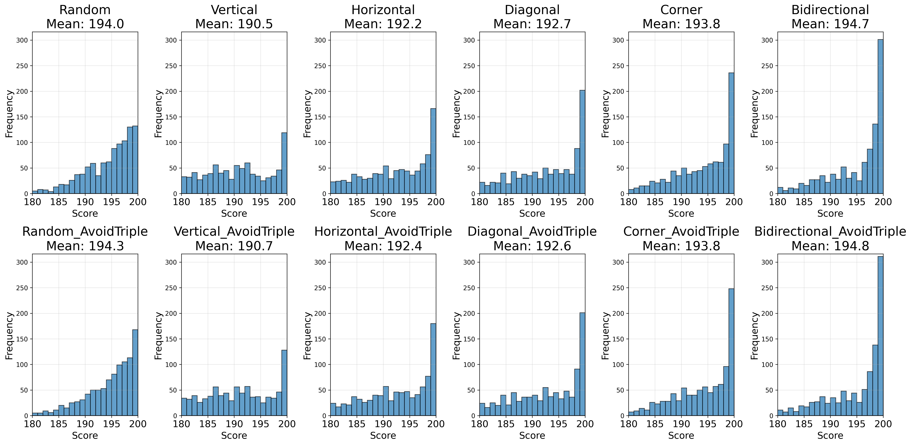

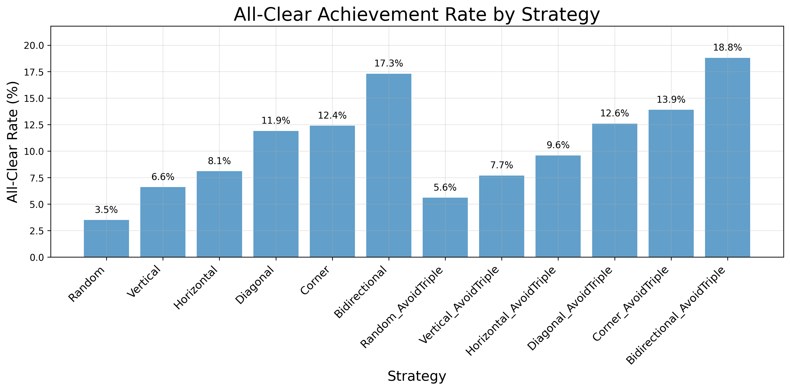

2つ目のグラフは、全消しの達成率をそれぞれの戦略について%表記と棒グラフで示しています。コツα無意識(前半6個)/コツα意識(後半6個)に関わらず、**全消し達成率は**

**ランダム** < **垂直** < **水平** < **斜め** < **四隅** < **斜め双方向**

の順に高くなる傾向が確認できます。

また、コツαを意識することにより、全戦略において全消し達成率が向上しています。簡単な3枚消しのみを回避しているにも関わらず、綺麗に全消し達成率が向上していることは興味深い点です。

特に、**コツα無意識におけるランダム戦略(3.5%)に比べて、コツα意識における斜め双方向戦略(18.8%)は、全消し達成率が大幅に向上しており、統計的にも有意差が認められます**。これは本記事が提案するコツγ `斜め双方向に消す` の有効性を強く示唆する結果です。

この理由について考察します。簡潔に言えば、先述の通り、斜め双方向戦略などの適切な戦略に基づくことで、**コツαである3枚消しの回避することとコツβである2枚隣接を残さないことが自動的に実行される**ことが要点です。

当然ではありますが、あるマスをクリックする際、ある2方向にそもそもタイルが存在しなければ、3枚消しは決して起こりません。ランダム戦略では基本的に4方向、水平戦略や垂直戦略では基本的に3方向、斜め戦略や四隅戦略や**斜め双方向戦略**では**基本的に2方向にのみタイルが存在する**ので、この順にコツα `3枚消しを回避する` が自動的に実行されやすくなります。

また、コツβ `2枚隣接を残さない`、つまり、配置由来の詰みを回避するという点においても、最後に塊として残れば残るほど、クリック可能なマスの数が減少するのは自然に理解できます。実際、水平戦略や斜め戦略では、次のような塊が最後に残ることが多いです。

| 水平戦略の最後の状態 | 斜め戦略の最後の状態 |
|:--:|:--:|
|  |  |

しかし、**斜め双方向戦略**では、GIF画像にも表れている通り、**斜め一直線上にタイルが残ることが多く、その分だけクリック可能なマスが多くなり、結果として全消し達成率が高くなります**。

以上より、コツγ `斜め双方向に消す` という戦略の有効性が理解できます。

一方で、コツα意識における斜め双方向戦略という今回の最良戦略においても、18.8%の全消し達成率に留まっていることも注目に値します。これはたったの5回に1回程度しか全消しが達成できないことを意味しており、決して高いとは言えません。更に、実際にプレイする際は要素1 `スピード` や要素2 `正確性` が欠けることによる失敗もあるので、実際の全消し達成率は更に低くなります。

単に上記戦略に基づくだけではなく、コツα `3枚消しを回避する` とコツβ `2枚隣接を残さない` を適切に意識するというプレイヤーの技量も、安定的な全消し達成には不可欠です。

以上のような理由から、

<!-- trick -->
* コツα: `3枚消しを回避する`
* コツβ: `2枚隣接を残さない`
* コツγ: `斜め双方向に消す`

の3点を意識することにより、より一段と全消し達成率が高くなることが、定量的にも定性的にも理解出来ます。

### 詰み要素の内訳

続いて、詰み要素の内訳についての結果です。

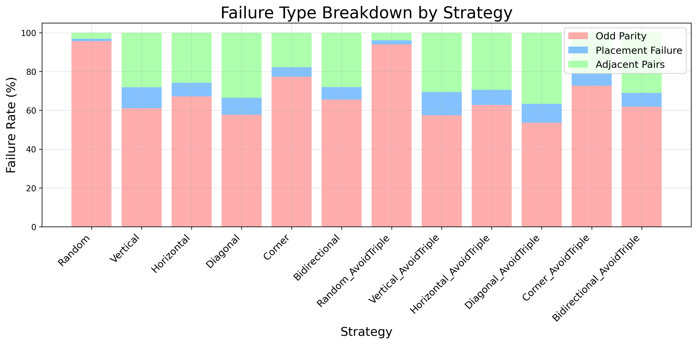

[評価方法](#評価方法)で述べた通り、これは失敗した試行における詰み要素の内訳を示しています。これらは、`偶奇由来の詰み`(赤色)・`配置由来の詰み`(青色)・`2枚隣接`(緑色)の3つで合計100%になります。

ここで注目すべき点の一つは、`偶奇由来の詰み`(赤色)の割合が全ての戦略において6割程度以上を占めていることです。全消し達成を阻む最大の要因は、やはり要素3 `偶奇由来の詰み回避` であることが分かり、コツα `3枚消しを回避する` の重要性が改めて確認できます。

そしてもう一つの注目すべき点は、それ以外の詰み要素であると、`2枚隣接` (緑色)の割合が、`配置由来の詰み` (青色)の割合に比べて、ほぼ全ての戦略において圧倒的に高いことです。つまり、全消し達成を阻む2番目に大きな要因は、`2枚隣接` の存在であることが分かります。

注意点として、この結果は `2枚隣接` が仮に消せたとしても、`配置由来の詰み` が起こる可能性はあるので、このグラフが示す結果ほどは `2枚隣接` の存在が致命的な訳ではありません。しかし、`2枚隣接` があればあるほど `配置由来の詰み` が起こる可能性は高くなることから、要素4 `配置由来の詰み回避` の為には、コツβ `2枚隣接を残さない` が重要であることは間違いありません。

### 結論

最後にいくつかの議論を行います。

本記事では、全消し戦略について定量的に考察しました。結論として、記事冒頭の繰り返しになりますが、全消しのコツとしては、

<!-- trick -->
* コツα: `3枚消しを回避する`
* コツβ: `2枚隣接を残さない`
* コツγ: `斜め双方向に消す`

を本記事では提案します。

私自身もこれらに基づいてプレイした結果、それなりの回数の全消しが達成出来ました。

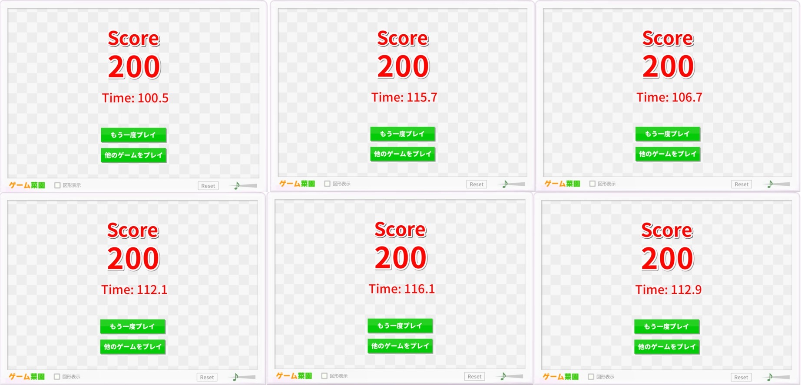
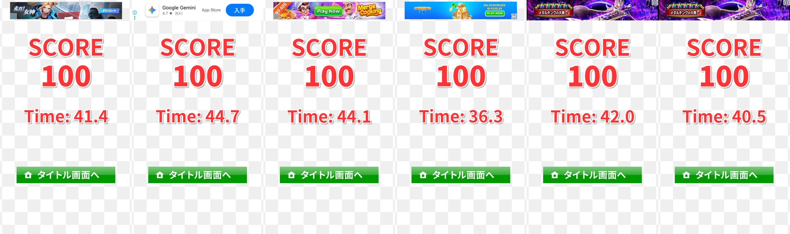

ちなみに、画像2枚目にある[iPhone版のカラータイル](https://apps.apple.com/jp/app/%E3%82%AB%E3%83%A9%E3%83%BC%E3%82%BF%E3%82%A4%E3%83%AB/id737150884)は、PC版とは少しルールが異なり、タイルの色の種類数や盤面の大きさが異なります。基本的な考え方は同じですが、少し調整が必要になると思います。

### 更なる考察

その上で、コツγ、つまり消し方の戦略には、更なる考察の余地があります。

例えば、消す2枚のタイルの組が平均でどれだけの距離離れるかは戦略に応じて変わりますが、近い2枚組であるほど、それを見つけるスピードや正しい場所を押す正確性が上がり、逆に遠い2枚組であるほどこれらは損なわれます。この記事では[全消し達成の為の要素](#全消し達成の為の要素)において、スピードや正確性は技量依存の要素として議論から外しましたが、このような指標によって、定量的なスピードや正確性に関する議論が可能で、戦略改善の余地の一つになります。[フィッツの法則](https://ja.wikipedia.org/wiki/%E3%83%95%E3%82%A3%E3%83%83%E3%83%84%E3%81%AE%E6%B3%95%E5%89%87)なども参考になるかも知れません。

**コツγは必ずしも厳守する必要がある戦略では決してなく、各個人の技量などに応じて柔軟に調整可能であり、そこもまたカラータイルというゲームの面白さだと思います。**

---

以上です、本記事がカラータイル全消し達成の一助となれば幸いです。
