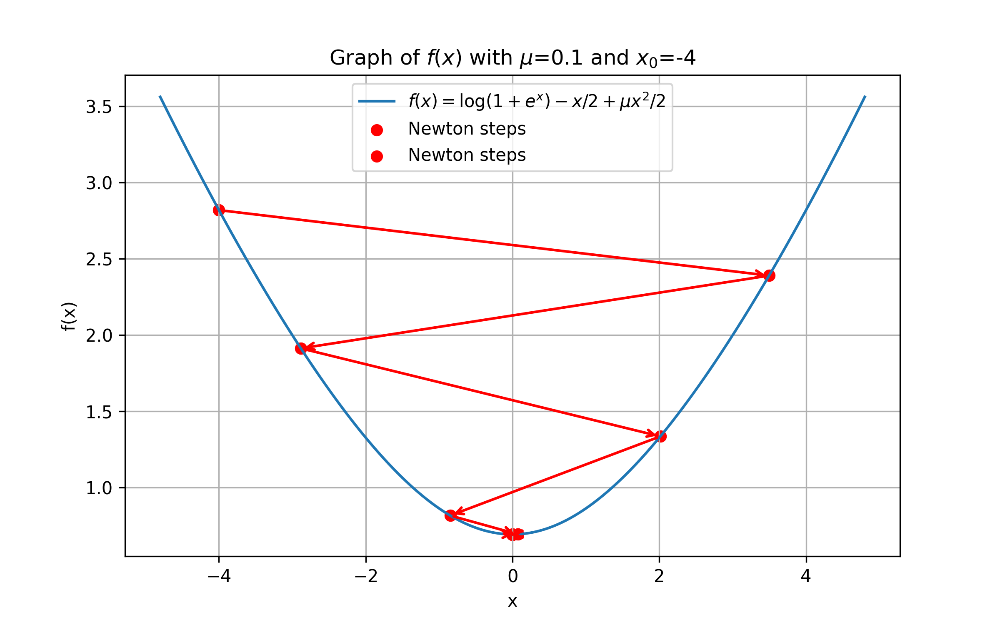
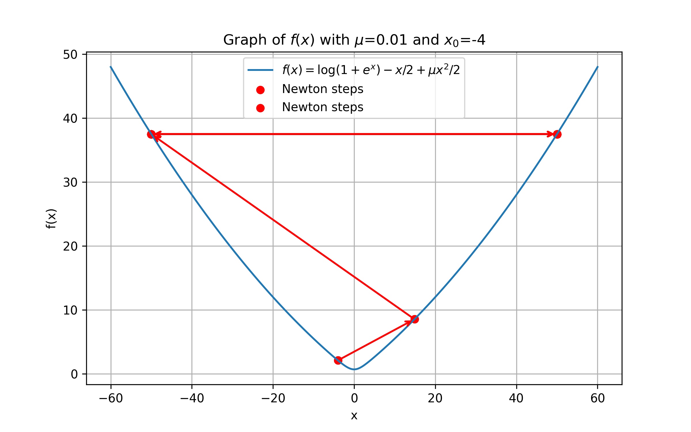

# 強凸関数だがNewton法が収束しない例

Doikov, N. (2021). [New second-order and tensor methods in convex optimization](https://dial.uclouvain.be/pr/boreal/object/boreal:260515) (Doctoral dissertation, Ph. D. thesis, Université catholique de Louvain). の Example 1.4.3.が面白かったので、走り書き程度のメモを残しておきます。

## 目的関数

目的関数、およびその導関数は以下の通りです。

$$
\begin{align*}
f(x) &= \log(1 + e^x) - \frac{x}{2} + \frac{\mu x^2}{2}\\
f'(x) &= \frac{e^x}{1+e^x} - \frac{1}{2} + \mu x\\
f''(x) &= \frac{e^x}{(1+e^x)^2} + \mu\\
f'''(x) &= \frac{e^x(1 - e^x)}{(1+e^x)^3}\\
f''''(x) &= \frac{e^x(1 - 4e^x + e^{2x})}{(1+e^x)^4}
\end{align*}
$$

この目的関数は、

* $\mu$-強凸
* $\max_x | f''(x) | = \frac{1}{4} + \mu$ ($e^x=1$ のとき) であるので、$\nabla f$ が $L$-smooth ($L=\frac{1}{4} + \mu$)
* $\max_x | f'''(x) | = \frac{1}{6\sqrt{3}}$ ($e^x=2-\sqrt{3}$ のとき) であるので、$\nabla^2 f$ が $M$-Lipschitz連続 ($M=\frac{1}{6\sqrt{3}}$)

という各種の良い性質を満たしますが、$\mu$ に対して初期点 $x_0$ が十分大きいとき、Newton法は収束しません。

(初期点 $x_0=-4, \mu=0.1$ の場合、収束する)

(初期点 $x_0=-4, \mu=0.01$ の場合、振動する)

## 実験コード

<!-- PROGRAM_INSERTION: main.py -->

## 終わりに

書いた後に気付いたのですが、自分が過去に読んでいた[こちらのpdf](https://www.ism.ac.jp/~mirai/sscoke/2024/marumo-answers.pdf)とほぼ同じ内容でした。全く同じ論文からの引用です。

図があると自分の理解の助けになるので、記事として残しておくことにします。
