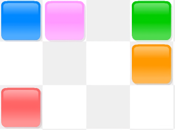
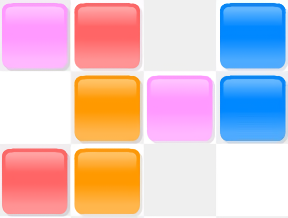

# カラータイル戦略についての考察

カラータイルの戦略について考察します。

## 概要

カラータイルとはゲーム菜園さんにより開発されたシンプルながら奥深いパズルゲームです。
このゲームでは、$15 \times 23$ の盤面に10色のタイルが各20枚ずつランダムに配置されます。
プレイヤーは、タイルの無いマスをクリックしていきます。クリックしたマスには、上下左右に高々4つの最も近いタイルがあります。そのタイル集合内で同色のものが2枚以上あれば、それらは全て消去されます。以上の手順を時間内まで繰り返し、最終的に消したタイルの枚数がスコアとなります。ゲーム概要については以下のGIFも参照してください。

一般に、タイルの「全消し」達成は極めて難易度が高いです。
シビアな時間制限により、実質的に2分間ノーミスで200枚消去しなければならないことも一因ですが、詰みの状況が非常に発生しやすいことも難易度を上げる大きな要因となっています。
詰みの理由には2種類存在し、

1. 3枚消しを奇数回行ってしまうことで、偶奇の関係上、1枚だけ残り消せなくなる
2. どのマスを押しても、配置の関係上、1枚も消せなくなる

というものがあります。

| 理由1 | 理由2 |
|:--:|:--:|
|  |  |

本記事では、この運ゲーとも呼ばれる詰み状況を、より高い確率で回避するための戦略を考察します。

賢い方なら全体におけるブロックの配置を認識し、出来る限り3個消しを避けて、もし3個消しをしてしまったとしてもその色を記憶して

Fittsの法則

https://ja.wikipedia.org/wiki/%E3%83%95%E3%82%A3%E3%83%83%E3%83%84%E3%81%AE%E6%B3%95%E5%89%87

##

上記の戦略を基にしたうえで、最終的に全消しが達成できるかどうかは慣れの問題が大きいと思います。

本記事の主題ではないので、参考文献にいくつか触れるのみになりますが、

上記の戦略を基にしても、

https://note.com/rrp22298630/n/nb383b777c01c
