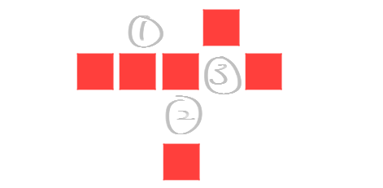
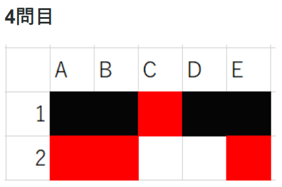
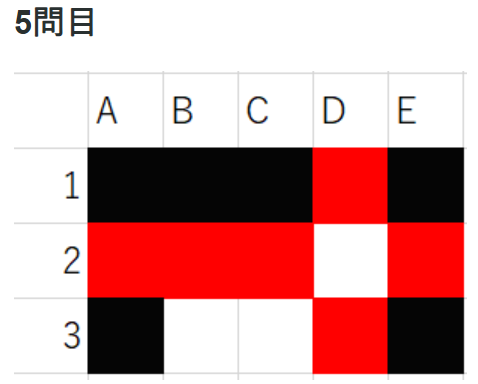
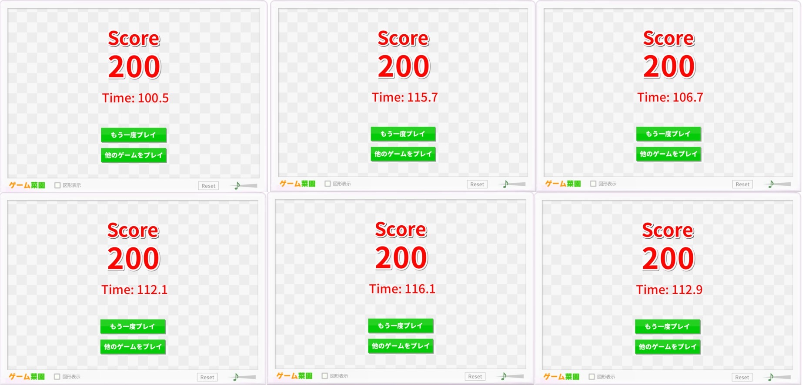
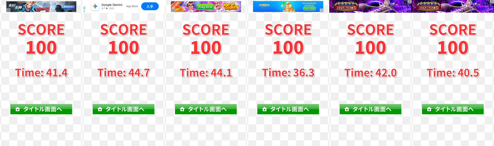

# カラータイルの全消し戦略

カラータイルの全消し戦略について考察します。

## 概要

カラータイルとはゲーム菜園さんにより開発されたシンプルながら奥深いパズルゲームです。

このゲームでは、$15 \times 23$ の盤面に10色のタイルが各20枚ずつランダムに配置されます。

プレイヤーは、タイルの無いマスをクリックしていきます。クリックしたマスには、上下左右に高々4つの最も近いタイルがあります。そのタイル集合内で同色のものが2枚以上あれば、それらは全て消去されます。以上の手順を時間内まで繰り返し、最終的に消したタイルの枚数がスコアとなります。

ゲーム概要については以下の動画も参照してください。

<iframe width="623" height="359" src="https://www.youtube.com/embed/4P429EM62rM" title="[カラータイル] 64.7秒 全消し(200) [Color Tile] 64.7sec All clear" frameborder="0" allow="accelerometer; autoplay; clipboard-write; encrypted-media; gyroscope; picture-in-picture; web-share" referrerpolicy="strict-origin-when-cross-origin" allowfullscreen></iframe>

一般に、タイルの「全消し」達成はかなり難易度が高いですが、コツを掴めばその確率は大幅に向上可能で、要は上の動画における次の3要素を真似出来ればよいです。

<!-- trick -->
* コツα: `3個消しを回避する`
* コツβ: `2個隣接を残さない`
* コツγ: `1方向に消していく`

そこで本記事では、数理モデルに基づいた実験をいくつか行い、その結果を踏まえて全消し戦略について考察し、「コツ」の定量的な理解を目指します。

以下ではカラータイルを数回程度遊ばれた方を想定読者とします。未プレイの方は是非一度遊んでみてください。

https://www.gamesaien.com/game/color_tiles/

## 全消し達成の為の要素

まず、そもそもどうすれば全消し達成を達成できるかについて整理します。その要素は大きく4つあると考えており、以下の通りです。

* 要素1: `スピード`
* 要素2: `正確性`
* 要素3: `偶奇由来の詰み回避`
* 要素4: `配置由来の詰み回避`

### 要素1,2について

要素1のスピード(制限時間2分で200枚のタイルを消せるか?)と要素2の正確性(ペナルティを避ける為、実質的にミスなく消していけるか?)はほぼプレイヤーの技量に依存する内容な為、本記事の範囲外とします。尤も、この2点こそがこのゲーム最大の難点です。基本的に慣れる以外の選択肢がないと思います。

いくつかの戦略的な要素として、使用するデバイスに関する選択肢が挙げられます。

もしiPadとPCの両方をお持ちであれば、より馴染みやすい方を選ぶとよいと思います。iPadは押しやすい代わりに手で隠れるので視認性が悪く、PCはその逆です。

また、画面の拡大率にも一種のトレードオフがあり、画面が小さいほど全体像を把握しやすいですが、正確性が損なわれやすくなります。

### 要素3,4について

以上を踏まえ、本記事では主に要素3,4について考察します。

ここで、

* 要素3の `偶奇由来の詰み` とは「3枚消しを奇数回行ってしまうことで、偶奇の関係上、1枚だけ残り消せなくなる」こと
* 要素4の `配置由来の詰み` とは「どのマスを押しても、配置の関係上、1枚も消せなくなる」こと

とそれぞれ定義します。初期時点でタイルが色毎に偶数枚あることと、全消しを目指していることから、これらの回避が要請されます。
以下の表にその具体例を載せています。

| 3. `偶奇由来の詰み` | 4. `配置由来の詰み` |
|:--:|:--:|
|  |  |

これらの回避にもプレイヤーの技量に左右される要素はあります。

例えばphoernianさんという方の以下のブログ記事では、典型的なタイル配置と詰み要素を回避できる消し方が紹介されています。

https://phoernian.hatenablog.com/entry/2020/07/31/211723

コツα: ③の位置を最初にクリックしないことで、`3個消しを回避する`

> 

(画像は上記ブログ記事より引用)

コツβ: 1手目で一番上と一番右のペアを消さないことで、`2個隣接を残さない`

> | 1手目 | 2手目 |
> | :--: | :--: |
> |  |  |

(画像は上記ブログ記事より引用)

同様に、以下のブログ記事でも、類似した内容を「詰めカラータイル」としてご紹介されています。

https://keionkakimasen.hatenadiary.com/entry/colortile_beginners

正しい「詰め方」はリンクよりご確認下さい。いずれもコツα,βを踏まえると正しく詰められることが分かります。

> | 第4問 | 第5問 |
> | :--: | :--: |
> |  |  |

(画像はそれぞれ上記ブログ記事より引用)

### 戦略が果たすべき役割

さて、前節では要素3 `偶奇由来の詰み回避` と要素4 `配置由来の詰み回避` は、プレイヤーの技量により達成可能な要素でもあることをブログ記事の引用により述べました。

一方で、これらを意識しながらタイルを消すことは、要素1 `スピード` と要素2 `正確性` を部分的に犠牲とします。詰み回避をしようと思えば、タイルを消す手に迷いが生じ、結果として遅くなったり不正確になったりするからです。

そこで本記事がメインで提案したいことは、**適切な戦略に基づき一定のルールに則って消していくことで、要素3,4に関する詰み回避をある程度は自動で行い、要素1,2の犠牲を最小限に抑えよう**、ということです。

一部のプレイヤーにとっては当然のことかも知れませんが、その戦略こそがコツγ `1方向に消していく` ということにあたります。

以降では、この戦略の評価を、実際にシミュレーションを行うことで定量的に行います。

## 実験方法

### シミュレーションプログラム

まず、カラータイルをプログラム上で再現しました。適当な手順を指定すると、実際にその手順に沿ってゲームの進行をシミュレーションが可能です。

プログラム自体は以下にGNU GPL v3ライセンスの下で公開しています。

<!-- todo: 以下のリンクの更新 -->
todo: 以下のリンクの更新
<!-- todo: ライセンスも更新 -->

https://github.com/HirokiHamaguchi/QiitaArticles/tree/main/20257777_ColorTile

権利上の注意点

これらのプログラムは、本家であるゲーム菜園さんのカラータイルを模倣して作成されたものであり、一般にそのようなプログラムは権利の問題を孕みます。

しかし、一般に著作権法における著作権保護の対象は「思想又は感情を創作的に表現したもの」であり、アイデアそれ自体、ここでいうゲームのルールは著作権保護の対象外であると考えています。

参考: ゲームの「パクリ」と著作権

https://bengoshi-sakao.com/column/%E3%82%B2%E3%83%BC%E3%83%A0%E3%81%AE%E3%80%8C%E3%83%91%E3%82%AF%E3%83%AA%E3%80%8D%E3%81%A8%E8%91%97%E4%BD%9C%E6%A8%A9/

以上の観点から、ゲーム的な創作要素を一切含まないようにして作られた本プログラムの公開は、著作権法上は問題ないと考え、実際に公開しています。

しかし、全ての権利はゲーム菜園さんに帰属すること、および、常識的な範囲を超えた利用はお控えいただきたいことを、念のため申し添えます。

また、そのような事情から本プログラムはコピーレフトを採用する為、GNU GPL v3に基づき公開しています。万一にも本プログラムを利用される場合は、これらを踏まえていただきますよう、お願い申し上げます。

### 戦略の種類

次に、いくつかの戦略に基づいてクリックする手順を生成し、実際にシミュレーションを行います。

本記事では、以下の4つの戦略を比較します。

1. ランダム戦略: クリック可能なマスをランダムに選択
2. 水平戦略: クリック可能なマスのうち、最も右端のマスを選択。もし複数あれば、最も上端のマスを選択。
3. 垂直戦略: クリック可能なマスのうち、最も上端のマスを選択。もし複数あれば、最も右端のマスを選択。
4. 斜め戦略: 水平戦略、垂直戦略を交互に繰り返す。

それぞれのgifは以下の通りです。

| ランダム戦略 | 水平戦略 |
|:--:|:--:|
|  |  |

| 垂直戦略 | 斜め戦略 |
|:--:|:--:|
|  |  |

また、各戦略では、以下の2つのバリエーションを考えます。

* コツα意識: 簡単に分かる3個消しを避ける。つまり、クリックするマスに直接隣接するマスのうち、同色のタイルが3枚以上ある場合は、各戦略において次点のマスを選択する。このような回避を繰り返した結果、3個消しが不可避となった場合は、各戦略において最優先のマスを選択する。
* コツα無意識: 3個消しを一切避けない。

コツα意識において、簡単には分からない3個消し(例えば、クリックするマスに隣接するマスに2枚、遠くにもう1枚ある場合など)は回避しないことに注意して下さい。これは遊んだ方には伝わると思いますが、完全に視界外のタイルが勝手に消えて3個消しになることは頻発します。そのような事情を反映した、現実的な戦略となっています。

以上の計8つの戦略を比較します。

### 評価方法

共通の初期配置をまずランダムに生成し、各戦略について独立にシミュレーションを行うことを、100回繰り返します。

各戦略について、以下の要素を評価します。

* スコア分布
  * 全消しのスコアは200点で、そのヒストグラムを描画
* 全消しの内訳
  * 全消し達成率は何%か
  * コツα意識の場合、全消し達成した試行のうち、平均何個の3個消しを回避したか
* 詰み要素の内訳
  * 全消し未達成の試行のうち、奇数枚残っているタイルが存在する確率は何%か (`偶奇由来の詰み`)
  * 全消し未達成の試行のうち、どのマスを押しても消せない状態になっている確率は何%か (`配置由来の詰み`)
  * 全消し未達成の試行のうち、隣接する同色の2枚のタイル組が存在する確率は何%か (`2個隣接`)

## 実験結果

### スコア分布

### 全消しの内訳

### 詰み要素の内訳

最後にいくつかの議論を行います。

### 結論

本記事では、全消し戦略について定量的に考察しました。

結論として、記事冒頭の繰り返しになりますが、全消しのコツとしては、

<!-- trick -->
* コツα: `3個消しを回避する`
* コツβ: `2個隣接を残さない`
* コツγ: `1方向に消していく`

になります。

私自身もこれらに基づいてプレイした結果、それなりの回数の全消しが達成出来ました。

### 更なる考察

その上で、コツγ、つまり消し方の戦略には、更なる考察の余地があります。

例えば、消す2枚のタイルの組が平均でどれだけの距離離れるかは戦略に応じて変わりますが、近い2枚組であるほど、それを見つけるスピードや正しい場所を押す正確性が上がり、逆に遠い2枚組であるほどこれらは損なわれます。この記事では[全消し達成の為の要素](#全消し達成の為の要素)において、スピードや正確性は技量依存の要素として議論から外しましたが、このような指標によって、定量的なスピードや正確性に関する議論が可能で、戦略改善の余地の一つになります。[フィッツの法則](https://ja.wikipedia.org/wiki/%E3%83%95%E3%82%A3%E3%83%83%E3%83%84%E3%81%AE%E6%B3%95%E5%89%87)なども参考になるかも知れません。

コツγは必ずしも厳守する必要がある戦略では決してなく、各個人の技量などに応じて柔軟に調整することが可能であり、そこもまたカラータイルというゲームの面白さだと思います。

---

以上です、本記事がカラータイル全消し達成の一助となれば幸いです。

## 参考文献

https://note.com/rrp22298630/n/nb383b777c01c

https://phoernian.hatenablog.com/entry/2020/11/23/000256
