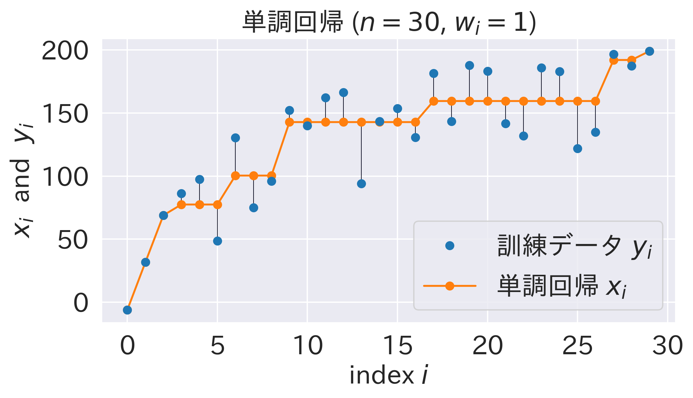
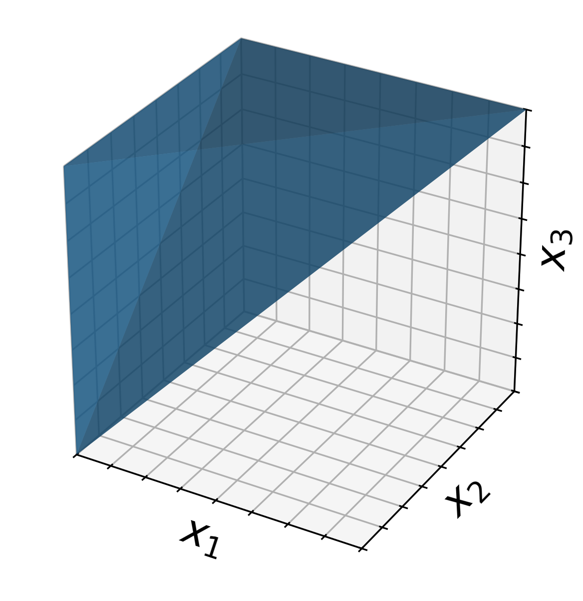

# Isotonic Regression (単調回帰) と Pool Adjacent Violators Algorithm (PAVA) について

## 概要

以下の問題について解説します。

$$
\begin{align*}
    \min_x \quad & \sum_{i=1}^n w_i (y_i - x_i)^2\\
    \text{s.t.} \quad & x_1 \leq x_2 \leq \dots \leq x_n
\end{align*}
$$



## 導入

Isotonic Regression または Monotonic Regression (単調回帰) とは、訓練データに対する重み付き最小二乗近似となる数列を、単調非減少という制約付きで求める手法です。

[^1] 及び [SciPy](https://docs.scipy.org/doc/scipy/reference/generated/scipy.optimize.isotonic_regression.html) では、$n$ 点からなるデータ $y$ とその重み $w$ が与えられたとき、以下の最適化問題を解くこととして定義されています:

$$
\begin{align*}
    \min_x \quad & \sum_{i=1}^n w_i (y_i - x_i)^2\\
    \text{s.t.} \quad & x_1 \leq x_2 \leq \dots \leq x_n
\end{align*}
$$

[Wikipedia](https://en.wikipedia.org/wiki/Isotonic_regression) 及び [scikit-learn](https://scikit-learn.org/stable/modules/generated/sklearn.isotonic.IsotonicRegression.html#sklearn.isotonic.IsotonicRegression) では、観測されるデータ点の添字についてより一般化した定義を採用しています。また、重み $w_i$ は全て1であるとし、目的関数は通常の最小二乗問題に帰着されることも多いです。

このように定義される Isotonic Regression は、様々な応用があり重要な手法となっています。本記事ではその基礎的内容に焦点を当てます。

## 手法

前節で定義された問題に対しては、PAVA (Pool Adjacent Violators Algorithm) と呼ばれるアルゴリズムが知られています。本節では、PAVA のアルゴリズムを説明し、また。

### 先行研究による実装

導入でも述べたように、Isotonic Regression に対する解法は、scikit-learn や SciPy という OSS でも実装されています。

```python
from sklearn.isotonic import IsotonicRegression
from scipy.optimize import isotonic_regression
```

執筆時では、sklearn は内部で SciPy を呼び出しています。
SciPy は内部で PAVA というPybindによる C++ 実装を呼び出しています。そしてこの PAVA は文献[^1] に基づいています。

文献[^1] はその実装を下記のページで公開しており、R のpackage (monotone) として公開されています。

https://cran.r-project.org/web/packages/monotone/index.html

この実装自体は本記事で取り扱いません。詳しくは上記リンクおよび文献[^1] を直接ご参照下さい。

### PAVA のアルゴリズム

PAVAという時、本質的には全て同じで、実装上の工夫に主な違いがあるという認識でいます(要確認)

[ajtulloch/Isotonic.jl](https://github.com/ajtulloch/Isotonic.jl
)というレポジトリでは Julia の実装があり、以下が実装されています:

* Linear PAVA (fastest)
* Pooled PAVA (slower)
* Active Set (slowest)

R のパッケージ isotone

https://cran.r-project.org/web/packages/isotone/index.html

https://cran.r-project.org/web/packages/isotone/vignettes/isotone.pdf

https://link-springer-com.utokyo.idm.oclc.org/article/10.1007/bf01580873

## 正当性の証明

本節では、PAVA の正当性を証明します。
ここからは数理最適化的な視点からの説明となります。

凸集合上の凸関数の最適化問題となっている為、この問題の解は一意に定まります。



Pool Adjacent Violators Algorithm (PAVA) と呼ばれるアルゴリズムが有名です。
このアルゴリズムの説明および正当性の証明を本記事では行います。

$$
\min \sum_{i=1}^n (y_i - f(x_i))^2 \quad \text{s.t.} \quad f(x_1) \leq f(x_2) \leq \cdots \leq f(x_n)
$$

## 議論

Centered Isotonic Regression という発展も知られています。 ([Wikipedia](https://en.wikipedia.org/wiki/Isotonic_regression#Centered_isotonic_regression), [R package "cir"](https://cran.r-project.org/web/packages/cir/index.html), 文献[^2]など)

これは平滑性を導入したもののようです。

## 参考文献

Isotonic Regression を扱ったQiita上の先行記事として、以下を参照させて頂きました。

https://qiita.com/dai08srhg/items/eb08fc98e7149748a9d5

[^1]: Busing, F. M. T. A. (2022). Monotone Regression: A Simple and Fast O(n) PAVA Implementation. Journal of Statistical Software, Code Snippets, 102(1), 1–25. https://doi.org/10.18637/jss.v102.c01

[^2]: Oron, A. P., & Flournoy, N. (2017). Centered Isotonic Regression: Point and Interval Estimation for Dose–Response Studies. Statistics in Biopharmaceutical Research, 9(3), 258–267. https://doi.org/10.1080%2F19466315.2017.1286256
