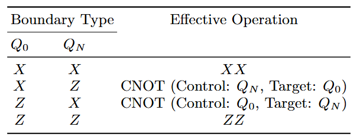
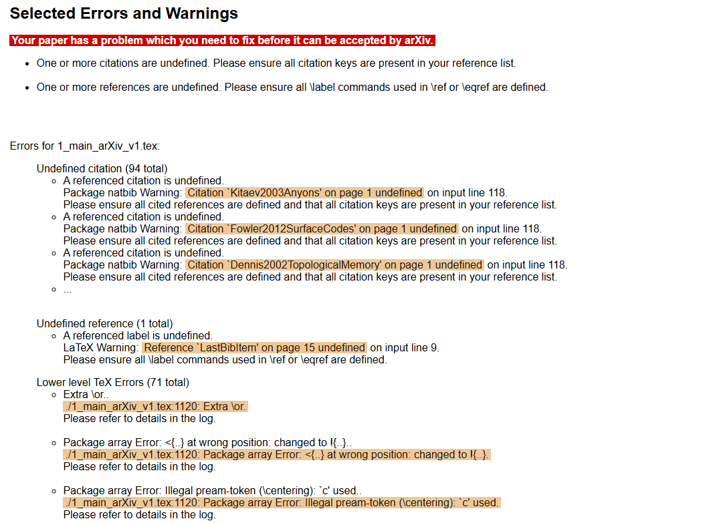

# arXivへ論文投稿する際のLaTeXに関する諸問題とその対処法

論文原稿をarXivに投稿する際に、私が詰まった問題とその対処法をまとめます。

本記事では、以下の諸問題を扱います:

<!-- no toc -->
* [BibTeX検出エラー](#bibtex検出エラー)
* [`subfiles`使用時の相対パス問題](#subfiles使用時の相対パス問題)
* [SVG画像を使う際の注意点](#svg画像を使う際の注意点)
* [REVTeXとarrayパッケージの相性問題](#revtexとarrayパッケージの相性問題)
* [en dashの使用について](#en-dashの使用について)

arXivの投稿システムやTeX Live環境は更新されるため、問題が起きた場合はarXiv公式の説明を確認するのが一番確実な方法だと思いますので、以下にリンクを載せておきます。本記事はあくまでその補足程度の体験談としてご参照頂ければ幸いです。

https://info.arxiv.org/help/submit_tex.html

この記事は個人的な備忘録の側面が強く、困った問題が発生する度に更新する可能性があります。

## BibTeX検出エラー

まず、BibTeXエラーについて述べます。以下の論文を投稿時に遭遇した問題です。

https://arxiv.org/abs/2603.10642

前提として、arXivに投稿する際、BibTeXを使う場合は、`.bib`ファイルまたは`.bbl`ファイルを適切に含めてアップロードする必要があります。arXivはBibTeX/Biber用の`.bib`ファイル処理もサポートしていますが、再現性や安全性の観点から、`.bbl`ファイルを含める運用もよく使われます。

このような処理に関しては、Overleafのsubmit機能を使うと良いことが知られています。この機能で出力される`.bbl`ファイルを含めてarXivにアップロードすれば、通常は問題なく処理されるはずです。ローカル環境でも、同様に`.bbl`ファイルを生成してアップロードすれば、問題なく処理されるはずです。

しかし、完全に`.bbl`ファイルや`.bib`ファイルがない状態でOverleaf上でコンパイルが通るとしても、次のようなエラーが出てくることがあります。


```txt
The scan did not detect a bibliography. Please include one.
Both bbl and bib files are missing
```

私の場合、これはsubfilesの内側で、次のようにif文付きのbibliographyコマンドを使っていたことが原因でした。

```tex
\ifSubfilesClassLoaded{
    \bibliography{myReferences.bib}
}{}
```

本来はif文によってこれは完全に無視されるので、コンパイルには一切関与しないのですが、arXivの事前検出はTeXの条件分岐を完全に評価するとは限らず、このようなエラーが出てしまうようです。
これを手動で削除したら解決しました。

つまり、より抽象的に言えば、arXiv側のシステムの解析で、使用の可能性が疑われる`.bib`ファイルが少しでもあると、実際の使用不使用に関わらずエラーの出る可能性があり、それを削除するのが重要、というのが本節の結論となります。

## `subfiles`使用時の相対パス問題

同様の話として、`subfiles`使用時に相対パスが認識されない問題もあります。以下の論文を投稿時に遭遇した問題です。

https://arxiv.org/abs/2603.10642

先述のarXivの公式ページには、以下のような記述があります。

> You can submit a collection of TeX input/include files, e.g. separate chapters, foreword, appendix, etc, and custom macros (see below) packaged in a (possibly compressed) .tar or .zip file. Main files (or "Toplevel files") can be in the root or in a subdirectory, **but note that compilation is always done from the root of your submission directory, even if the main file is in a subdirectory**. This is important when you use \include or \input or any other command that includes data from external files.
>
> (TeXの入力ファイルやincludeファイル、例えば別々の章、前書き、付録などを、（必要に応じて圧縮された）.tarや.zipファイルにまとめて提出できます。メインファイル（または「トップレベルファイル」）はルートまたはいずれかのサブディレクトリに置くことができますが、**コンパイルは常に提出ディレクトリのルートから行われることに注意してください**。これは、\includeや\inputなどのコマンドを使用して外部ファイルからデータを含める場合に重要です。)

([arXiv公式ページ](https://info.arxiv.org/help/submit_tex.html)より。最終閲覧日: 2026年6月24日。翻訳、強調は筆者による。)

特に、手元の環境とコンパイルが行われるディレクトリが異なる場合に、相対パスが壊れ、特にトラブルが起きやすいと思います。一番簡単なのは、mainとなるtexファイルをフォルダーの中ではなく、ルート直下に配置することだと思います。そうすれば、殆どの環境で両者が一致し、トラブルが起きにくくなると思います。

具体的には、ローカル環境では

```txt
doc/
├─ main.tex
├─ subfile/
│  ├─ chapter1.tex
└  └─ chapter2.tex
src/
└─ run.py
README.md
```

のような構成であったとしても、Overleaf上では、

```txt
main.tex
subfile/
├─ chapter1.tex
└─ chapter2.tex
```

のように、main.texをルート直下に置く構成に変えておくことがお勧め、というのが本節の結論です。

## SVG画像を使う際の注意点

続いて、SVG画像に関する注意点を述べます。以下の論文を投稿時に遭遇した問題です。

https://arxiv.org/abs/2606.21192

arXivにTeX/LaTeXソースを投稿する場合、SVG画像をそのまま扱う運用は避けるべきです。[svg package](https://ctan.org/pkg/svg)は`\includesvg`や`\includeinkscape`を提供し、内部でInkscapeのコマンドライン機能を使ってSVGを変換しますが、そのような処理がarXiv上ではサポートされていないためです。

先述のarXivの公式ページには、以下のような記述があります。

> Depending on the selected processor (see above), only certain types of images can be included without conversion:
> for plain TeX, and for "LaTeX in DVI mode", only (encapsulated) PostScript (.ps or .eps) are supported;
> for "LaTeX in PDF mode", you may embed your .pdf, .png, .jpg figures using the same mechanisms.

([arXiv公式ページ](https://info.arxiv.org/help/submit_tex.html)より。最終閲覧日: 2026年6月24日。翻訳は筆者による。)

つまり、SVGはデフォルトでは対応しておらず、投稿時にコンパイルエラーになる可能性が高いです。
SVGで作成した図を使いたい場合は、投稿前に、使用するTeXエンジンに合った形式へ変換しておくのが安全です。例えば`pdflatex`ならPDF、PNG、JPG、DVIモードのLaTeXならEPSまたはPSが候補になります。

個人的には、ベクター図としての品質を保ちたい場合はPDFへ変換するのが良いかと思います。

また、以下の記事も参考になるかも知れません。

https://tex.stackexchange.com/questions/711503/processing-document-with-svgs-for-submission-to-arxiv

## REVTeXとarrayパッケージの相性問題

続いてバージョン違いに起因した問題を述べます。以下の論文を投稿時に遭遇した問題です。

https://arxiv.org/abs/2606.21192

なお、具体的なバージョンの話が出てきますが、単に特定の状況に対する示唆というよりも、はるかにより普遍的かつ一般的な解決策を目指して本節は書いています。なので、個別のパッケージ名やバージョン番号は、あくまで例示としてご参照ください。

私が遭遇した問題は、REVTeXというドキュメントクラスを使っている状況で、Overleaf上では問題なくコンパイルできるのに、arXiv上ではコンパイルが通らない、というものでした。




原因は、REVTeXと`array`パッケージの相性問題でした。TeX Live 2025環境で`array`パッケージを読み込むと、`p{30mm}`のような折り返し可能な表カラムが原因でコンパイルに失敗することがあります。

この問題については、TeX Stack Exchangeの[p column type stops compilation in RevTeX](https://tex.stackexchange.com/questions/731843/p-column-type-stops-compilation-in-revtex)で議論されています。

arXivに投稿した時にのみ、エラーの中にUndefined control sequenceが出てきた場合、このようなバージョン違いに起因することは意外と多くあると思っています。
異なるドキュメントクラス、異なるパッケージを使用している場合でも、そのようなバージョン違いを疑ってみるのは、一般論として有効な手段だと思います。

なお、arXiv公式の[TeX Live at arXiv](https://info.arxiv.org/help/faq/texlive.html)にて、次のような解決策が示されています。

> Notes concerning TeX Live 2025
> We list the most common errors we have seen in the set of current submissions. Further information can be found at the Overleaf announcement that TeX Live 2025 is now available.
>
> Issues with the array package
> Under various circumstances, in particular when using a revtex documentclass together with the array package, compilation issue might arise.
>
> We suggest either selecting TeX Live 2023, or requesting an older version or the array package using
>
> ```tex
> \usepackage{array}[=2016-10-06]
> ```

この他にもarXiv公式ではいくつかのトラブルとその解決策が紹介されています。

## en dashの使用について

最後に、arXivでen dash (–)をtitleに使うときの注意点について述べます。以下の論文を投稿時に遭遇した問題です。

https://arxiv.org/abs/2412.20317

前提として、en dash (–)は、主に2人以上の人名をつなげるときによく使われます。例えば高校数学でも登場するコーシーシュワルツの不等式は、Wikipediaでは[Cauchy–Schwarz inequality](https://en.wikipedia.org/wiki/Cauchy%E2%80%93Schwarz_inequality)とen dashを用いて表記されています。LaTeXでは、通常`--`と書くとen dashになります。

しかし、arXivに投稿する際に、タイトルなどのmetadataで--と書くと、これはen dashとして処理されず、単なるダブルハイフン(--)のまま表示されてしまい、やや見栄えが悪くなります。また、arXivはmetadataとして、ASCII以外の文字は受け付けないので、en dashを直接書くことも出来ません。よって、**あくまで私の知る限りにおいて、このダブルハイフンを用いる手法が最善だと思います**。


(Our metadata fields only accept ASCII input. Unicode characters should be converted to its TeX equivalent)

一方で、en dashをarXivのmetadataで`\unicode{x2013}`のように、Unicodeエスケープで指定する手法もあるようです。HTMLでは正しく処理されるので、一見良いように思えます。しかし、**この手法は全くおすすめ出来ません**。あえてリンクは載せませんが、2026年現在、arXivのmetadataでen dashを使う際に、これを勧める記事がトップヒットしますが、**これはかなり危険な方法だと思います**。


(Unicodeによるen dashの使用例に関するツイート)

具体的には、以下のかなり重大な欠点を抱えています:

* 参考文献としてbibtexで読み込んで使おうとすると、`\unicode{x2013}`が正しく処理されず、**エラーになり得ることがある**。
* ロードのタイミング(?)では正しく描画されず、代わりに`\unicode{x2013}`の文字列が**そのまま表示されることがある**。


(LaTeXでは、`\unicode{x2013}`は正しく処理されず、コンパイルエラーになる。)


(先述の私の論文。タイトルに`\unicode{x2013}`を使ってしまっている。その後、修正しました。)

よって、en dashを使うときは、厳密な表記ではないという点から少し不満点は残りますが、普通に`--`と書くのが一番安全で確実な方法だと思います。

## 最後に

以上、いくつかの問題についてまとめました。

本記事は今後も更新する可能性があります。何か新しい情報が分かり次第、随時更新していきたいと思います。
