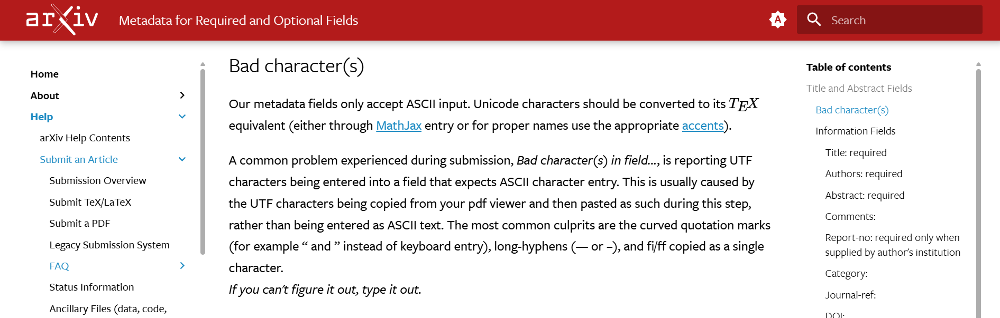
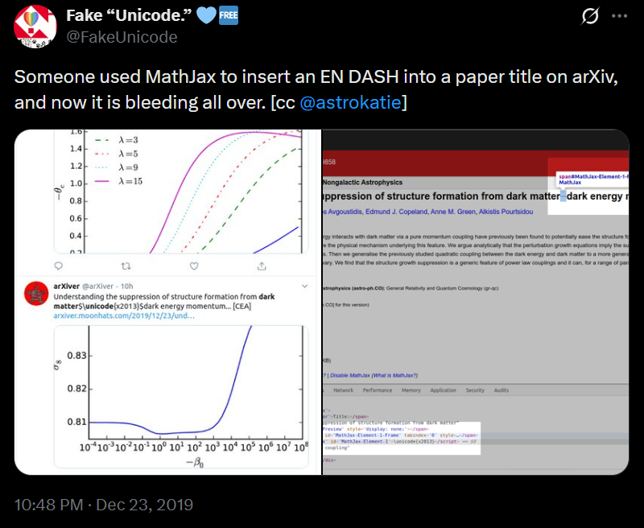
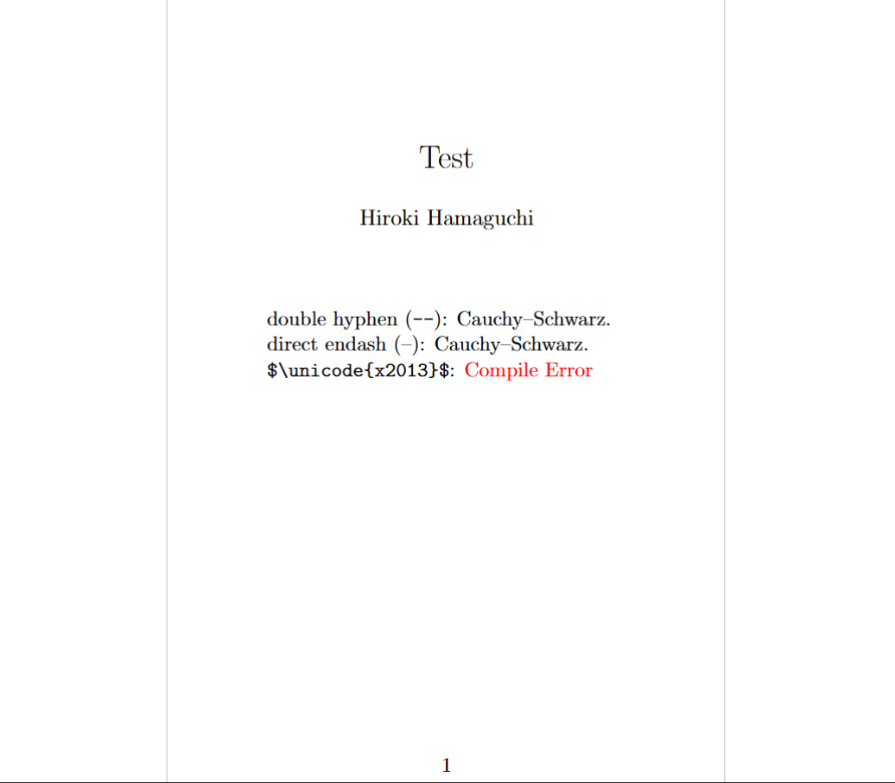
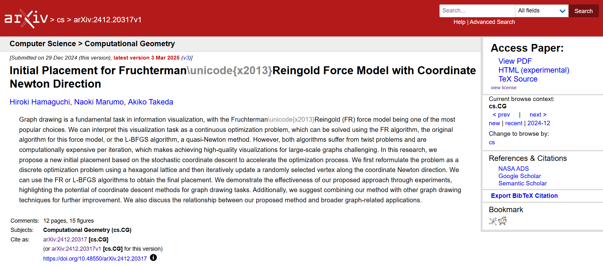

# arXivなどへ論文投稿をする際の、LaTeXに関する諸問題とその対処法

論文原稿を投稿する際に、私が詰まった問題などについて本記事ではまとめます。

本記事では、以下の諸問題を扱います:

<!-- no toc -->
* [orcidlinkのリンク不全](#orcidlinkコマンドがuplatexで反応しない問題)
* [arXivでのBibTeXエラー](#arxivに投稿する際のbibtexエラー)
* [arXivでのsubfile誤認識](#arxivでsubfileが認識されない問題)
* [arXivでのendash使用](#arxivでendashを使う際の注意点)

なお、特にarXivに投稿する際に問題点が生じて本記事をご参照なさっている場合、arXivの公式ページを参照することが一番確実な方法だと思いますので、以下にリンクを載せておきます。本記事はあくまでその補足程度の体験談としてご参照頂ければ幸いです。

https://info.arxiv.org/help/submit_tex.html

この記事は個人的な備忘録の側面が強く、困った問題が発生する度に更新する可能性があります。

## orcidlinkコマンドがupLaTeXで反応しない問題

arXivなどへ論文を投稿する際に、ORCIDを記載することが推奨されることがあります。特に、orcidlink packageは、ORCIDのアイコンとハイパーリンクを簡単に作成できる便利なパッケージで、近年は利用されている論文も増えているように思っています。

これに関して、特にupLaTeXを使っている場合、ORCIDのリンクが反応しないという問題が起きることがあります。この問題はarXivの投稿と直接の関係はありませんが、何も知らず投稿の際に初めて`\orcidlink`コマンドを使い始めると、その想定外の挙動に戸惑うことがあると思います。というより、私が戸惑いました。

これは主にarXiv以外に投稿する際や、localで論文をコンパイルする際に問題になり得る話ですので、この問題については別記事にてまとめました。ご興味のある方はそちらをご参照ください。

https://qiita.com/hari64/items/1ae14ff750f910275b29

## arXivに投稿する際のBibTeXエラー

続いて、arXivに投稿する際のBibTeXエラーについて述べます。

この問題については、一般にOverleafのsubmit機能を使うと良いことが知られています。この機能で出力されるbblファイルを含めて、arXivにアップロードすれば、通常は問題なく処理されるはずです。ローカルでも、同様にbblファイルを生成して、それを含めてアップロードすれば、同様に問題なく処理されるはずです。

しかし、完全にbblファイルやbibファイルがない状態でOverleaf上でコンパイルが通るとしても、次のようなエラーが出てくることがあります。


```txt
The scan did not detect a bibliography. Please include one.
Both bbl and bib files are missing
```

私の場合、これはsubfilesの内側で、次のようにif文付きのbibliographyコマンドを使っていたことが原因でした。

```tex
\ifSubfilesClassLoaded{
    \bibliography{myReferences.bib}
}{}
```

本来if文によって、これは完全に無視されるので、一切コンパイルには関与しないのですが、arXiv側のシステムがあまり賢くないようで、このようなエラーが出てしまうようです。これを手動で削除したら解決しました。

つまり、より抽象的に言えば、arXiv側のシステムの解析で、使用の可能性が疑われるbibファイルが少しでもあると、実際の使用不使用に関わらずエラーの出る可能性があり、それを削除するのが重要、というのが本節の結論となります。

## arXivでsubfileが認識されない問題

同様の話として、subfileが認識されない問題もあります。

先述のarXivの公式ページには、以下のような記述があります。

> You can submit a collection of TeX input/include files, e.g. separate chapters, foreword, appendix, etc, and custom macros (see below) packaged in a (possibly compressed) .tar or .zip file. Main files (or "Toplevel files") can be in the root or in a subdirectory, **but note that compilation is always done from the root of your submission directory, even if the main file is in a subdirectory**. This is important when you use \include or \input or any other command that includes data from external files.
>
> (TeXの入力ファイルやincludeファイル、例えば別々の章、前書き、付録などを、（必要に応じて圧縮された）.tarや.zipファイルにまとめて提出できます。メインファイル（または「トップレベルファイル」）はルートまたはいずれかのサブディレクトリに置くことができますが、**コンパイルは常に提出ディレクトリのルートから行われることに注意してください**。これは、\includeや\inputなどのコマンドを使用して外部ファイルからデータを含める場合に重要です。)

([arXiv公式ページ](https://info.arxiv.org/help/submit_tex.html)より。最終閲覧日: 2026年3月12日。翻訳、強調は筆者による。)

特に、手元の環境とコンパイルが行われるディレクトリが異なる場合に、相対パスが壊れ、特にトラブルが起きやすいと思います。一番簡単なのは、mainとなるtexファイルをフォルダーの中ではなく、ルート直下に配置することだと思います。そうすれば、殆どの環境で両者が一致し、トラブルが起きにくくなると思います。

## arXivでendashを使う際の注意点

最後に、arXivでendash(–)をtitleに使うときの注意点について述べます。

前提として、endash(–)は、主に2人以上の人名をつなげるときによく使われます。例えば高校数学でも扱われるコーシーシュワルツの不等式は、Wikipediaでは[Cauchy–Schwarz inequality](https://en.wikipedia.org/wiki/Cauchy%E2%80%93Schwarz_inequality)とendash(–)を用いて表記されています。LaTeXでは、通常`--`と書くとendash(–)になります。

しかし、arXivに投稿する際に、タイトルなどのmetadataで--と書くと、これendash(–)として処理されず、単なるダブルハイフン(--)のまま表示されてしまい、やや見栄えが悪くなります。また、arXivはmetadataとして、ASCII以外の文字は受け付けないので、endash(–)を直接書くことも出来ません。よって、**あくまで私の知る限りにおいて、このダブルハイフンを用いる手法が最善だと思います**。


(Our metadata fields only accept ASCII input. Unicode characters should be converted to its TeX equivalent)

一方で、endashをarXivのmetadataで`\unicode{x2013}`のように、Unicodeエスケープで指定する手法もあるようです。HTMLでは正しく処理されるので、一見良いように思えます。しかし、**この手法は全くおすすめ出来ません**。あえてリンクは載せませんが、2026年現在、arXivのmetadataでendashを使う際に、これを勧める記事がトップヒットしますが、**これはかなり危険な方法だと思います**。


(Unicodeによるendashの使用例に関するツイート)

具体的には、以下のかなり重大な欠点を抱えています:

* 参考文献としてbibtexで読み込んで使おうとすると、`\unicode{x2013}`が正しく処理されず、**エラーになり得ることがある**。
* ロードのタイミング(?)では正しく描画されず、代わりに`\unicode{x2013}`の文字列が**そのまま表示されることがある**。


(LaTeXでは、`\unicode{x2013}`は正しく処理されず、コンパイルエラーになる。)


(過去に投稿した私の論文。タイトルに`\unicode{x2013}`を使ってしまっている。その後、修正しました。)

よって、endashを使うときは、厳密な表記ではないという点から少し不満点は残りますが、普通に`--`と書くのが一番安全で確実な方法だと思います。

## 最後に

以上、いくつかの問題についてまとめました。

本記事は今後も更新する可能性があります。何か新しい情報が分かり次第、随時更新していきたいと思います。
