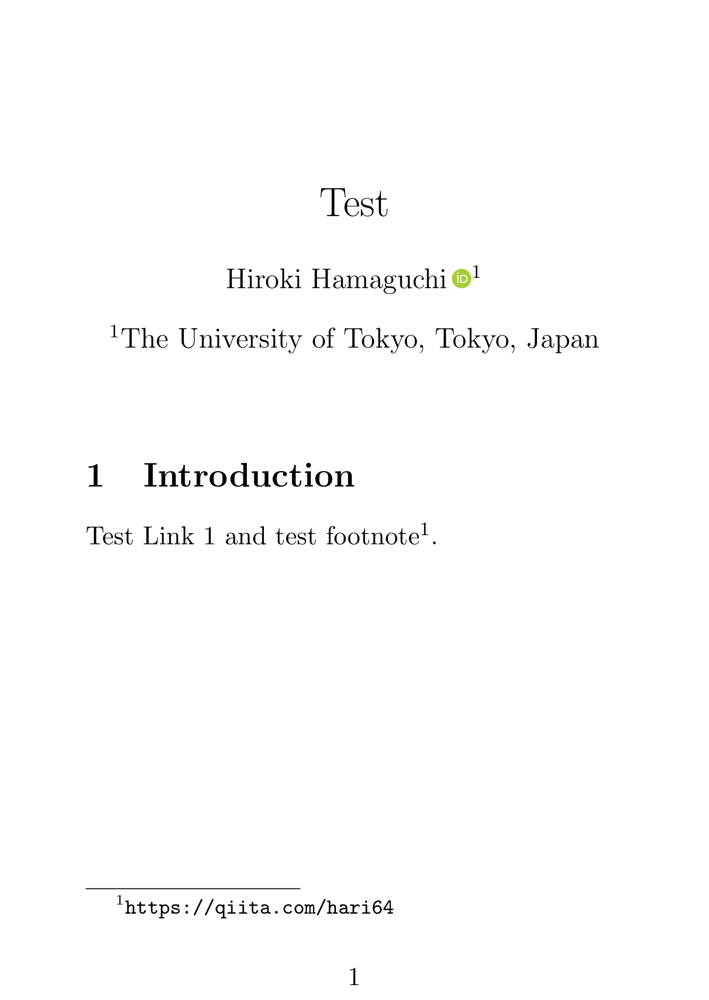
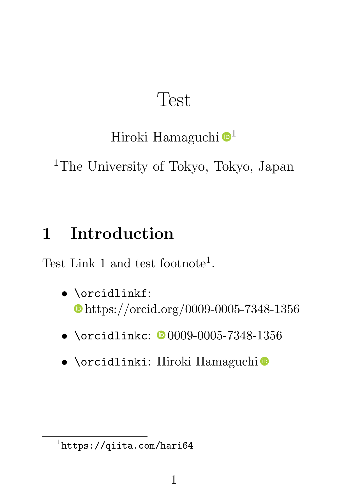
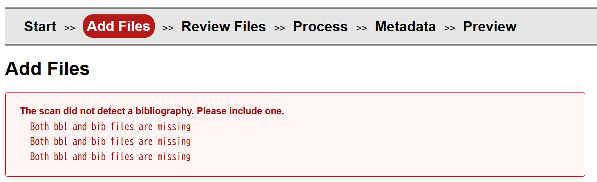

# orcidlinkコマンドがuplatexで反応しない問題とarXivに投稿する際のBibTeXエラーについて

論文原稿を投稿する際に詰まった問題などについてまとめておきます。

一部の問題は現在でも根本的な原因などが全く分からず、場当たり的な対処法だけを書いており大変恐縮です。
そのような記事を書くのは私としても非常に心苦しいのですが、しかし執筆現在において私の見つけ出せる範囲内にあまり情報がないため、やむを得ずこのような記事を書いています。

もし何かしら情報をお持ちの方がいらっしゃいましたら、是非ご教授頂けますと幸いです。

- [orcidlinkコマンドがuplatexで反応しない問題とarXivに投稿する際のBibTeXエラーについて](#orcidlinkコマンドがuplatexで反応しない問題とarxivに投稿する際のbibtexエラーについて)
  - [orcidlinkコマンドがuplatexで反応しない問題](#orcidlinkコマンドがuplatexで反応しない問題)
    - [動作例](#動作例)
    - [dvipdfmxオプションを付けない場合の警告](#dvipdfmxオプションを付けない場合の警告)
    - [dvipdfmxオプションを付けた場合の挙動についての考察](#dvipdfmxオプションを付けた場合の挙動についての考察)
    - [暫定的な解決策: pdflatexの使用またはorcidlinkiコマンドの使用](#暫定的な解決策-pdflatexの使用またはorcidlinkiコマンドの使用)
    - [余談: eprintコマンドもリンクが反応しない問題](#余談-eprintコマンドもリンクが反応しない問題)
  - [arXivに投稿する際のBibTeXエラー](#arxivに投稿する際のbibtexエラー)
  - [arXivでsubfileが認識されない問題](#arxivでsubfileが認識されない問題)
  - [arXivでendashを使う際の注意点](#arxivでendashを使う際の注意点)
  - [最後に](#最後に)


## orcidlinkコマンドがuplatexで反応しない問題

orcidlinkコマンドを使って、ORCIDのアイコンおよびハイパーリンクを作成した時、uplatex+dvipdfmxの環境だと、一見正常にコンパイルされているように見えますが、実は機能しない現象があります。本節ではその問題について述べます。

### 動作例

以下に動作例を載せます。



(`pdflatex` でコンパイルした場合。ORCIDアイコンは正しく描画され、全てのリンクが機能する。)


(`uplatex` でコンパイルし、かつ `documentclass` に `dvipdfmx` オプションを付けていない場合。ORCIDアイコン自体が描画されず、さらに節参照リンクや `\url` も含めて、`hyperref` 由来のリンクが全体的に壊れる。)


(`uplatex` でコンパイルし、かつ `documentclass` に `dvipdfmx` オプションを付けた場合。ORCIDアイコンは描画され、通常の `hyperref` のリンクも機能するが、ORCIDのリンクだけは反応しない。)

再現に使った最小コードを以下に載せます。本文の差分はほとんどなく、レシピ指定と `dvipdfmx` オプションの有無だけを変えています。

<details><summary>pdflatex</summary>

<!-- PROGRAM_INSERTION: test_pdflatex.tex -->

</details>

<details><summary>uplatex</summary>

<!-- PROGRAM_INSERTION: test_uplatex.tex -->

</details>

<details><summary>uplatex + dvipdfmx</summary>

<!-- PROGRAM_INSERTION: test_uplatex_dvipdfmx.tex -->

</details>

このように、特にuplatex+dvipdfmxの場合に、かなり気付きにくい形でorcidlinkは壊れることがあります。

### dvipdfmxオプションを付けない場合の警告

uplatexかつ、dvipdfmxオプションを付けない場合、VS Code上では警告が出ません。


しかし、以下のような警告文がOUTPUTのLaTeX Compilerのログに出ていることが分かります。

```txt
dvipdfmx:warning: Unknown token "SDict" dvipdfmx:warning: Interpreting PS code failed!!! Output might be broken!!! dvipdfmx:warning: Interpreting special command ps: (ps:) failed.
```

簡単にこの原因を説明すると、dvips 用 driverを使ってしまっていることが原因です。(詳細をここに記述、要確認!!!!!!!!!!!!!!!!!!!!!!!!!!!!!!!!!)

画像をLaTeXの中で描画する場合、dvipdfmxの指定がないとコンパイルに失敗することがあるので、その点ではこのミスは気が付きやすいです。

### dvipdfmxオプションを付けた場合の挙動についての考察

先述の通り、uplatex+dvipdfmxの環境では、ORCIDアイコンは描画され、通常の `hyperref` のリンクも機能するが、ORCIDのリンクだけは反応しないという現象が起きます。

[orcidlink package](https://ctan.org/pkg/orcidlink)の[GitHubにある実装](https://github.com/duetosymmetry/orcidlink-LaTeX-command/blob/master/orcidlink.sty)を見ると、内部でhyperrefコマンドを使っています。

以下がその実装の引用です。

<details><summary>orcidlink.styの実装</summary>

```tex
\NeedsTeXFormat{LaTeX2e}[1994/06/01]
\ProvidesPackage{orcidlink}
    [2024/06/26 v1.1.0 Support ORCID's three different ID formats.]

\RequirePackage{hyperref}
\RequirePackage{tikz}

\ProcessOptions\relax

\usetikzlibrary{svg.path}

\definecolor{orcidlogocol}{HTML}{A6CE39}
\tikzset{
  orcidlogo/.pic={
    \fill[orcidlogocol] svg{M256,128c0,70.7-57.3,128-128,128C57.3,256,0,198.7,0,128C0,57.3,57.3,0,128,0C198.7,0,256,57.3,256,128z};
    \fill[white] svg{M86.3,186.2H70.9V79.1h15.4v48.4V186.2z}
                 svg{M108.9,79.1h41.6c39.6,0,57,28.3,57,53.6c0,27.5-21.5,53.6-56.8,53.6h-41.8V79.1z M124.3,172.4h24.5c34.9,0,42.9-26.5,42.9-39.7c0-21.5-13.7-39.7-43.7-39.7h-23.7V172.4z}
                 svg{M88.7,56.8c0,5.5-4.5,10.1-10.1,10.1c-5.6,0-10.1-4.6-10.1-10.1c0-5.6,4.5-10.1,10.1-10.1C84.2,46.7,88.7,51.3,88.7,56.8z};
  }
}

%% Reciprocal of the height of the svg whose source is above.  The
%% original generates a 256pt high graphic; this macro holds 1/256.
\newcommand{\@OrigHeightRecip}{0.00390625}

%% We will compute the current X height to make the logo the right height
\newlength{\@curXheight}

%% Prevent externalization of the ORCiD logo.
\newcommand{\@preventExternalization}{%
\ifcsname tikz@library@external@loaded\endcsname%
\tikzset{external/export next=false}\else\fi%
}

\newcommand{\orcidlogo}{%
\texorpdfstring{%
\setlength{\@curXheight}{\fontcharht\font`X}%
\XeTeXLinkBox{%
\@preventExternalization%
\begin{tikzpicture}[yscale=-\@OrigHeightRecip*\@curXheight,
xscale=\@OrigHeightRecip*\@curXheight,transform shape]
\pic{orcidlogo};
\end{tikzpicture}%
}}{}}

\DeclareRobustCommand\orcidlinkX[3]{\href{https://orcid.org/#2}{%
\ifstrempty{#1}{}{#1\,}\orcidlogo\ifstrempty{#3}{}{\,#3}}}
\newcommand{\orcidlinkf}[1]{\orcidlinkX{}{#1}{https://orcid.org/#1}}
\newcommand{\orcidlinkc}[1]{\orcidlinkX{}{#1}{#1}}
\newcommand{\orcidlinki}[2]{\orcidlinkX{#1}{#2}{}}
\newcommand{\orcidlink}[1]{\orcidlinkX{}{#1}{}}

\endinput
```

</details>

ここから先は完全な推測ですが、恐らく画像に対するhyperrefがこの場合は上手く行かないのではないでしょうか。その根本的な原因や解決策は今のところ全く分かっていません。何かご存じの方がいらっしゃればお知らせ願いたいですし、もし私の方で何かしらの解決策を見つけたら、この記事を更新していきたいと思います。

### 暫定的な解決策: pdflatexの使用またはorcidlinkiコマンドの使用

この問題を回避するための暫定的な解決策は、pdflatexを使うことです。そもそも非日本語圏では昨今pdflatexが主流になっているようですので、その流れに乗っていれば大抵の問題は起きないと思います。

pdflatexでも例えばCJKパッケージを使うことで日本語入力は可能なので、代替案にはなり得ると思います。

また、uplatexを使う場合でも、先ほどのorcidlinkの実装にもあった\orcidlinkiなどを使うと、文字側にハイパーリンクを付けられるので、それで対処することも可能かもしれません。



<details><summary>orcidlinkiコマンドを使った例</summary>

<!-- PROGRAM_INSERTION: test_uplatex_dvipdfmx_orcidlinki.tex -->

</details>

### 余談: eprintコマンドもリンクが反応しない問題

eprintというコマンドも参考文献の中で使われることがありますが、これも同様にリンクが反応しないことがあり、また対応策が分かっていません。

SpringerのMathematical Programming Computationというジャーナルでは、以下のようにスタイルを指定することが求められており、特にspbasicがeprintコマンドを使用しています。

```tex
% BibTeX users please use one of
% \bibliographystyle{spbasic}      % basic style, author-year citations
\bibliographystyle{spmpsci}      % mathematics and physical sciences
%\bibliographystyle{spphys}       % APS-like style for physics
```

私はspbasicの使用はあきらめて、spmpsciを使うことにしました。これだとそもそもeprintコマンドが出てきません。

## arXivに投稿する際のBibTeXエラー

Overleafのsubmit機能を使うと良いことが知られています。
一般的には、この機能で出力されるbblファイルを含めて、arXivにアップロードすれば、問題なく処理されるはずです。

しかし、完全にbblファイルやbibファイルがない状態でOverleaf上でコンパイルが通るとしても、次のようなエラーが出てくることがあります。

<!-- ignore -->


```txt
The scan did not detect a bibliography. Please include one.
Both bbl and bib files are missing
```

私の場合、これはsubfilesの内側で、次のようにif文付きのbibliographyコマンドを使っていたことが原因でした。

```tex
\ifSubfilesClassLoaded{
    \bibliography{myReferences.bib}
}{}
```

本来if文によって、これは完全に無視されるので、一切コンパイルには関与しないのですが、arXiv側のシステムがあまり賢くないので、このようなエラーが出てしまうようです。

これを手動で削除したら解決しました。

## arXivでsubfileが認識されない問題

同様の話として、subfileが認識されない問題もあります。

これも原因はよく分かっていませんが、mainとなるtexファイルをフォルダーの中ではなく、ルート直下に配置したら治りました。相対パスの問題だと思われます。

## arXivでendashを使う際の注意点

## 最後に

以上、いくつかの問題についてまとめました。

本記事は今後も更新する可能性があります。何か新しい情報が分かり次第、随時更新していきたいと思います。
