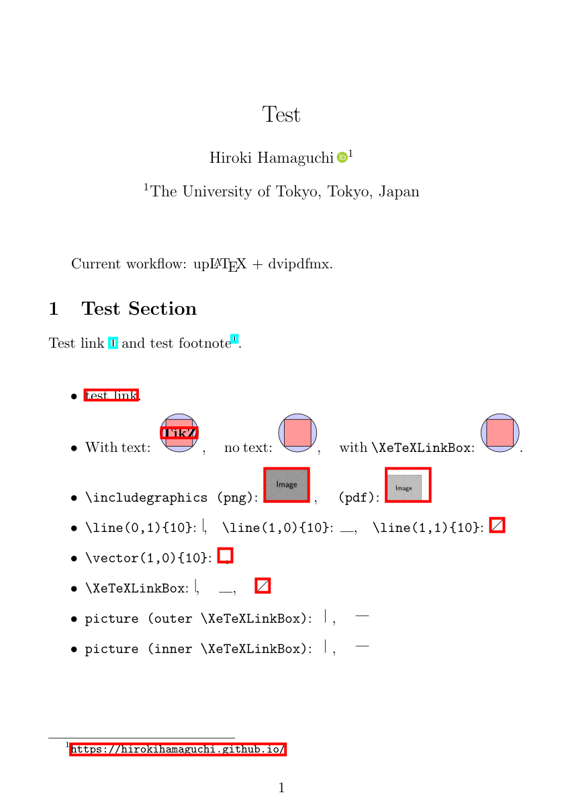
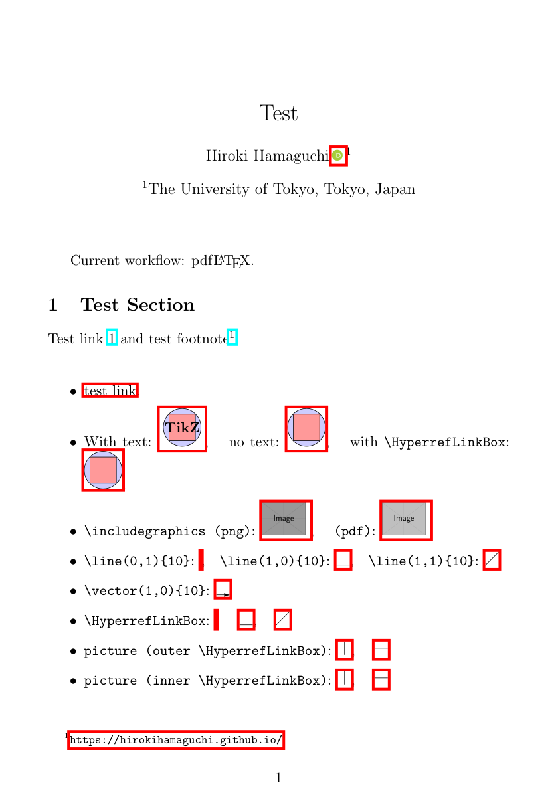
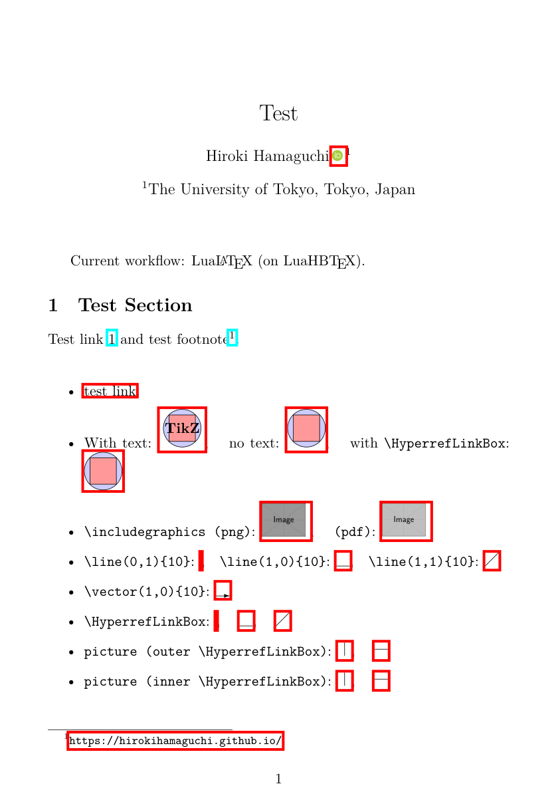
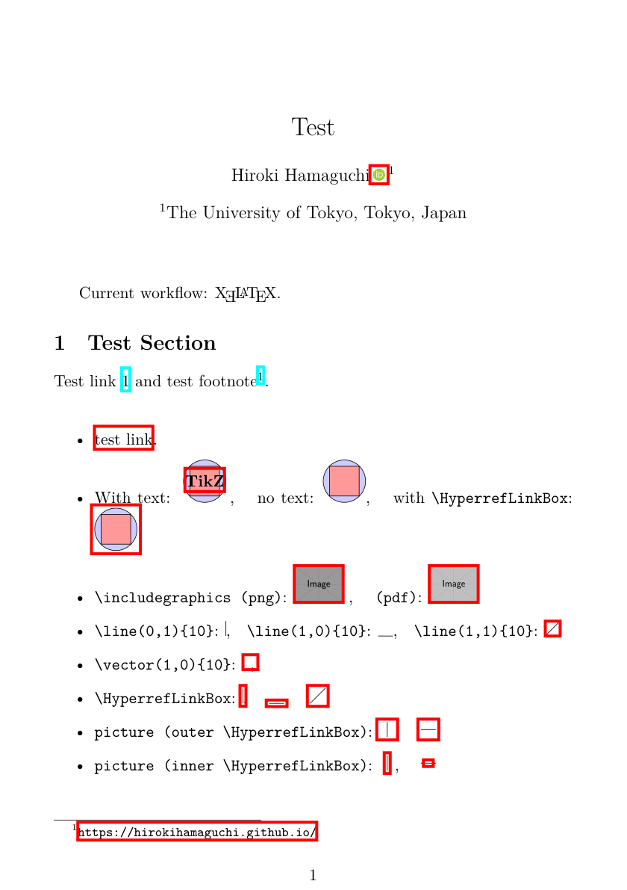
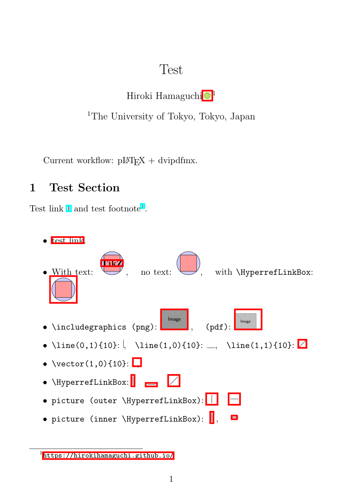

# TBD

For hyperref package developers.

Hello, I am Hiroki Hamaguchi from Japan, and I sincerely appreciate the efforts of the hyperref package developers.

I am making this Pull Request (PR) to fix and improve the situation about the `\XeTeXLinkBox` command.

## Summary

* `\XeTeXLinkBox`コマンドでは対応しきれていない、画像などに対するhyperlinkの生成に関する問題を修正したい
* このコマンドを一般向けに実装した新しいコマンド`\HyperrefLinkBox`を定義し、後方互換性を保ちつつ問題が修正できるようにした
* この変更は、orcidlink packageをはじめとする多くのユーザーに影響があると考えており、reviewをお願いしたい

## Background

始めに、今回のPRの背景について、私の認識している範囲で説明します。

### XeTexLinkBox Command

hyperrefには、`\XeTeXLinkBox`というコマンドが存在しており、これは以下のように説明されています。

> 7.7 \XeTeXLinkBoxWhen
> When XeTeX generates a link annotation, it does not look at the boxes (as the other drivers), but only at the character glyphs. If there are no glyphs (images, rules, ...), then it does not generate a link annotation. Macro \XeTeXLinkBox puts its argument in a box and adds spaces at the lower left and upper right corners. An additional margin can be specified by setting it to the dimen register \XeTeXLinkMargin. The default is 2pt.

(From [the hyperref manual](https://ctan.tikz.jp/macros/latex/contrib/hyperref/doc/hyperref-doc.html#x1-360007.7), v7.01p (2026-01-29))

このコマンドなどは、次の箇所で定義されています:

https://github.com/latex3/hyperref/blob/d2eb2fae09eee648f81659613a37e3e45566e479/hyperref.dtx#L7886

このコマンドの歴史的な経緯としては、XeTeXでコンパイルする際に、いくつかの対象にリンクが生成されないことから、その対処として使用されてきたものと思われます。dvipdfmxなどのバグと思われますが、未だ修正はされておらず、またhyperref側で比較的簡単に対処できることから、本PRを提出するに至りました。


(From [StackExchange](https://tex.stackexchange.com/questions/56802/hyperlinking-a-drawing), last visited 2026-03-14)

### Usage in orcidlink package

今回のPRの大きな動機の一つは、orcidlink packageでこのコマンドが使用されており、その影響が大きいと考えられることです。orcidlink packageは、ORCIDのアイコンとハイパーリンクを簡単に作成できる便利なパッケージです。


(From [CTAN](https://ctan.org/pkg/orcidlink), last visited 2026-03-14)

hyperref packageが内部で使われており、近年は特に使用者が多いことからも、重要な応用例の一つであると考えています。

後述する問題の修正には、当然orcidlink packageの修正も必要になり、私は今後そちらにもPRを送ることを考えていますが、先にhyperref packageの方で修正を行うことが必要であると考えています。

## Existing Problems

続いて、本節では、現在の問題点について説明します。

先ほど述べたリンクが生成されない問題は、XeTeX以外のドライバでコンパイルする際にも発生します。そして、`\XeTeXLinkBox`コマンドでは、XeTeX以外のドライバでコンパイルする際の問題に対応できていません。

恐らく、8年前からコミュニティでは認識されている問題ではないでしょうか?

https://github.com/latex3/hyperref/blame/d2eb2fae09eee648f81659613a37e3e45566e479/README.md#L127

また、こちらのissueでも、同様の議論がされているように思われます。

https://github.com/latex3/hyperref/issues/16

特に、pLaTeXでコンパイルする場合については、例えば以下の記事で言及があります。

https://tex.stackexchange.com/questions/559136/why-is-the-link-area-in-the-image-so-small

これらと同様の問題は、upLaTeXなど、dvipdfmx系だと発生します。以下に実行例を示します。Pythonによって、リンクが存在する部分には赤や青の枠で強調表示しています。pdflatexやlualatexなど、pdfTeX系のエンジンでコンパイルした場合は、リンクが生成されていることがわかります。一方で、dvipdfmx系のエンジンでコンパイルした場合は、画像に対するリンクが一部生成されていないことがわかります。全て最新のTeX Live 2026で確認しています。

特に、orcidlink packageによる、ORCIDアイコンへのリンクが生成されていないことが分かります。これは単なる重箱の隅をつつくような問題ではなく、実際に多くのユーザーが遭遇する可能性のある問題であると考えています。

Table: Raw engine outputs

| latexmk pdflatex | lualatex | pdflatex | xelatex | xelatex xdvipdfmx |
| :---: | :---: | :---: | :---: | :---: |
|  |  |  |  |  |

Table: DVI-to-PDF workflow outputs

| platex dvipdfmx | ptex2pdf platex | ptex2pdf uplatex | uplatex dvipdfmx |
| :---: | :---: | :---: | :---: |
|  |  |  |  |

この結果の詳細な生成方法やpdfの本体は、[私のGitHubリポジトリ](https://github.com/HirokiHamaguchi/QiitaArticles/tree/main/20260313_orcidlink)で確認できます。`pdf2png.py`というPythonスクリプトを実行すると、全ての結果が生成されます。

この結果から、確かにdvipdfmxなどでコンパイルした場合は、\XeTeXLinkBoxコマンドだけでは、対応できていない例があることがわかります。

### Potential Bugs

続いて、`\XeTeXLinkBox`コマンドの実装に由来する、潜在的なバグについて説明します。

`\XeTeXLinkBox`コマンドは空白を追加することでリンク領域を生成しているとdocumentedされていますが、この空白は1spの空白を追加することで達成されています。sp means "scaled point", and it satisfies 1sp = 1/65536 pt. しかし、この1spの空白というのが、XeTeX以外のドライバでは問題を起こし、修正の妨げになっていました。具体的には、単純な修正を実装すると、以下のようなエラーが発生していました。

```tex
pdfTeX error (arithmetic): divided by zero.
<argument> ...shipout:D \box_use:N \l_shipout_box \__shipout_drop_firstpage_...
```

また、GitHub上で、`\XeTeXLinkBox`に関するissueとして、この1spの空白に由来する問題が指摘されているものもあります。

https://github.com/progit-ja/progit/issues/8

https://github.com/Zettlr/Zettlr/issues/209

```tex
! Font \XeTeXLink@font=pzdr at 0.00002pt not loadable:
Metric (TFM) file or installed font not found.
```

## Proposed Solution

以上の前提と問題点を基に、以下のような解決策を提案します。

* `\XeTeXLinkBox`コマンドと似た機能を有する`\HyperrefLinkBox`コマンドをXeTeX以外にも定義する
* `\XeTeXLinkBox`の実装とは違い、1spの空白ではなく、1ptの空白を追加することで、リンク領域を生成するようにする

詳細は、PRのコードをご覧ください。

## Compiled Results

実際に、この変更を実装して、コンパイルした結果を以下に示します。orcidlink packageでも、この変更を前提として軽微な修正を加えています。
具体的には、以下のように変更をしています。

```diff
+ \newcommand{\@OrcidLinkBox}[1]{%
+ \ifcsname HyperrefLinkBox\endcsname%
+ \HyperrefLinkBox{#1}%
+ \else%
+ \XeTeXLinkBox{#1}%
+ \fi%
+ }

\newcommand{\orcidlogo}{%
\texorpdfstring{%
\setlength{\@curXheight}{\fontcharht\font`X}%
- \XeTexLinkBox{%
+ \@OrcidLinkBox{%
\@preventExternalization%
\begin{tikzpicture}[yscale=-\@OrigHeightRecip*\@curXheight,
xscale=\@OrigHeightRecip*\@curXheight,transform shape]
\pic{orcidlogo};
\end{tikzpicture}%
}}{}}
```

[Existing Problems](#existing-problems)のセクションで示したのと殆ど同様の方法で、コンパイルをしました。ただし、`\XeTeXLinkBox`コマンドを`\HyperrefLinkBox`コマンドに置き換えています。

実際に、先ほどは生成されていなかったリンクが生成されていることがわかります。

Table: Raw engine outputs

| latexmk pdflatex succeeded | lualatex succeeded | pdflatex succeeded | xelatex succeeded | xelatex xdvipdfmx succeeded |
| :---: | :---: | :---: | :---: | :---: |
|  |  |  |  |  |

Table: DVI-to-PDF workflow outputs

| platex dvipdfmx succeeded | ptex2pdf platex succeeded | ptex2pdf uplatex succeeded | uplatex dvipdfmx succeeded |
| :---: | :---: | :---: | :---: |
|  |  |  |  |

## 影響範囲の調査と今後の展望

### 影響範囲の調査

意図しない影響を避けるために、このコマンドなどの使用状況などは軽く調べました。

以下のissueの存在は認識しており、今回の変更は、こちらのissueでも述べられている考えと合致する、普遍性のある変更だと考えています。

https://github.com/latex3/hyperref/issues/240

また、後方互換性の観点から、`\XeTeXLinkBox`コマンドの定義を変更することは避けました。例えば以下のサイトなどで、`\XeTeXLinkMargin`に言及があるようです。

https://tex.stackexchange.com/questions/577314/xelatex-hyperref-bounding-box

ただ、個人的には、`\XeTeXLinkBox`コマンドは、`\HyperrefLinkBox`コマンドを使って実装することも可能で、可読性はこちらの方が高いと考えています。もし、後者の方が好ましいということであれば、変更することも可能です。

なお、`\HyperrefLinkBox`コマンドという命名は、マクロとして変数名の衝突を避けるために、あえてHyperrefという名前を入れていますが、もし、より適切な命名があれば、そちらに変更することも可能です。この名前は、少なくともGoogle検索の完全一致検索において、衝突がないことは確認しています。

### 今後の展望

まず、maintainerの方々に、このPRが必要かどうかをご判断いただきたいです。もし何かしら別の方法での実装を考えていた場合には、このPRは取り下げます。

また、このPRがmaintainerの方々にとって有益であると判断された場合には、**このPRは次の点で完全ではなく、議論をしたいです**。
なお、**必要であれば、適切な指示さえいただければ、これらの変更は私の側で実装することも可能です**。

1. 先述のように、どのように`\XeTeXLinkBox`を実装すべきか、また、`\HyperrefLinkBox`の実装がこれでよいのかを議論したいです。
2. hyperref.dtxにおけるコメント部分はどのように記すべきか? (例えば、現在のこのファイルには、`% \subsection{Link box support for XeTeX}`などの記載があるが、これがどこで使用されているか検索しても分かりませんでした。適当に推測して現在はPRを書いていますが、正しい方法があれば教えていただきたいです。)
3. doc/hyperref-doc.texへの変更の追記 (\subsection{\textbackslash XeTeXLinkBox}の後に同様の説明と例を追加する必要があると思います)
4. testの追加 (testがどう実行されているかどうかも、あまりよく分かりませんでした。また、他のdriverでのテストも必要かもしれません。)
5. Changelog.txtへの変更の追記 (これは適当に書けば良さそうです)

## まとめ

お手数をおかけしますが、reviewのほど、どうぞよろしくお願いいたします。
