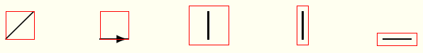

# adding

For hyperref package developers.

Hello, I am Hiroki Hamaguchi from Japan, and I sincerely appreciate the efforts of the hyperref package developers.

I am making this Pull Request to fix and improve the situation about the `\XeTeXLinkBox` command, which is used in the orcidlink package.

## Background

始めに、今回のPRの背景について説明します。

### XeTexLinkBox command

hyperrefには、\XeTeXLinkBoxというコマンドが存在しており、これは以下のように説明されています。

> 7.7 \XeTeXLinkBoxWhen
> When XeTeX generates a link annotation, it does not look at the boxes (as the other drivers), but only at the character glyphs. If there are no glyphs (images, rules, ...), then it does not generate a link annotation. Macro \XeTeXLinkBox puts its argument in a box and adds spaces at the lower left and upper right corners. An additional margin can be specified by setting it to the dimen register \XeTeXLinkMargin. The default is 2pt.
(From [the hyperref manual](https://ctan.tikz.jp/macros/latex/contrib/hyperref/doc/hyperref-doc.html#x1-360007.7), v7.01p (2026-01-29))

このコマンドなどは、次の箇所で定義されています:

https://github.com/latex3/hyperref/blob/d2eb2fae09eee648f81659613a37e3e45566e479/hyperref.dtx#L7886

XeTeXでコンパイルする際に、いくつかの対象にリンクが生成されないことから、この\XeTeXLinkBoxコマンドが定義および使用されてきたものと思われます。

(From [StackExchange](https://tex.stackexchange.com/questions/56802/hyperlinking-a-drawing), last visited 2026-03-14)

### orcidlink package

orcidlink packageは、ORCIDのアイコンとハイパーリンクを簡単に作成できる便利なパッケージです。

(From [CTAN](https://ctan.org/pkg/orcidlink), last visited 2026-03-14)

hyperref packageが内部で使われており、近年は特に使用者が多いことからも、重要な応用例の一つであると考えています。

## Existing problems

続いて、本節では、現在の問題点について説明します。

実は、先ほど述べたリンクが生成されない問題は、XeTeX以外のドライバでコンパイルする際にも発生します。

特に、pLaTeXでコンパイルする場合については、例えば以下の記事で言及があります。

https://tex.stackexchange.com/questions/559136/why-is-the-link-area-in-the-image-so-small

同様の問題は、upLaTeXでも発生します。以下に実行例を示します。

% 1sp = 1/65536 pt

## Proposed solution

%  pdfTeX error (arithmetic): divided by zero.
% <argument> ...shipout:D \box_use:N \l_shipout_box
%                                                   \__shipout_drop_firstpage_...

## Compiled Results

## 影響範囲の調査

2026年3月13日時点で、`\XeTeXLinkBox`および`\XeTeXLinkMargin`コマンドは、GitHub上で以下の4つのissuesで言及されています。

https://github.com/search?q=xetexlink&type=issues

うち、2つのissuesは、

https://github.com/progit-ja/progit/issues/8

また、こちらのissueはこのhyperrefレポジトリでのissueで、XeTeX以外のエンジンでも定義しておくことで、テストの必要性がないことを指摘しています。

https://github.com/latex3/hyperref/issues/240

https://tex.stackexchange.com/questions/577314/xelatex-hyperref-bounding-box

## まとめ

お手数をおかけしますが、reviewのほど、どうぞよろしくお願いいたします。
