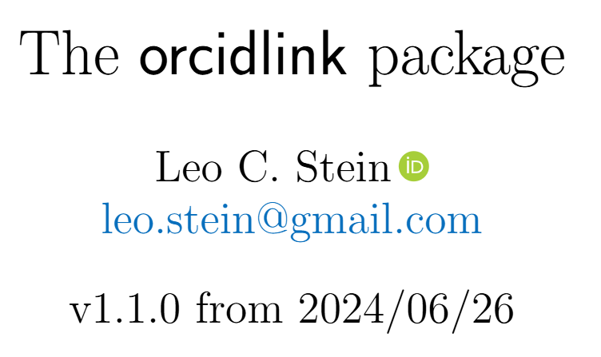
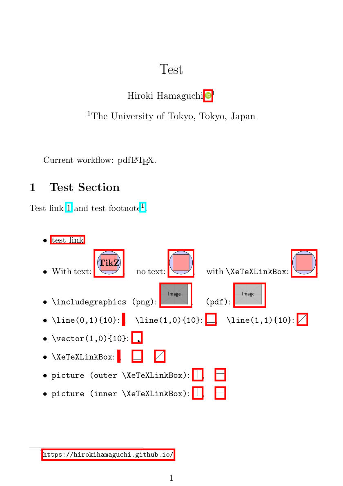
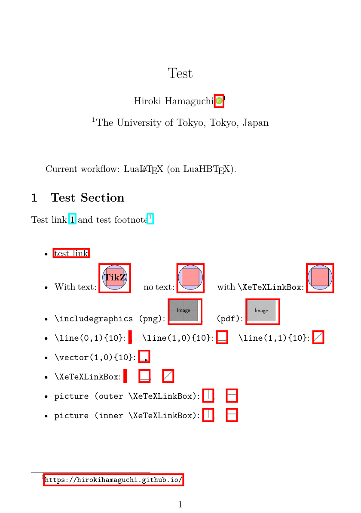
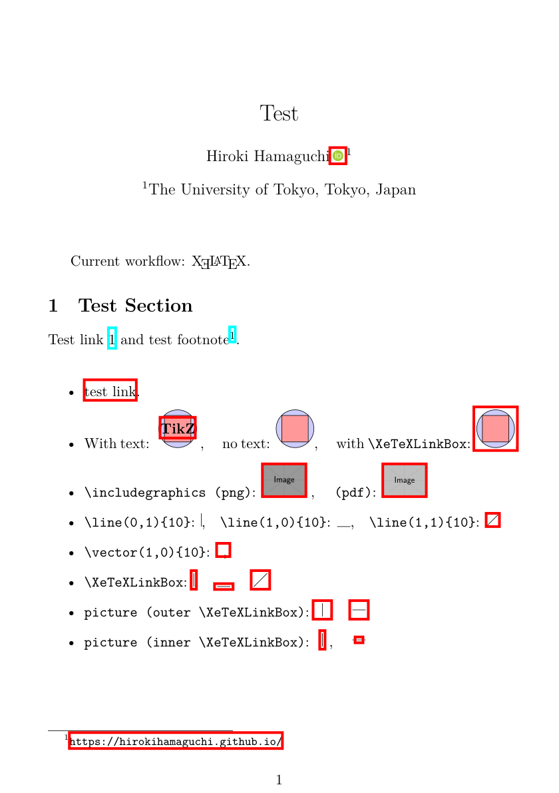

# adding

For hyperref package developers.

Hello, I am Hiroki Hamaguchi from Japan, and I sincerely appreciate the efforts of the hyperref package developers.

I am making this Pull Request to fix and improve the situation about the `\XeTeXLinkBox` command.

## Summary

* `\XeTeXLinkBox`コマンドでは対応しきれていない、画像などに対するhyperlinkの生成に関する問題を修正したい
* このコマンドを抽象化したような新しいコマンドを定義し、後方互換性を保ちつつ問題が修正できるようにした
* この変更は、orcidlink packageをはじめとする多くのユーザーに影響があると考えており、reviewをお願いしたい

## Background

始めに、今回のPRの背景について、私の認識している範囲で説明します。

### XeTexLinkBox Command

hyperrefには、\XeTeXLinkBoxというコマンドが存在しており、これは以下のように説明されています。

> 7.7 \XeTeXLinkBoxWhen
> When XeTeX generates a link annotation, it does not look at the boxes (as the other drivers), but only at the character glyphs. If there are no glyphs (images, rules, ...), then it does not generate a link annotation. Macro \XeTeXLinkBox puts its argument in a box and adds spaces at the lower left and upper right corners. An additional margin can be specified by setting it to the dimen register \XeTeXLinkMargin. The default is 2pt.

(From [the hyperref manual](https://ctan.tikz.jp/macros/latex/contrib/hyperref/doc/hyperref-doc.html#x1-360007.7), v7.01p (2026-01-29))

このコマンドなどは、次の箇所で定義されています:

https://github.com/latex3/hyperref/blob/d2eb2fae09eee648f81659613a37e3e45566e479/hyperref.dtx#L7886

XeTeXでコンパイルする際に、いくつかの対象にリンクが生成されないことから、この\XeTeXLinkBoxコマンドが定義および使用されてきたものと思われます。


(From [StackExchange](https://tex.stackexchange.com/questions/56802/hyperlinking-a-drawing), last visited 2026-03-14)

### Usage in orcidlink package

orcidlink packageは、ORCIDのアイコンとハイパーリンクを簡単に作成できる便利なパッケージです。



(From [CTAN](https://ctan.org/pkg/orcidlink), last visited 2026-03-14)

hyperref packageが内部で使われており、近年は特に使用者が多いことからも、重要な応用例の一つであると考えています。

## Existing Problems

続いて、本節では、現在の問題点について説明します。

先ほど述べたリンクが生成されない問題は、XeTeX以外のドライバでコンパイルする際にも発生します。そして、`\XeTeXLinkBox`コマンドでは、XeTeX以外のドライバでコンパイルする際の問題に対応できていません。

恐らく、8年前からコミュニティでは認識されている問題ではないでしょうか?

https://github.com/latex3/hyperref/blame/d2eb2fae09eee648f81659613a37e3e45566e479/README.md#L127

また、こちらのissueでも、同様の議論がされているように思われます。

https://github.com/latex3/hyperref/issues/16

特に、pLaTeXでコンパイルする場合については、例えば以下の記事で言及があります。

https://tex.stackexchange.com/questions/559136/why-is-the-link-area-in-the-image-so-small

同様の問題は、upLaTeXなど、dvipdfmx系だと発生します。以下に実行例を示します。Pythonによって、リンクが存在する部分には赤や青の枠で強調表示しています。pdflatexやlualatexなど、pdfTeX系のエンジンでコンパイルした場合は、リンクが生成されていることがわかります。一方で、dvipdfmx系のエンジンでコンパイルした場合は、orcidlinkを含む画像に対するリンクが一部生成されていないことがわかります。全て最新のTeX Live 2026で確認しています。

Table: Raw engine outputs

| latexmk pdflatex | lualatex | pdflatex | xelatex | xelatex xdvipdfmx |
| :---: | :---: | :---: | :---: | :---: |
|  |  |  |  |  |

Table: DVI-to-PDF workflow outputs

| platex dvipdfmx | ptex2pdf platex | ptex2pdf uplatex | uplatex dvipdfmx |
| :---: | :---: | :---: | :---: |
|  |  |  |  |

この結果の詳細な生成方法は、[私のGitHubリポジトリ](https://github.com/HirokiHamaguchi/QiitaArticles/tree/main/20260313_orcidlink)で確認できます。この結果から、確かにdvipdfmxなどでコンパイルした場合は、\XeTeXLinkBoxコマンドだけでは、対応できていない例があることがわかります。

### Potential Bugs

また、\XeTeXLinkBoxコマンドは空白を追加することでリンク領域を生成しているとdocumentedされていますが、この空白は1spの空白を追加することで達成されています。sp means "scaled point", and it satisfies 1sp = 1/65536 pt. しかし、この1spの空白というのが、XeTeX以外のドライバでは問題を起こし、修正の妨げになっていました。具体的には、単純な修正を実装すると、以下のようなエラーが発生していました。

```tex
pdfTeX error (arithmetic): divided by zero.
<argument> ...shipout:D \box_use:N \l_shipout_box \__shipout_drop_firstpage_...
```

また、GitHub上で、`\XeTeXLinkBox`に関するissueとして、この1spの空白に由来する問題が指摘されているものもあります。

https://github.com/progit-ja/progit/issues/8

https://github.com/Zettlr/Zettlr/issues/209

```tex
! Font \XeTeXLink@font=pzdr at 0.00002pt not loadable:
Metric (TFM) file or installed font not found.
```

## Proposed Solution

以上の前提と問題点を基に、以下のような解決策を提案します。

* `\XeTeXLinkBox`コマンドを抽象化した`\MakeLinkBox`コマンドを定義する
* `\MakeLinkBox`コマンドは、引数として、リンク領域を生成するための空白の量を受け取るようにする

## Compiled Results

実際に、この変更を実装して、コンパイルした結果を以下に示します。orcidlink packageでも、この変更を前提として軽微な修正を加えています。実際に、先ほどは生成されていなかったリンクが生成されていることがわかります。

## 影響範囲の調査

今回の変更は、こちらのissueでも述べられている考えと合致する、普遍性のある変更だと考えています。

https://github.com/latex3/hyperref/issues/240

また、後方互換性の観点から、`\XeTeXLinkBox`コマンドの定義を変更することは避けるべきだと考えています。例えば以下のサイトなどで、`\XeTeXLinkMargin`に言及があるようです。

https://tex.stackexchange.com/questions/577314/xelatex-hyperref-bounding-box

## まとめ

お手数をおかけしますが、reviewのほど、どうぞよろしくお願いいたします。
