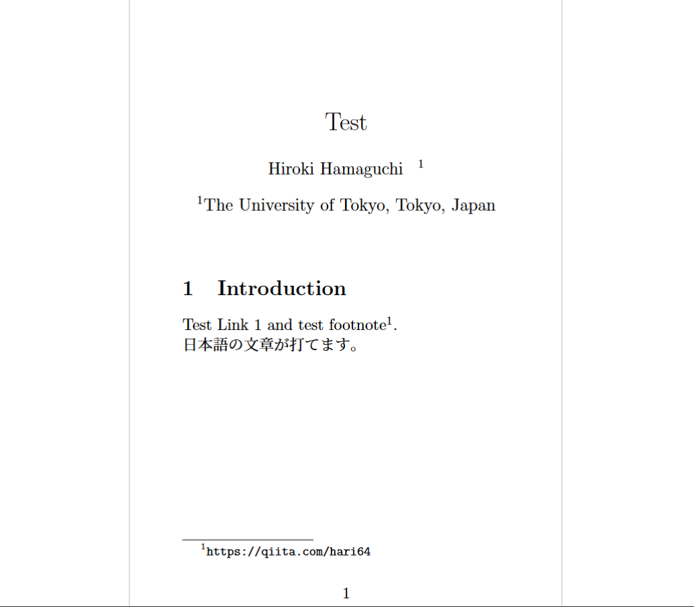
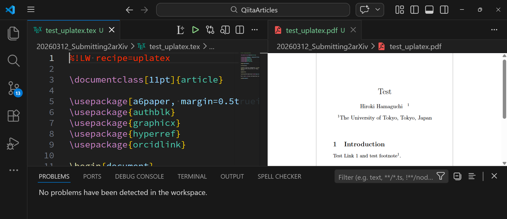
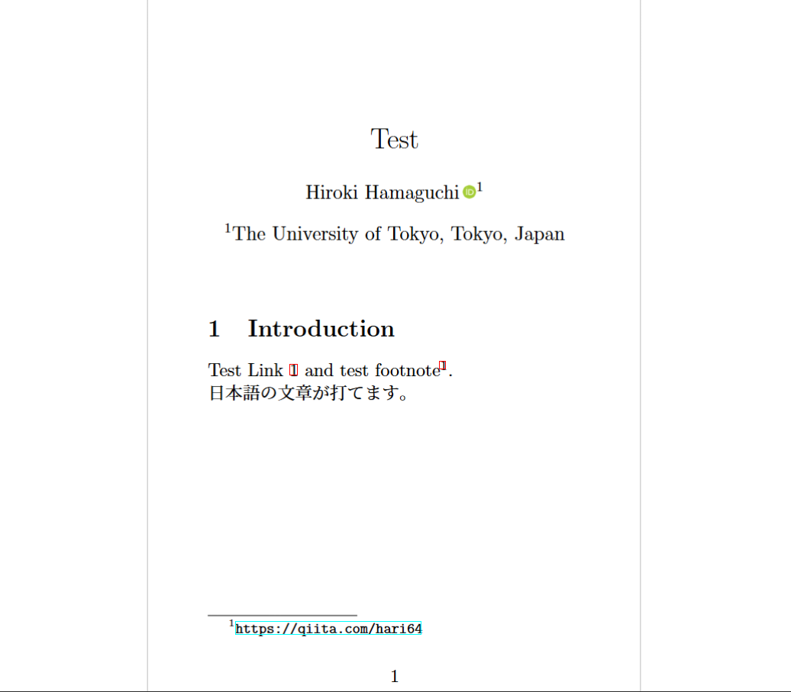
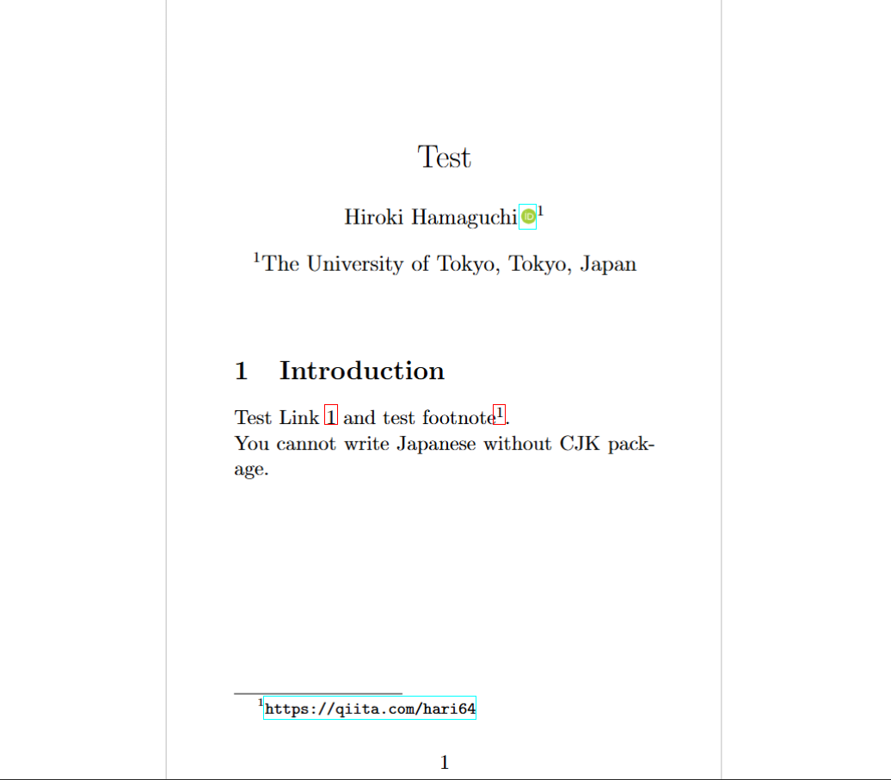
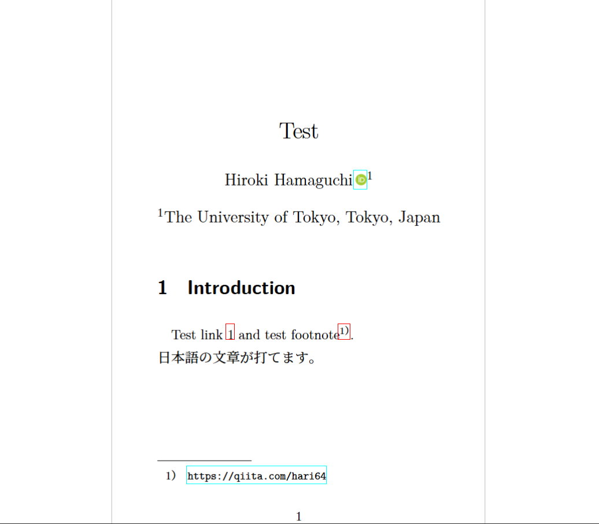

# orcidlinkがuplatexでリンク不全になる問題とその対処法

`\orcidlink`コマンドを使って、ORCIDのアイコンおよびハイパーリンクを作成した時、upLaTeX+dvipdfmxの環境だと、一見正常にコンパイルされているように見えますが、実は機能しない現象があります。本記事ではその問題について述べます。

## 背景

ORCIDは研究者の識別子の一つで、論文などにORCIDを記載することが推奨されることがあります。例えばarXivもアカウントとORCIDの連携を推奨しています。

> ORCID® iDs are unique researcher identifiers designed to provide a transparent method for linking researchers and contributors to their activities and outputs. (…… 中略 ……) It will help with the ongoing challenge of distinguishing your research activities from those of others with similar names.
> We encourage all arXiv authors to link their ORCID iD with arXiv.
>
> (ORCID® iDは、研究者や貢献者をその活動や成果に透明な方法で結びつけるために設計された一意の識別子です。(…… 中略 ……)名前が似ている他の人の研究活動と区別するという継続的な課題に役立ちます。我々はすべてのarXiv著者がORCID iDをarXivにリンクすることを奨励します。)

([arXiv公式ページ](https://info.arxiv.org/help/orcid.html)より。最終閲覧日: 2026年3月12日。翻訳、抜粋は筆者による。)

特に、orcidlink packageは、ORCIDのアイコンとハイパーリンクを簡単に作成できる便利なパッケージで、近年は利用されている論文も増えているように思っています。

https://ctan.org/pkg/orcidlink


## 動作例

このorcidlink packageは、環境によって不完全な動作をします。以下に動作例を載せます。TeX Live 2025を使用しています。

### upLaTeX

upLaTeXは、一昔前の日本語LaTeXにおける主流エンジンの一つで、現在も日本語を扱う際に使われることがあります。本来、dvipdfmxと組み合わせて使うことが推奨されているようですが、誤ってdvipdfmxオプションを付けずにコンパイルしてしまうと、以下のような現象が起きます。

https://ctan.org/pkg/uplatex



(`uplatex` でコンパイルし、かつ `documentclass` に `dvipdfmx` オプションを付けていない場合。ORCIDアイコン自体が描画されず、さらに節参照リンクや `\url` も含めて、`hyperref` 由来のリンクが全体的に壊れる。)

<details><summary>upLaTeXのコード</summary>

<!-- PROGRAM_INSERTION: test_uplatex.tex -->

</details>

この場合でも、リンクに枠線などを出していないと、一見正常にコンパイルされているように見えるため、やや気が付きにくいです。特に、VS Code上では警告が出ないことがあります。



ただし、以下のような警告文がOUTPUTのLaTeX Compilerのログに出ていることが分かります。これが何故VS CodeのPROBLEMSタブに出ないかは不明です。

```txt
dvipdfmx:warning: Unknown token "SDict"
dvipdfmx:warning: Interpreting PS code failed!!! Output might be broken!!!
dvipdfmx:warning: Interpreting special command ps: (ps:) failed.
```

簡単にこの原因を説明すると、driverの不一致が原因でこのような警告が出ています。尤も、pdfなどの画像を含めていると、明示的にエラーが出るという点では、やや気が付きやすいです。

### upLaTeX + dvipdfmx

正しくdvipdfmxオプションを付けてコンパイルした場合、以下のような現象が起きます。

https://ctan.org/pkg/dvipdfmx



(`uplatex` でコンパイルし、かつ `documentclass` に `dvipdfmx` オプションを付けた場合。ORCIDアイコンは描画され、通常の `hyperref` のリンクも機能するが、**ORCIDのリンクだけは反応しない**。)

<details><summary>upLaTeX + dvipdfmxのコード</summary>

<!-- PROGRAM_INSERTION: test_uplatex_dvipdfmx.tex -->

</details>

画像の通り、upLaTeX+dvipdfmxの環境では、ORCIDアイコンは描画され、通常の `hyperref` のリンクも機能しますが、`\orcidlink`のリンクだけは反応しないという現象が起きます。このように、特にupLaTeX+dvipdfmxの場合に、**かなり気付きにくい形でorcidlinkは壊れることがあります**。また、先ほどと同様、VS Code上では警告が出ないことがあります。

### pdfLaTeX

pdfLaTeXは、PDFを直接出力するLaTeXのエンジンの一つで、特に非日本語圏では主流になっているとの言説もみかけます。デフォルトでは日本語を扱うことは出来ませんが、`\orcidlink`コマンドは正常に機能します。

https://ctan.org/pkg/pdftex?lang=en



(`pdflatex` でコンパイルした場合。ORCIDアイコンは正しく描画され、全てのリンクが機能する。)

<details><summary>pdfLaTeXのコード</summary>

<!-- PROGRAM_INSERTION: test_pdflatex.tex -->

</details>

### luaLaTeX

luaLaTeXは、Luaというプログラミング言語を組み込んだLaTeXのエンジンの一つで、近年は特に日本語を扱う際に使われることが増えてきています。こちらも`\orcidlink`コマンドは正常に機能します。

https://www.luatex.org/



(`lualatex` でコンパイルした場合。ORCIDアイコンは正しく描画され、全てのリンクが機能する。)

<details><summary>luaLaTeXのコード</summary>

<!-- PROGRAM_INSERTION: test_lualatex.tex -->

</details>

## 原因の考察

upLaTeX+dvipdfmxの環境で、何故`\orcidlink`のリンクだけが反応しないのか、以下に考察を述べます。

[orcidlink package](https://ctan.org/pkg/orcidlink)の[GitHubにある実装](https://github.com/duetosymmetry/orcidlink-LaTeX-command/blob/master/orcidlink.sty)を見ると、内部でhyperrefコマンドを使っています。以下がその実装の引用です。

<details><summary>orcidlink.styの実装</summary>

```tex
\NeedsTeXFormat{LaTeX2e}[1994/06/01]
\ProvidesPackage{orcidlink}
    [2024/06/26 v1.1.0 Support ORCID's three different ID formats.]

\RequirePackage{hyperref}
\RequirePackage{tikz}

\ProcessOptions\relax

\usetikzlibrary{svg.path}

\definecolor{orcidlogocol}{HTML}{A6CE39}
\tikzset{
  orcidlogo/.pic={
    \fill[orcidlogocol] svg{M256,128c0,70.7-57.3,128-128,128C57.3,256,0,198.7,0,128C0,57.3,57.3,0,128,0C198.7,0,256,57.3,256,128z};
    \fill[white] svg{M86.3,186.2H70.9V79.1h15.4v48.4V186.2z}
                 svg{M108.9,79.1h41.6c39.6,0,57,28.3,57,53.6c0,27.5-21.5,53.6-56.8,53.6h-41.8V79.1z M124.3,172.4h24.5c34.9,0,42.9-26.5,42.9-39.7c0-21.5-13.7-39.7-43.7-39.7h-23.7V172.4z}
                 svg{M88.7,56.8c0,5.5-4.5,10.1-10.1,10.1c-5.6,0-10.1-4.6-10.1-10.1c0-5.6,4.5-10.1,10.1-10.1C84.2,46.7,88.7,51.3,88.7,56.8z};
  }
}

%% Reciprocal of the height of the svg whose source is above.  The
%% original generates a 256pt high graphic; this macro holds 1/256.
\newcommand{\@OrigHeightRecip}{0.00390625}

%% We will compute the current X height to make the logo the right height
\newlength{\@curXheight}

%% Prevent externalization of the ORCiD logo.
\newcommand{\@preventExternalization}{%
\ifcsname tikz@library@external@loaded\endcsname%
\tikzset{external/export next=false}\else\fi%
}

\newcommand{\orcidlogo}{%
\texorpdfstring{%
\setlength{\@curXheight}{\fontcharht\font`X}%
\XeTeXLinkBox{%
\@preventExternalization%
\begin{tikzpicture}[yscale=-\@OrigHeightRecip*\@curXheight,
xscale=\@OrigHeightRecip*\@curXheight,transform shape]
\pic{orcidlogo};
\end{tikzpicture}%
}}{}}

\DeclareRobustCommand\orcidlinkX[3]{\href{https://orcid.org/#2}{%
\ifstrempty{#1}{}{#1\,}\orcidlogo\ifstrempty{#3}{}{\,#3}}}
\newcommand{\orcidlinkf}[1]{\orcidlinkX{}{#1}{https://orcid.org/#1}}
\newcommand{\orcidlinkc}[1]{\orcidlinkX{}{#1}{#1}}
\newcommand{\orcidlinki}[2]{\orcidlinkX{#1}{#2}{}}
\newcommand{\orcidlink}[1]{\orcidlinkX{}{#1}{}}

\endinput
```

</details>

具体的には、`TikZ`で描画したものに対して、`hyperref`の`\href`コマンドでリンクを付けている形になっています。XeLaTeXを使う場合に関しては、このような場合に対する不具合は古くから知られているようで、実際、上の実装では`\XeTeXLinkBox`を使うことで、リンクが機能するように工夫されているようです。v1.0.4のアップデートでこれが解消されたとの記載が公式ドキュメントにありました。upLaTeXについては、特に情報を見つけられませんでした。

https://tex.stackexchange.com/questions/563279/using-hyperref-with-includegraphics-doesnt-work-with-xelatex

リンクが反応しない原因は、このように画像に対してハイパーリンクを付けようとすると、特にドライバなどの処理系に依存したの問題発生するためだと思われます。

## 解決策

以下に、この問題に対する暫定的な解決策を述べます。

### 解決策0: そもそもORCIDを使わない

研究室の助教さんと雑談していたら、そもそもORCIDを載せなくてよいのでは、と言われました。

投稿規定などに制約がない限り、その通りな気もします。

例えば、直近のarXivの論文を見ていると、Physicsの論文では大体15%程度、Mathの論文では大体5%程度の論文が`\orcidlink`を使ってORCIDを表示しているように見えます。出版社側から指定されている訳でもなければ、そもそも使わないという選択肢も十分にあり得ると思います。

ただ、個人的にはE-mailよりも追跡性が高い識別子であるORCIDは良い取り組みだなと思っていたので、出来れば使いたいと思っており、このような記事を書いている次第です。

### 解決策1: pdfLaTeX・luaLaTeX・XeLaTeXの使用

簡易的な解決策の一つは、pdfLaTeX・luaLaTeX・XeLaTeXを使うことです。昨今はpdfLaTeXが国際的に主流であり、またluaLaTeXやXeLaTeXも広く使われているようですので、その流れに乗っていれば大抵の問題は起きないと思います。pdfLaTeXでも例えばCJKパッケージを使うことで日本語入力は可能なので、代替案にはなり得ると思います。

外部リンクなどをはることは省略しますが、特にluaLaTeXは使用を促す記事も多く、やや速度が遅いという欠点はあるものの、こういった現象を未然に防ぐという観点からは有望な選択肢のように思われます。

### 解決策2: orcidlinkiコマンドの使用

また、upLaTeXを使う場合でも、先ほどのorcidlinkの実装にもあった`\orcidlinki`などを使うと、文字側にハイパーリンクを付けられるので、それで対処することも可能かもしれません。


<details><summary>orcidlinkiコマンドを使った例</summary>

<!-- PROGRAM_INSERTION: test_uplatex_dvipdfmx_orcidlinki.tex -->

</details>

画像自体にはリンクが機能しないままですが、ほぼ同様の機能を実現できます。

## 最後に

以上が`\orcidlink`のリンクがupLaTeX+dvipdfmxの環境で反応しない問題についての考察と暫定的な解決策になります。
ご参考になれば幸いです。
