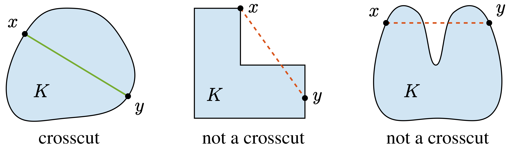
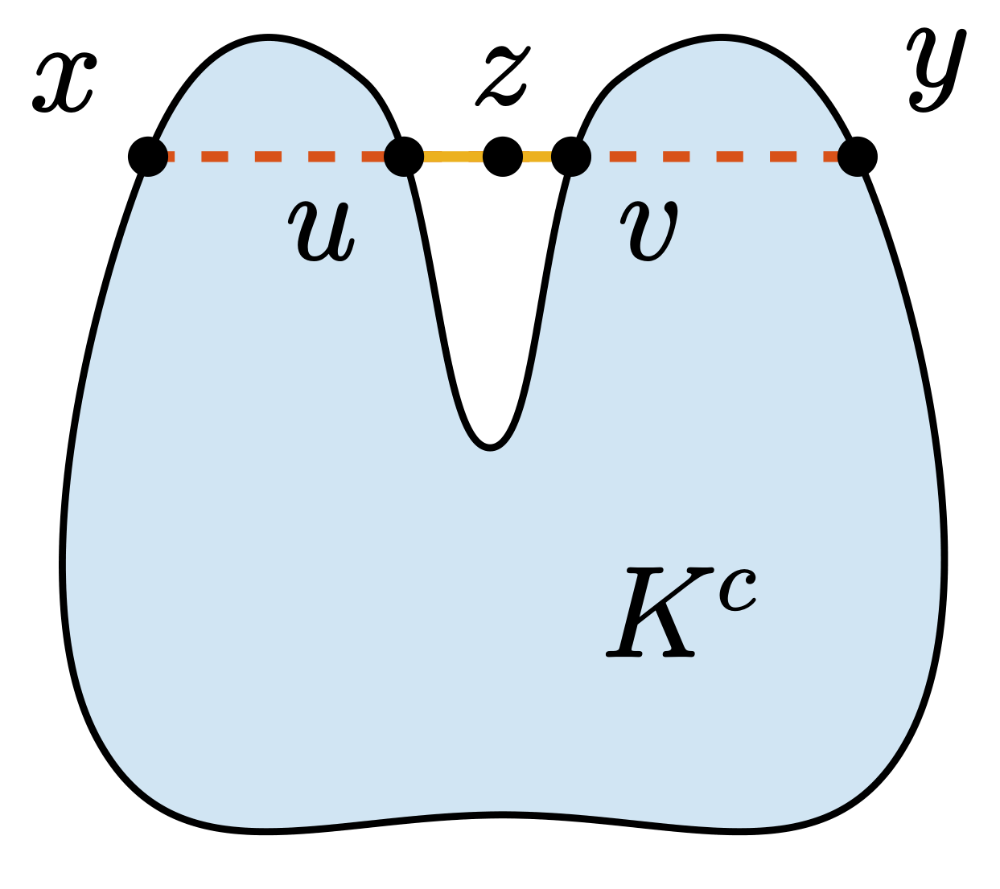
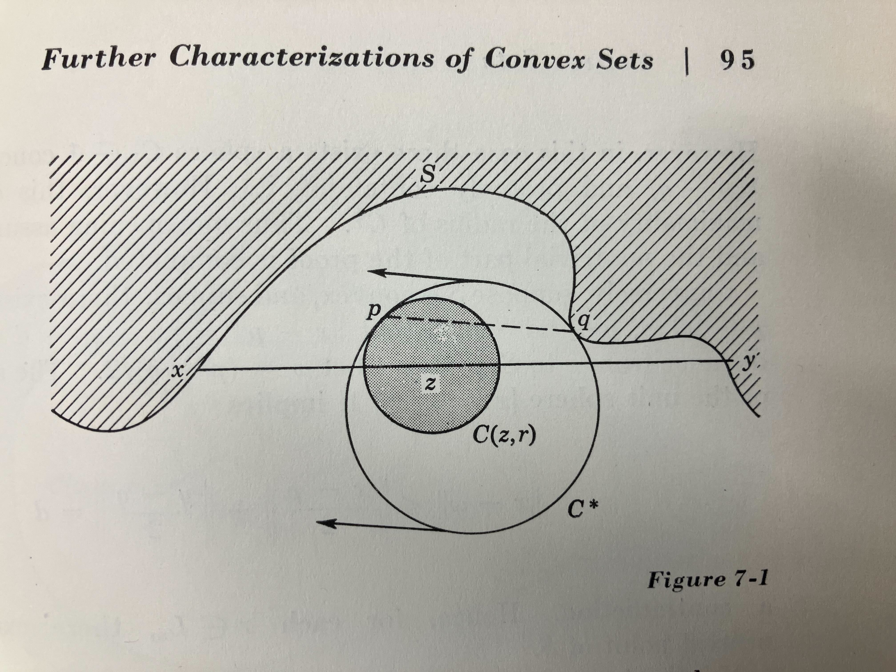

# ユークリッド射影の一意性と凸性の同値性に関する証明

本記事ではユークリッド射影の一意性と凸性の同値性に関する証明を行います。

## 概要

本記事が証明するのは、以下の定理です。

**集合 $K$ が $\mathbb{R}^m$ の非空な閉集合であるとき、$K$ が凸集合であることと、$\mathbb{R}^m$ の任意の点に対して $K$ の最近点が一意に定まることは同値である。**

この結果は、近年のサーベイ論文 [^Kuznetsov] や、Frederick A. Valentine による "Convex sets" [^Valentine] において、Motzkinの定理 (Motzkin's theorem)と呼ばれています。1935年に T. Motzkin が発表した論文がこの結果に対する最初の証明であるようです。(先述のサーベイ論文内での参考文献と、Valentineによる本とでの参考文献に齟齬があり、両方とも原本を確認できなかったため、その原論文はあえて参考文献欄に載せていません。) 本記事では、Valentineの本に記載された証明を紹介します。

[Theodore Motzkin](https://en.wikipedia.org/wiki/Theodore_Motzkin)はイスラエル系アメリカ人の数学者で、[Motzkin number](https://en.wikipedia.org/wiki/Motzkin_number)などに名を残した人物であり、[Motzkin–Taussky theorem](https://en.wikipedia.org/wiki/Motzkin%E2%80%93Taussky_theorem)という線形代数の定理でも有名のようですが、本記事で扱う定理の内容はそれとは異なることに注意して下さい。

ここで、ユークリッド空間上において、ユークリッド射影 (Euclidean projection) は一般に次のように定義されます:

$$
\operatorname{Proj}_K(x) = \underset{y \in K}{\operatorname{argmin}} \|x-y\|.
$$

これは、点 $x$ から集合 $K$ への最近点集合に対する写像に他なりません。Motzkinの定理は、$K$ が凸集合であることと、ユークリッド射影 $\operatorname{Proj}_K(x)$ の一意性に関する同値性を主張しています。特に、$K$ が閉凸集合ならば、ユークリッド射影が一意であるという事実は、最適化アルゴリズムの一つである射影勾配法 (projected gradient method) に関する解析などで重要な役割を果たします。射影勾配法に関する解説としては、例えば以下の記事が参考になり、鏡像降下法 (mirror descent) についても触れられています。

https://vene.ro/blog/mirror-descent.html

なお、余談として、Motzkinの定理の証明には、本記事で紹介する証明以外にも不動点定理を用いるものもあるようです。本記事では省略します。

https://math.stackexchange.com/questions/274810/is-a-closed-set-with-the-unique-nearest-point-property-convex

それでは、以下でMotzkinの定理の証明を行っていきます。

## 定義

以下、$L$ を位相線型空間とします。記事の前半は一般の $L$ でも成立しますが、Motzkinの定理が主に $\mathbb{R}^n$ を対象とした定理なので、本記事では $L=\mathbb{R}^n$ としても問題ありません。
また、集合 $S \subseteq L$ に対して、$S$ の内部を $\operatorname{int}S$、境界を $\operatorname{bd} S$、補集合を $S^c$ と表します。

### 線分

$x,y \in L$ に対して、閉線分 $xy$ は次のように定義されます（文献[^Valentine] Definition 1.2）。

$$
xy= \left\{ \alpha x+\beta y \mathrel{\mid} \alpha, \beta \geq 0, \ \alpha+\beta=1 \right\}.
$$

また、$x \neq y$ のとき、開線分 $\mathrm{intv}~xy$ は次のように定義されます（文献[^Valentine] Definition 1.8）。

$$
\operatorname{intv} xy = \left\{ \alpha x+\beta y \mathrel{\mid} \alpha, \beta > 0,\ \alpha+\beta=1 \right\}.
$$

閉線分 $xy$ は端点 $x,y$ を含みますが、開線分 $\mathrm{intv}~xy$ は端点を含みません。
ただし、例外として、$x=y$ のときは、閉線分 $xy$ と開線分 $\mathrm{intv}~xy$ はともに $\{x\}$ となり、端点を含みます。

### 凸集合

集合 $S \subseteq L$ が凸(convex)であることは、任意の $x,y \in S$ に対して、閉線分 $xy$ が再び $S$ に含まれることと同値です（文献[^Valentine] Definition 1.3）。

$$
x,y \in S \implies xy \subseteq S.
$$

なお、端点は自明に $S$ に含まれるので、

$$
x, y \in S \implies \operatorname{intv} xy \subseteq S
$$

も同値な条件になります。

また、$S$ が凸集合であり、かつ、内部が空でないとき、$S$ を凸体(convex body)と呼びます（教科書 Definition 1.10）。

$$
S \text{ is a convex body}
\iff
S \text{ is convex and } \operatorname{int}S \neq \emptyset.
$$

### Crosscut

集合 $S \subseteq L$ と $x,y \in \operatorname{bd} S$ に対して、閉線分 $xy$ が $S$ の crosscut であることは、開線分 $\operatorname{intv} xy$ が $S$ の内部に含まれることと同値です（教科書 Definition 4.1）。

$$
xy \text{ is a crosscut of } S
\iff
x,y \in \operatorname{bd} S,\ x \neq y,\ \mathrm{intv}~xy \subseteq \operatorname{int}S.
$$

つまり、crosscut とは、両端点が境界上にあり、その間の点がすべて内部に入っているような線分です。

## Crosscut を持たない集合は凸集合の補集合である

Motzkinの定理を証明するのに必要な準備として、以下を示します。(文献[^Valentine] Theorem 4.2)

**$K$ を開集合とする。$K$ が crosscut を持たないならば、$K$ はある凸集合の補集合である。**

なお、本記事での証明は、文献[^Valentine] における行間を埋めたものになっています。
この証明の更なる行間は、本記事末尾のLeanによる証明で埋めています。

### Crosscut を持たない集合の補集合は凸集合であることの証明

集合 $K$ の補集合 $K^c$ が凸であることを示します。
定義より、任意の $x,y \in K^c$ に対して、開線分 $\operatorname{intv} xy$ が $K^c$ に含まれることを示せばよいです。

背理法で示します。補集合の定義より、
$$
\operatorname{intv} xy \cap K \neq \emptyset
$$
であると仮定したときに、矛盾が導ける、つまり、$K$ が crosscut を持つことが示されることを目指します。
まず、先ほどの条件から、
$$
z \in \operatorname{intv} xy \cap K
$$
が存在します。特に、$K$ は開集合なので、
$$
z \in \operatorname{int}K
$$
です。
この時、ある $u,v \in \operatorname{bd} K$ が閉線分 $xy$ 上に存在して、$uv$ が $K$ のcrosscutになることを示します。
先述の通り、そのことが示されれば、矛盾が導け主張が証明されます。

以下では $u$ を構成する方法を説明します。$v$ も同様に構成できます。
まず、$x$ と $z$ を結ぶ線分上の点をパラメータ $t \in [0, 1]$ を用いて表すと、$\gamma(t) = (1-t)x + tz$ と書けます。
このとき、実数の完備性により、次のように $t_u$ および $u$ を構成できます。
$$
\begin{align*}
t_u &\coloneqq \inf \{ t \in [0, 1] \mid \forall s \in (t, 1], \gamma(s) \in K \}\\
u & \coloneqq \gamma(t_u)
\end{align*}
$$

すると、次のことが成り立ちます:

1. $u \neq z$, （$x \notin K, z \in K$ と $K$ の開集合性）
2. $u \in \operatorname{bd} K$, （$\gamma$ の連続性と境界の定義）
3. $u \in xz$, （$u$ は $x$ であってもよい。crosscutの節における図の2番目の例を参照）
4. $(u, z] \subseteq \operatorname{int} K$. （$u$ の構成）

同様に $v$ も構成して、二点 $u,v$ を考えると、これは次を満たします:

1. $u,v \in \operatorname{bd} K$,
2. $u \neq v$,
3. $\mathrm{intv}~uv \subseteq \operatorname{int}K$.

これは、$uv$ が $K$ の crosscut であることの定義そのものです。
よって、確かに $K$ は crosscut を持ち、矛盾が導けました。

## Motzkinの定理

では、続いてMotzkinの定理を証明します。

主張としては、

### Motzkinの定理の証明

以上で証明は完了となります。

## おまけ

最後に、本記事の結びとして、少しおまけを紹介します。

## Lean による形式化

本文中でも言及しましたが、Crosscutに関する主張の証明は、[Lean4](https://ja.wikipedia.org/wiki/Lean_(%E8%A8%BC%E6%98%8E%E3%82%A2%E3%82%B7%E3%82%B9%E3%82%BF%E3%83%B3%E3%83%88))による形式化も行っています。Lean4とは、数学の証明をコードとして記述することで、機械的に証明を検証できる「定理証明支援系」の機能を持つ純粋関数型プログラミング言語です。命題の記述が正しい限りにおいて、証明の正しさを機械的に保証できることが強みです。

まず、以下に証明の骨格を示します。一部の補題は、後述のファイルで示します。(詳しい説明などはあまりしていませんが、こちらだけならLean4を知らない方でもある程度理解できると思います。)

<!-- PROGRAM_INSERTION: Motzkin/Motzkin.lean -->

そして、先ほど省略した補題が以下になります。ここが、正に記事の本文でも説明を省略した行間を埋める部分になります。

<!-- PROGRAM_INSERTION: Motzkin/Motzkin/Basic.lean -->

## Valentineの本について

本記事で参照させていただいたValentineの本は、今回東大の工学部6号館にある図書館の地下の可動式書庫を動かしてようやく読むことが出来ました。かなり古めかしい本で、ネット上に情報が少ないのも頷けます。

本書において、先ほどのCrosscutに関する主張は、次のように証明されています。

Lean4による証明と比べて、めちゃくちゃ短いですね……。

個人的に、これは本当にいろいろなことに対して示唆的だと思っています。
人間がもつ数学的対象に対する直感の強さ、Lean4が持つ機械的な検証能力の豊かさ、そして一世紀近くも前に発表された数学の定理がその検証に耐えられるだけの厳密性をなお持っていることに対する衝撃を感じます。

本記事を執筆した動機の一つは、このユークリッド射影の一意性に関する定理の証明が非常にネット上では限られていたり見つけにくかったりしており、かつこのような良書が誰にも知られずに朽ちていくのは非常に口惜しく感じたからでした。

本記事が、その周知の一助になれば幸いです。

## 参考文献

[^Kuznetsov]: Kuznetsov, N. (2024). On analytic characterization of convex sets in $\mathbb{R}^m$ (a survey). arXiv [Math.AP]. http://arxiv.org/abs/2405.18013

[^Valentine]: Valentine, F. A. (1964). Convex sets. McGraw-Hill series in higher mathematics. McGraw-Hill Book Company.
