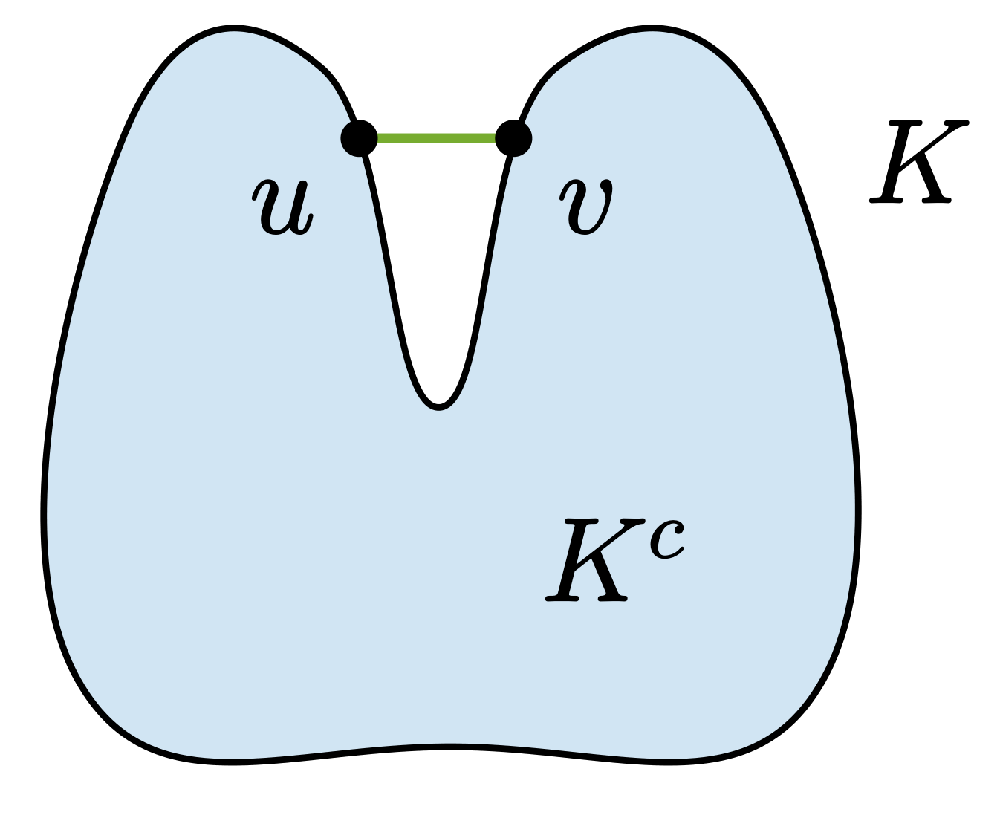
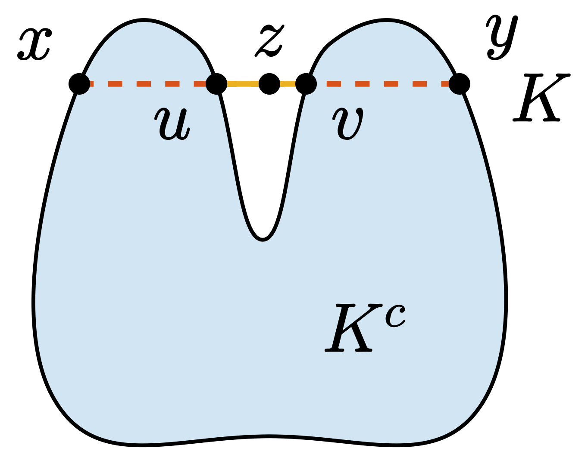
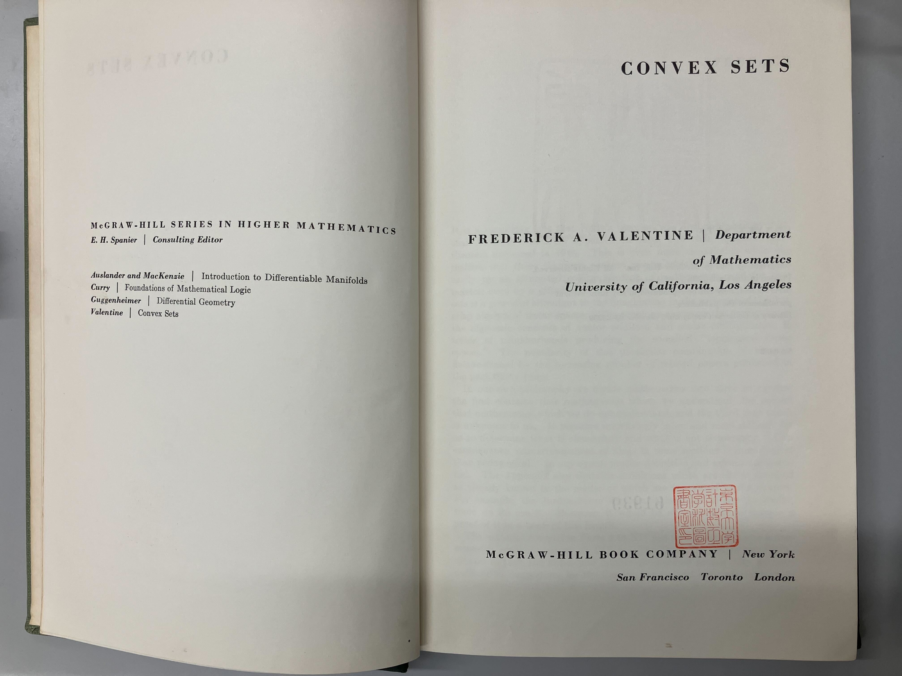
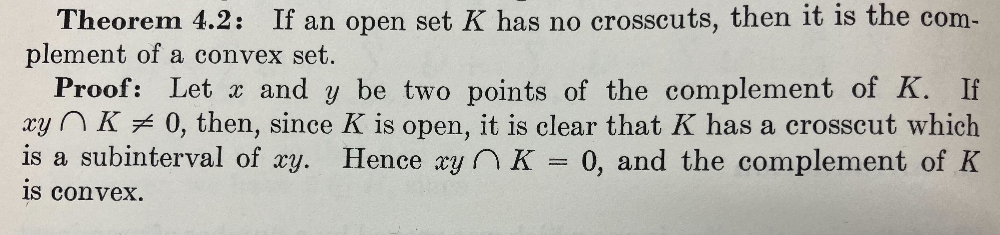

# Crosscutを持たない開集合は凸集合の補集合である

本記事では、crosscut を持たない開集合が凸集合の補集合であることを証明します。

なお、本記事は諸事情につき、お蔵入り的な性格が強い内容となっています。

(本当はMotzkinの定理と呼ばれる、閉集合におけるユークリッド射影の一意性と凸性の同値性に関する定理を示したかったのですが、crosscut を用いた手法は厳密に議論することがかなり難しそうに思われます。そのため、本記事ではその crosscut に関する議論のみを紹介します。)

ただし、本記事の範囲内において、誤りはないと思います。本記事の末尾に、Lean4による形式化も掲載しています。

## 定義

以下、$L$ を位相線型空間とします。本記事では簡単のために $L=\mathbb{R}^n$ としますが、他の空間でも同様の議論が成り立ちます。また、集合 $S \subseteq L$ に対して、$S$ の内部を $\operatorname{int} S$、境界を $\operatorname{bd} S$、補集合を $S^c$ と表します。

### 線分

$x,y \in L$ に対して、閉線分 $xy$ は次のように定義されます（文献[^Valentine] Definition 1.2）:

$$
xy= \left\{ \alpha x+\beta y \mathrel{\mid} \alpha, \beta \geq 0, \ \alpha+\beta=1 \right\}.
$$

また、$x \neq y$ のとき、開線分 $\operatorname{intv} xy$ は次のように定義されます（文献[^Valentine] Definition 1.8）:

$$
\operatorname{intv} xy = \left\{ \alpha x+\beta y \mathrel{\mid} \alpha, \beta > 0,\ \alpha+\beta=1 \right\}.
$$

閉線分 $xy$ は端点 $x,y$ を含みますが、開線分 $\operatorname{intv} xy$ は $x \neq y$ のとき端点を含みません。

ただし、例外として $x=y$ のときは、閉線分 $xy$ と開線分 $\operatorname{intv} xy$ はともに $\{ x \}$ となり、端点を含みます。

### 凸集合

集合 $S \subseteq L$ が凸(convex)であることは、任意の $x,y \in S$ に対して、閉線分 $xy$ が再び $S$ に含まれることと同値です（文献[^Valentine] Definition 1.3）:

$$
x,y \in S \implies xy \subseteq S.
$$

なお、端点は自明に $S$ に含まれるので、次も同値な条件です:

$$
x, y \in S \implies \operatorname{intv} xy \subseteq S
$$

### Crosscut

集合 $S \subseteq L$ と $x,y \in \operatorname{bd} S$ に対して、閉線分 $xy$ が $S$ の crosscut であることは、開線分 $\operatorname{intv} xy$ が $S$ の内部に含まれることと同値です（文献[^Valentine] Definition 4.1）:

$$
\begin{gather*}
xy \text{ is a crosscut of } S\\
\iff\\
x,y \in \operatorname{bd} S,\ x \neq y,\ \operatorname{intv} xy \subseteq \operatorname{int}S.
\end{gather*}
$$

つまり、crosscut とは、両端点が境界上にあり、その間の点がすべて内部に入っているような線分です。

## Crosscut を持たない集合は凸集合の補集合である

以下を示します(文献[^Valentine] Theorem 4.2):

**$K$ を開集合とする。$K$ が crosscut を持たないならば、$K$ はある凸集合の補集合である。**

より直感的な解釈としては、対偶により次のように言い換えることができます:

**$K^c$ を閉集合とする。$K^c$ が凸集合でなければ、$K$ は crosscut を持つ。**

通常は集合の凸性に関する特徴づけを主張する定理が多いですが、この主張は**非**凸性の特徴づけとなっています。

それ故に、非凸集合が出てきたときに、この crosscut を構成することが出来て、そこから議論を展開することが出来る、という点で少し面白い定理だと思います。

### 証明

以下では、先述の主張を証明していきます。なお、本記事での証明は、文献[^Valentine] における行間を埋めたものになっています。この証明の更なる行間は、本記事末尾のLeanによる証明で埋めています。

集合 $K$ の補集合 $K^c$ が凸であることを示します。定義より、任意の $x,y \in K^c$ に対して、開線分 $\operatorname{intv} xy$ が $K^c$ に含まれることを示せばよいです。

背理法で示します。補集合の定義より、

$$
\operatorname{intv} xy \cap K \neq \emptyset
$$

であると仮定したときに、矛盾が導ける、つまり、$K$ が crosscut を持つことが示されることを目指します。まず、この仮定から、

$$
z \in \operatorname{intv} xy \cap K
$$

が存在します。特に、$K$ は開集合なので、

$$
z \in \operatorname{int}K
$$

です。このとき、ある $u,v \in \operatorname{bd} K$ が閉線分 $xy$ 上に存在して、$uv$ が $K$ の crosscut になることを示します。先述の通り、これが示されれば、矛盾が導け主張が証明されます。

以下では $u$ を構成する方法を説明します。$v$ も同様に構成できます。$x$ と $z$ を結ぶ線分上の点をパラメータ $t \in [0, 1]$ を用いて表すと、$\gamma(t) = (1-t)x + tz$ と書けます。このとき、実数の完備性により、次のように $t_u$ および $u$ を構成できます。

$$
\begin{align*}
t_u &\coloneqq \inf \{ t \in [0, 1] \mid \forall s \in (t, 1], \gamma(s) \in K \}\\
u & \coloneqq \gamma(t_u)
\end{align*}
$$

すると、次のことが成り立ちます:

1. $u \neq z$, （$x \notin K, z \in K$ と $K$ の開集合性）
2. $u \in \operatorname{bd} K$, （$\gamma$ の連続性と境界の定義）
3. $u \in xz$, （$u$ は $x$ であってもよい。crosscut の節における図の2番目の例を参照）
4. $(u, z] \subseteq \operatorname{int} K$. （$u$ の構成）

同様に $v$ も構成して、二点 $u,v$ を考えると次を満たします:

1. $u,v \in \operatorname{bd} K$,
2. $u \neq v$,
3. $\operatorname{intv} uv \subseteq \operatorname{int}K$.

これは、閉線分 $uv$ が $K$ の crosscut であることの定義そのものです。よって、確かに $K$ は crosscut を持ち、矛盾が導けました。

## Lean による形式化

先ほども言及しましたが、この証明は[Lean4](https://ja.wikipedia.org/wiki/Lean_(%E8%A8%BC%E6%98%8E%E3%82%A2%E3%82%B7%E3%82%B9%E3%82%BF%E3%83%B3%E3%83%88))による形式化も行っています。Lean4とは、数学の証明をコードとして記述することで、機械的に証明を検証できる「定理証明支援系」の機能を持つ純粋関数型プログラミング言語です。命題の記述が正しい限りにおいて、証明の正しさを機械的に保証できることが強みです。

まず、以下に証明の骨格を示します。一部の補題は、後述で示します。(若干補足をコメントで書いているので、こちらだけならLean4を知らない方でもある程度理解できると思います。)

<!-- PROGRAM_INSERTION: Motzkin/Main.lean -->

そして、先ほど省略した補題が以下になります。ここが、正に記事の本文でも説明を省略した行間を埋める部分になります。

<!-- PROGRAM_INSERTION: Motzkin/Motzkin/Crosscut.lean -->

## Valentineの本について

本記事で参照させていただいたValentineの本は、今回東大の工学部6号館にある図書館の地下の可動式書庫を動かしてようやく読むことが出来ました。かなり古めかしい本で、ネット上に情報が少ないのも頷けます。

本書において、先ほどの crosscut に関する主張は、次のように証明されています。

Lean4による証明と比べて、めちゃくちゃ短いですね……。

個人的に、これは本当にいろいろなことに対して示唆的だと思っています。
人間がもつ数学的対象に対する直感の強さ、Lean4が持つ機械的な検証能力の豊かさ、そして一世紀近くも前に発表された数学の定理がその検証に耐えられるだけの厳密性をなお持っていることに対する衝撃を感じます。

本記事を執筆した動機の一つは、このような良書が誰にも知られずに朽ちていくのは非常に口惜しく感じたからでした。

本記事が過去と現在の数学の橋渡しの一助になれば良いなと思いつつ、ここで筆を置きたいと思います。

[^Valentine]: Valentine, F. A. (1964). Convex sets. McGraw-Hill series in higher mathematics. McGraw-Hill Book Company.
