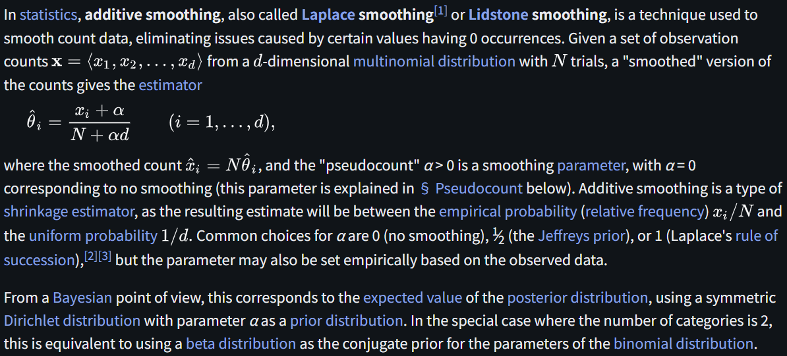

# Additive Smoothing

文献:

https://en.wikipedia.org/wiki/Additive_smoothing

解説:

Additive SmoothingはLaplace Smoothingとも呼ばれている。少しだけ値を足してから頻度を求める。
なお、[Laplacian Smoothing](https://en.wikipedia.org/wiki/Laplacian_smoothing) もあるが、そちらはグラフ理論関連の話。
