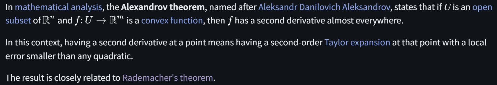

# Alexandrov Theorem

文献:

https://en.wikipedia.org/wiki/Alexandrov_theorem

解説:

凸関数が2階微分を殆ど至る点で持つことを大まかには述べている。

なお、Rademacher's Theoremは、リプシッツ連続関数が1階微分を殆ど至る点で持つことを大まかには述べている。

詳細はRademacher's Theoremにて。
