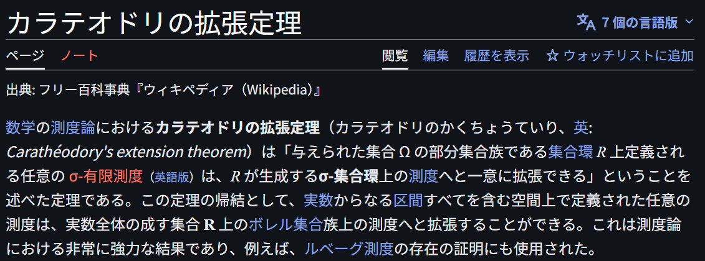

# Caratheodory's Extension Theorem

文献:

https://ja.wikipedia.org/wiki/%E3%82%AB%E3%83%A9%E3%83%86%E3%82%AA%E3%83%89%E3%83%AA%E3%81%AE%E6%8B%A1%E5%BC%B5%E5%AE%9A%E7%90%86

解説:

最適化との馴染みはやや薄いが、Caratheodory と名のつく定理は複数存在するので、あくまで対比の為に記しておく。本題は Caratheodory's Theorem (Convex Hull) である。
