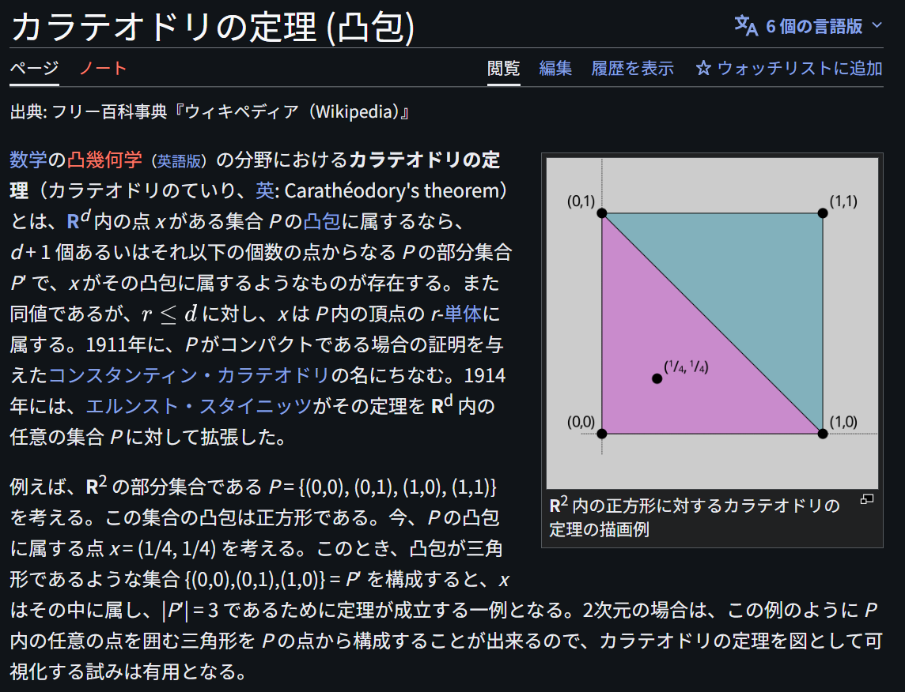

# Caratheodory's Theorem (Convex Hull)

文献:

https://ja.wikipedia.org/wiki/%E3%82%AB%E3%83%A9%E3%83%86%E3%82%AA%E3%83%89%E3%83%AA%E3%81%AE%E5%AE%9A%E7%90%86_(%E5%87%B8%E5%8C%85)#/languages

解説:

証明は[高校数学の美しい物語](https://manabitimes.jp/math/1216)さんに詳しい。

todo: 書籍での例を記す

ちなみに Caratheodory's Extension Theorem の[Caratheodory](https://en.wikipedia.org/wiki/Constantin_Carath%C3%A9odory)さんと同一人物。
