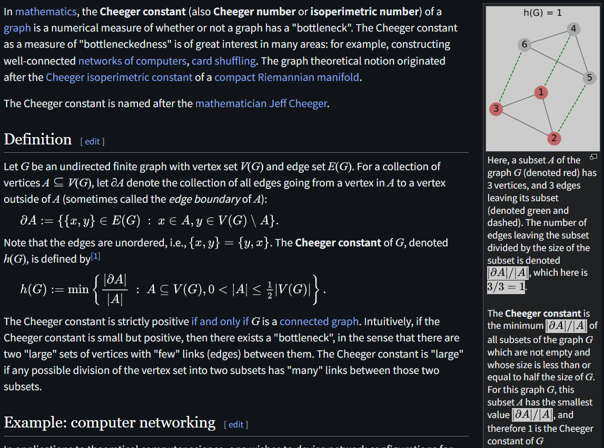
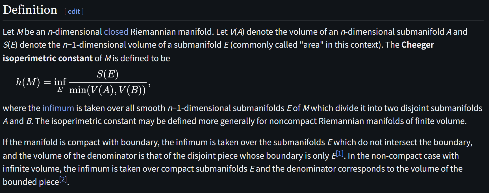

# Cheeger Constant

文献:

https://arxiv.org/pdf/2609.00337

(Blaschke–Santaló diagramというものの文脈で登場している)
 

https://en.wikipedia.org/wiki/Cheeger_constant_(graph_theory)

https://en.wikipedia.org/wiki/Cheeger_constant

解説:

チーガー定数と読むらしい。
グラフの方が解釈が簡単だが、カットの概念に近い。
固有値評価などに応用があるらしいが、あまり理解せず。
