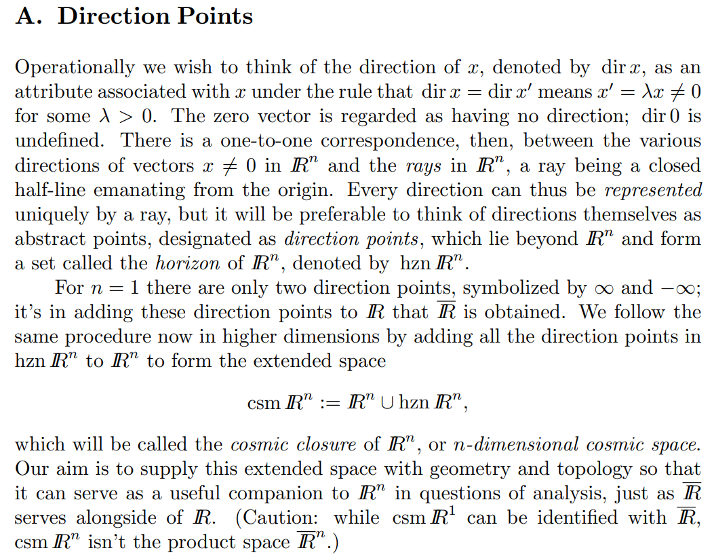
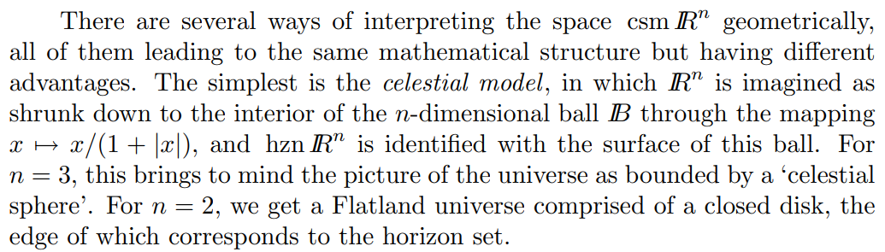
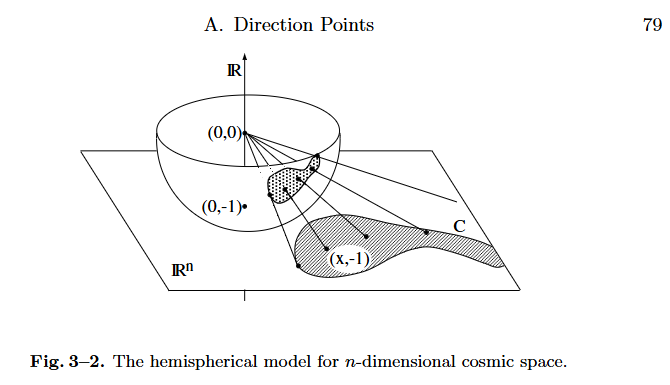

# Cosmic Closure

文献:

https://link.springer.com/chapter/10.1007/978-3-642-02431-3_3

解説:

大雑把には、$\mathbb{R}^n$ に「無限遠の方向」を点として付け加えてコンパクト化したものと言える。

直訳すると、宇宙の閉包だろうか、意図自体は上述の3次元についての説明より汲み取れる。命名がやたら格好良い。
