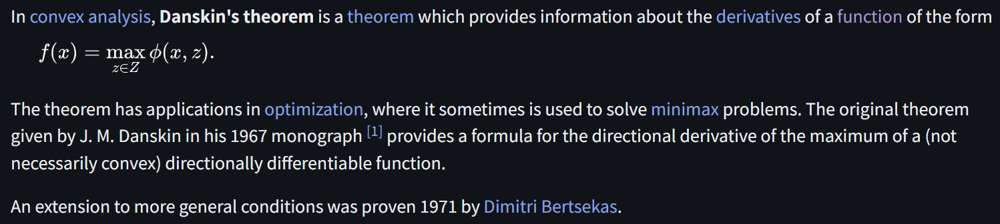
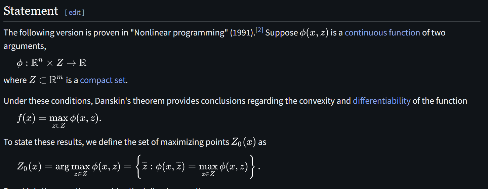
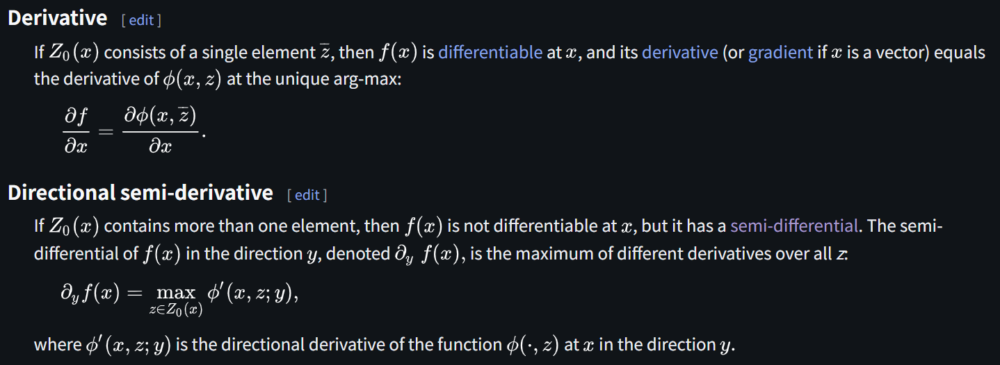
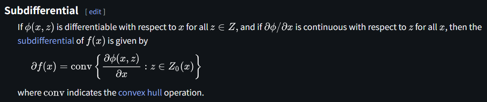

# Danskin's Theorem

文献:

https://en.wikipedia.org/wiki/Danskin%27s_theorem

解説:

minimax問題などにおける関数の勾配や劣勾配の計算に使われる定理。
見れば分かる通り、もし最適解が一意でかつ(ラフな意味で)病的でなければ、これはかなり自明。
本当に大切なのは、むしろ最適解が複数ある場合や、滑らかでない場合だろう。
