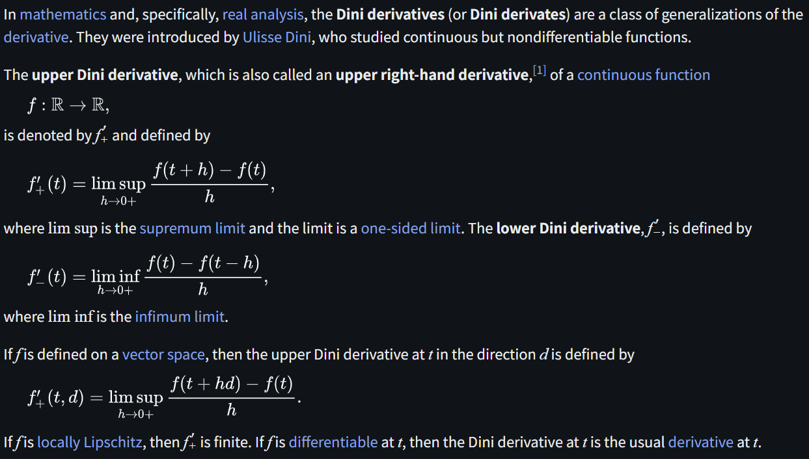
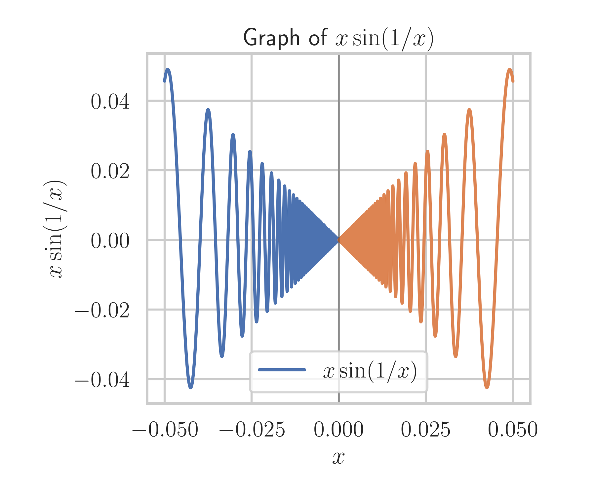

# Dini Derivative

文献:

https://en.wikipedia.org/wiki/Dini_derivative

解説:

単純な片側極限と比較すると分かりやすい。

$$
\begin{align*}
f'_+(x) &= \lim_{h\downarrow 0} \frac{f(x+h)-f(x)}{h},\\
\overline D_+ f(x) &= \limsup_{h\downarrow 0} \frac{f(x+h)-f(x)}{h},\\
\underline D_+ f(x) &= \liminf_{h\downarrow 0} \frac{f(x+h)-f(x)}{h}.
\end{align*}
$$

例えば、

$$
f(x)=
\begin{cases}
x\sin(1/x), & x\neq 0,\\
0, & x=0.
\end{cases}
$$

を考えると、

$$
\begin{align*}
f'_+(0) &= \text{does not exist},\\
\overline D_+ f(0) &= +1,\\
\underline D_+ f(0) &= -1.
\end{align*}
$$

となる。

通常の微分が発散するということも踏まえると、中々に便利な概念で感心する。
