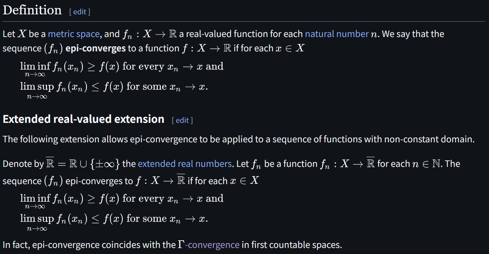
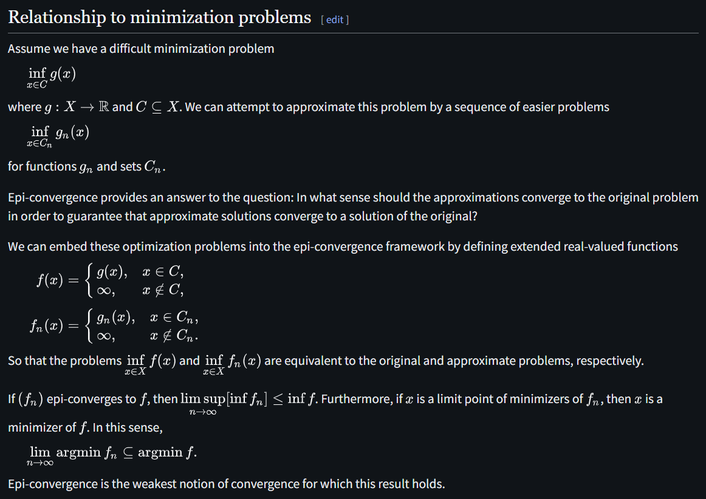
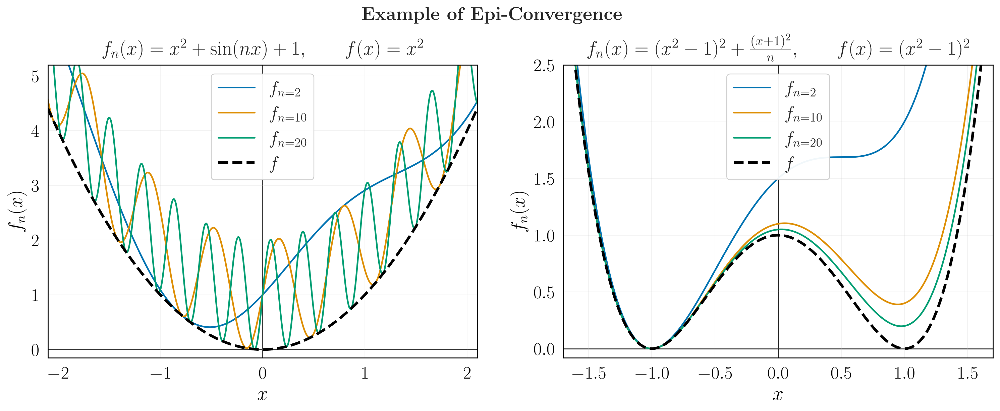

# Epi-Convergence

文献:

https://en.wikipedia.org/wiki/Epi-convergence

解説:

具体例があまりネットになかったので、以下に簡単な例を示す。

左は点ごとには収束しないにもかかわらずEpi-Convergenceが起きる例、右は極限で最小点集合が拡大し $\lim \operatorname{argmin} f_n \subsetneq \operatorname{argmin} f$ となる例を示す。

似た概念に[Gamma-Convergence](https://en.wikipedia.org/wiki/%CE%93-convergence)というのもあるらしい。
