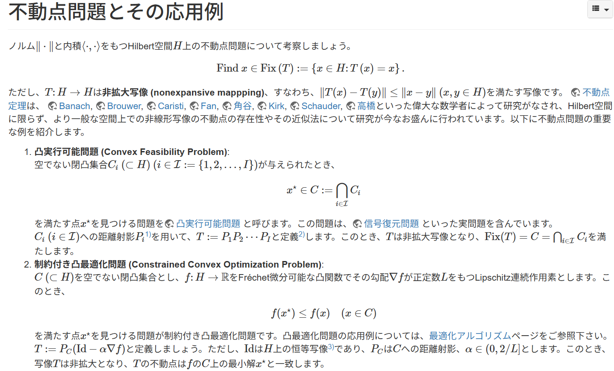
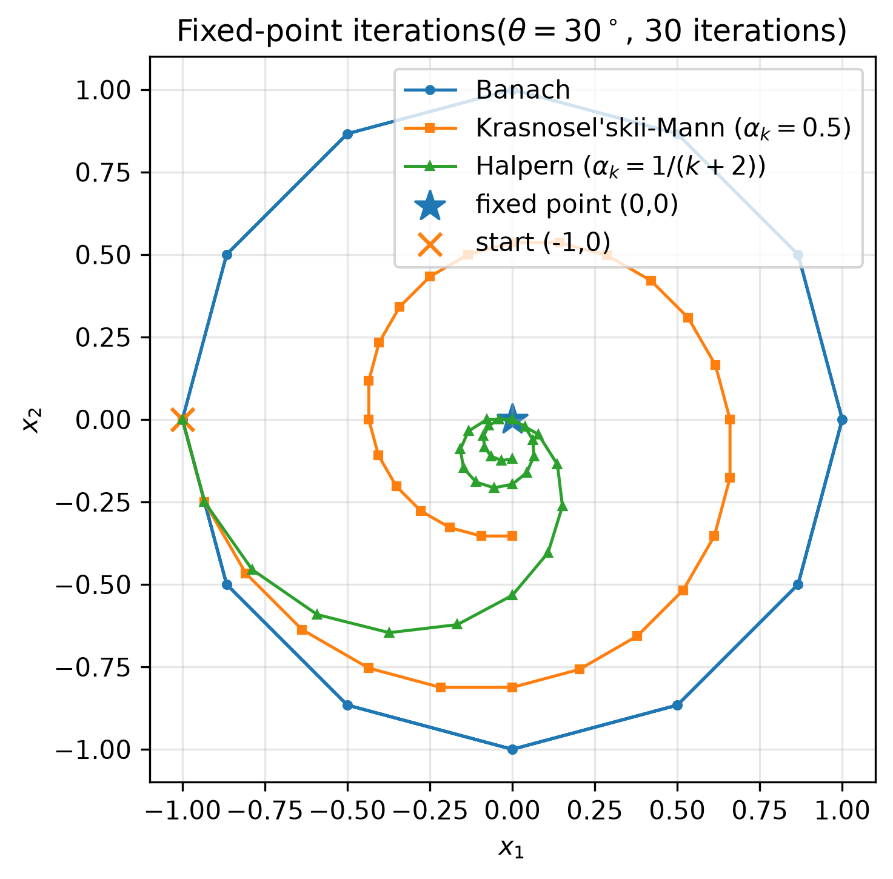

# Fixed Point

文献:

https://iiduka.net/intro/researches/fixedpoint

(飯塚先生のHP)

<!--  -->

https://www.ohmsha.co.jp/book/9784274230066.html

(飯塚先生の著書、7章が不動点近似法で詳しい)

https://www.ism.ac.jp/~mirai/sscoke/2021/

(飯塚先生の講義資料)

解説:

上記の「連続最適化アルゴリズム」という書籍の第7章で扱われている、$T \colon C\to C$ の不動点 $x^\ast=T(x^\ast)$ を求める問題に対する、3つの代表的反復法は以下の通りである。

| 手法                             | 更新式                                 |
| :------------------------------: | :------------------------------------: |
| Banach の不動点近似法            | $x_{k+1}=T(x_k)$                       |
| Krasnosel'skiĭ–Mann 不動点近似法 | $x_{k+1}=x_k+\alpha_k (T(x_k)-x_k)$    |
| Halpern 不動点近似法             | $x_{k+1}=T(x_k)+\alpha_k (x_0-T(x_k))$ |

例として $n=2$ かつ $T$ を30度回転とした場合の、各反復法の挙動を比較する。([実装](https://github.com/HirokiHamaguchi/QiitaArticles/tree/main/20260827_OptimizationWords/FixedPoint/rotation.py))

