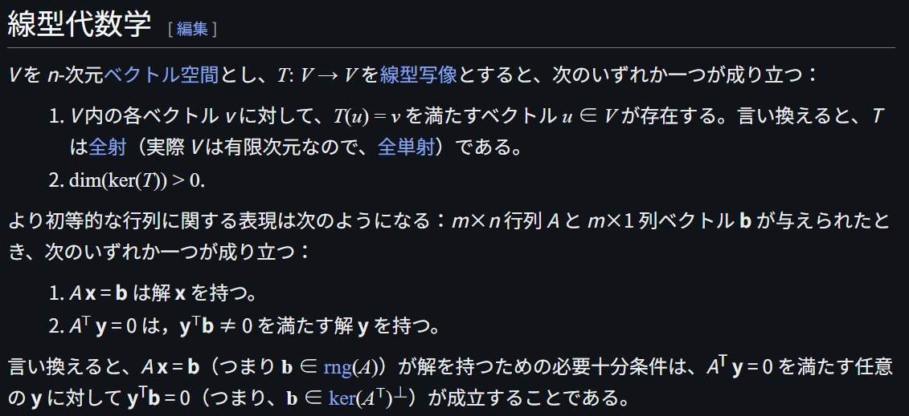
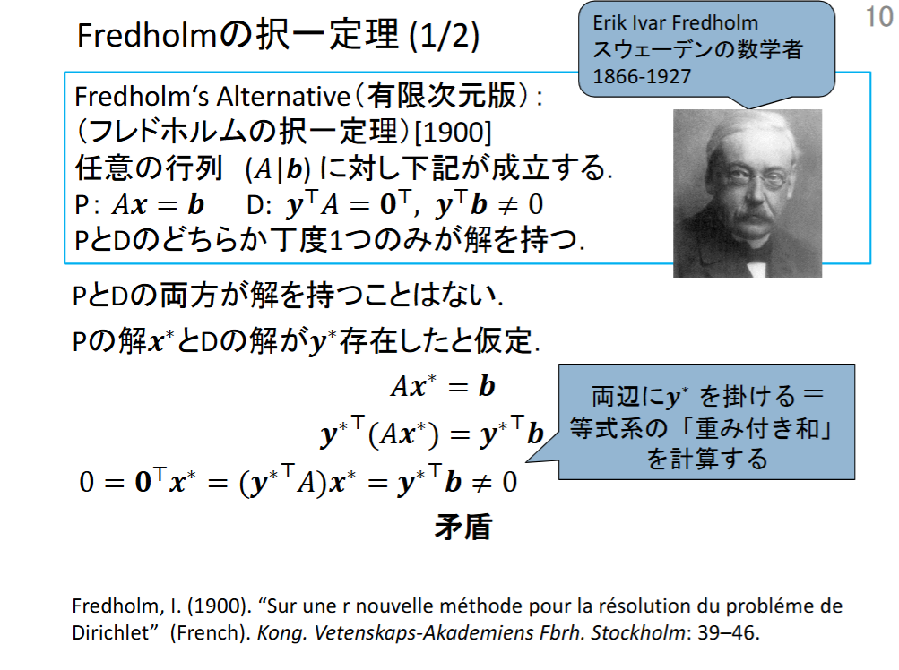

# Fredholm Alternative

文献:

https://en.wikipedia.org/wiki/Fredholm_alternative

https://researchmap.jp/Tomomi_Matsui

解説:

書いてある通りだが、$b \in \mathrm{Im}(A)$ と $b \in \mathrm{Ker}(A^\top)^\perp$ が同値ということを言っているに過ぎない。
[Farkas' lemmaのcorollary](https://en.wikipedia.org/wiki/Farkas%27_lemma)として得られる。
