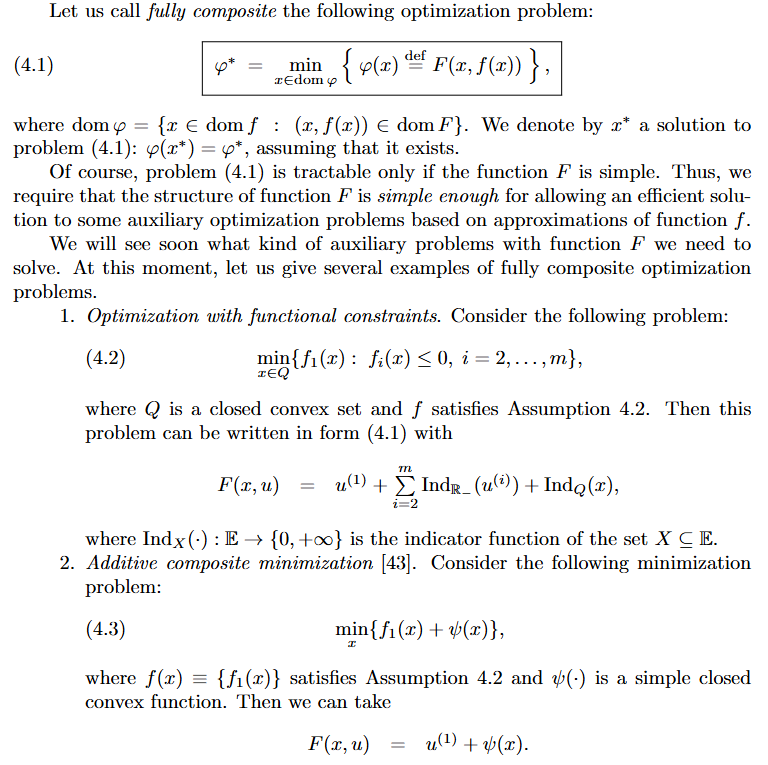

# Fully Composite

文献:

https://epubs.siam.org/doi/abs/10.1137/21M1410063 Nesterovの論文

解説:

例は上の画像の後にも続き、Functional composite minimization, Functional and additive composition, Composition with linear mappingなどとなっていく。
この統一性・抽象性が大事に思われる。
