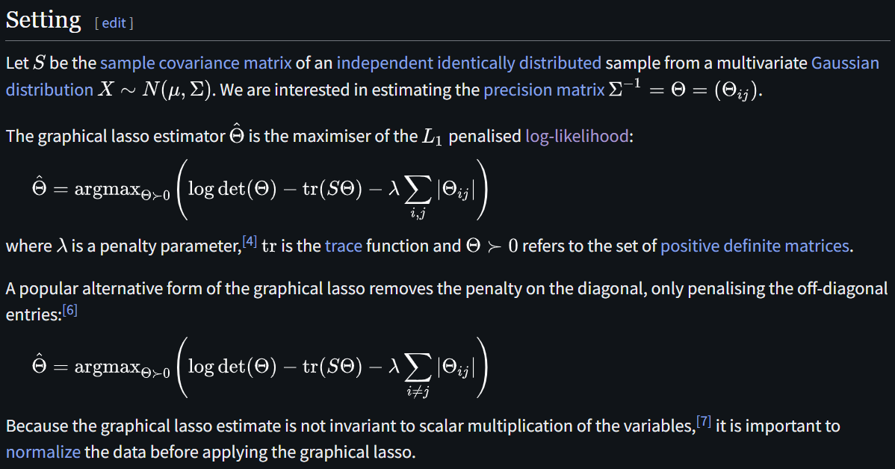
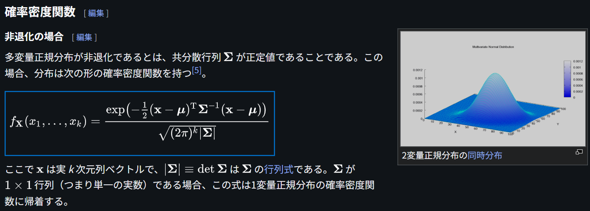

# Graphical Lasso

文献:

https://en.wikipedia.org/wiki/Graphical_lasso

解説:

Graphical Lassoという名前であるが、そのグラフ要素は手法自体には出てこない。本質的にやっていることは多変量正規分布の逆共分散行列(精度行列、precision matrixとも)に関する、$L_1$ 正則化付きの推定に過ぎない。この手法の導出は、確率密度関数よりほぼ自明である。

$L_1$ 正則化をつけているから、逆行列に疎行列が出てきて、それがグラフにみなせて、解釈が楽になる、という話と理解している。
