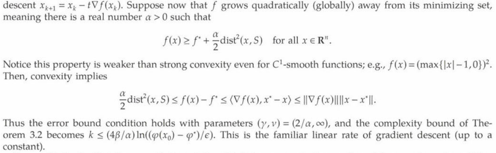

# Growth Condition

文献:

https://pubsonline.informs.org/doi/abs/10.1287/moor.2017.0889

https://arxiv.org/pdf/2608.20642

([12]が上の文献にあたる)

解説:

最適値からの目的関数値の差が解集合までの距離に応じてどれだけ増えるかを下から評価する正則性条件。
近接勾配法などの線形収束を導くために用いられる。
