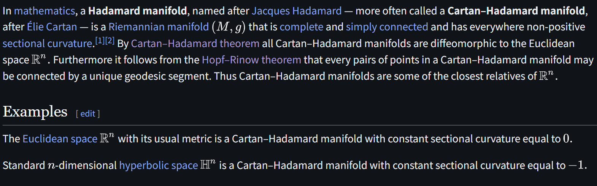

# Hadamard Manifold

文献:

https://en.wikipedia.org/wiki/Hadamard_manifold

https://arxiv.org/pdf/2609.00540

(Hadamard Manifolds上の射影勾配法が調べられている)

解説:

書いてある通りだが、断面曲率がどこでも0以下な、完備で単連結なリーマン多様体。
双曲空間をイメージしておけば概ね良さそう。
