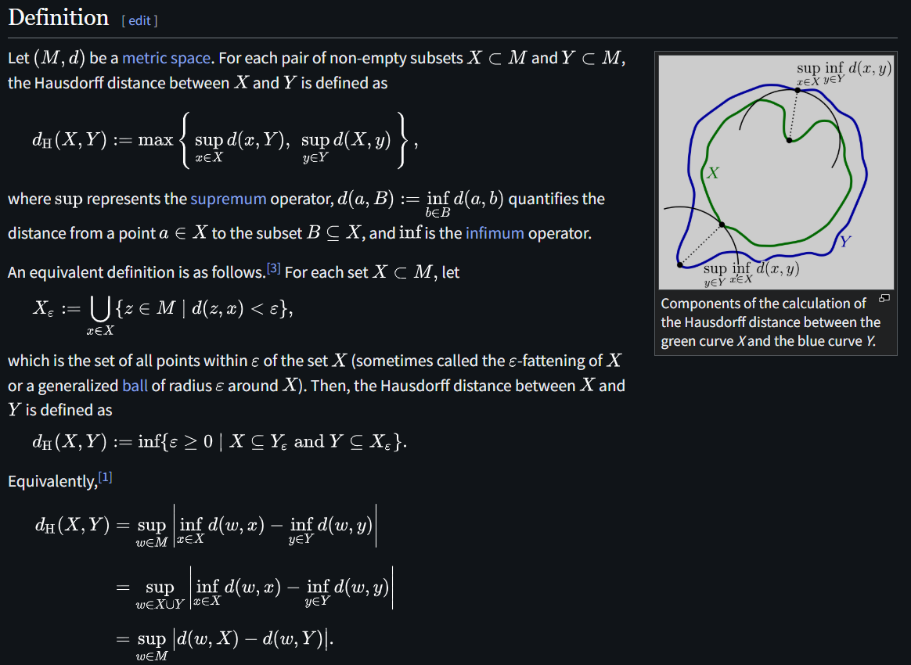

# Hausdroff Distance

文献:

https://en.wikipedia.org/wiki/Hausdorff_distance

解説:

Pompeiu--Hausdorff distanceとも。簡単に言えば集合同士の一番遠い点の距離を測っている。

Wikiの定義において、$X$ を地球の表面、$Y$ を陸の表面とすると、[point Nemo](https://ja.wikipedia.org/wiki/%E3%83%9D%E3%82%A4%E3%83%B3%E3%83%88%E3%83%BB%E3%83%8D%E3%83%A2)、つまり、陸から最も遠い地点の、陸からの距離は、正にHausdorff distanceで表される、ということが[Wiki](https://en.wikipedia.org/wiki/Hausdorff_distance#Applications)にも書いてある。
