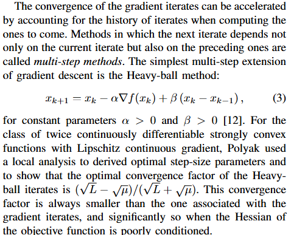
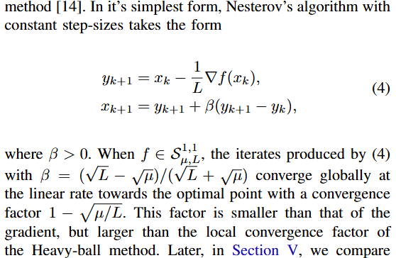

# Heavy-Ball Method

文献:

https://www.sciencedirect.com/science/article/pii/0041555364901375

(提案論文)
 

https://ieeexplore.ieee.org/document/7330562

解説:

Nesterovの加速勾配法との違いに注意。
計算量の比較などをしようとすると、流石に長くなりすぎるのでここでは省略するが、いつか書きたい。
