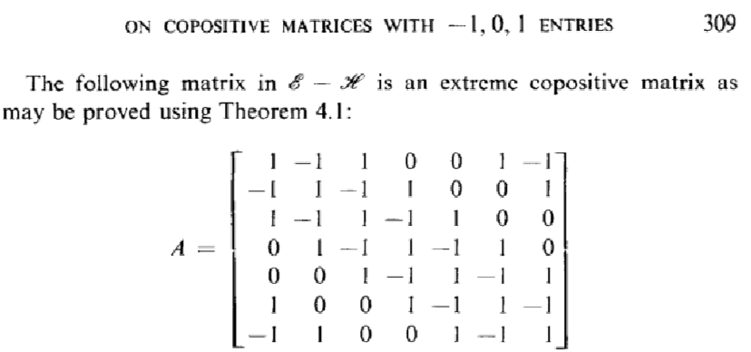
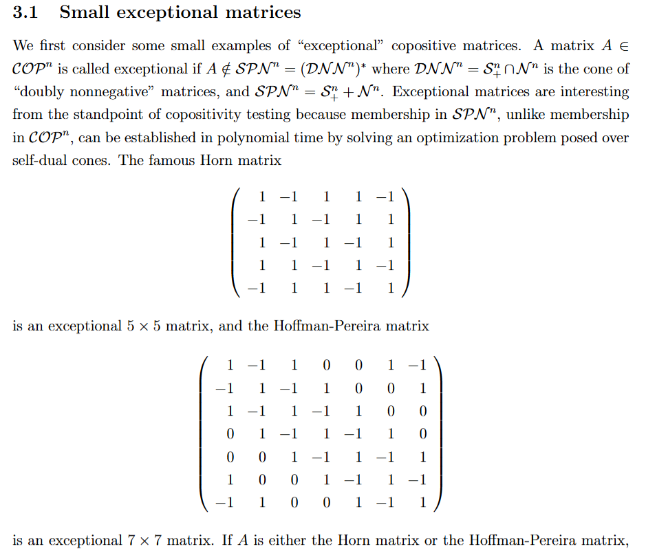

# Hoffman--Pereira Matrix

文献:

https://arxiv.org/abs/2609.01010

(この論文に登場していた)
<br>

https://www.sciencedirect.com/science/article/pii/009731657390006X

(1973年の初出論文)



https://www.sciencedirect.com/science/article/pii/S0024379520304171

<!--  -->

解説:

copositiveだが半正定値行列+非負行列という形で書けない (exceptionalである)。

```Python
import cvxpy as cp
import numpy as np

H = np.array([
    [ 1,-1, 1, 0, 0, 1,-1],
    [-1, 1,-1, 1, 0, 0, 1],
    [ 1,-1, 1,-1, 1, 0, 0],
    [ 0, 1,-1, 1,-1, 1, 0],
    [ 0, 0, 1,-1, 1,-1, 1],
    [ 1, 0, 0, 1,-1, 1,-1],
    [-1, 1, 0, 0, 1,-1, 1]
], dtype=float)

P = cp.Variable((7, 7), symmetric=True)
N = cp.Variable((7, 7), symmetric=True)

constraints = [
    H == P + N,
    P >> 0,      # P is PSD
    N >= 0       # entrywise nonnegative
]

prob = cp.Problem(cp.Minimize(0), constraints)
prob.solve()

print(prob.status)
```

これがinfeasibleになることからも数値的に示唆される。

原論文の方はextreme rayという文脈で論じており、関係性があるらしい。
