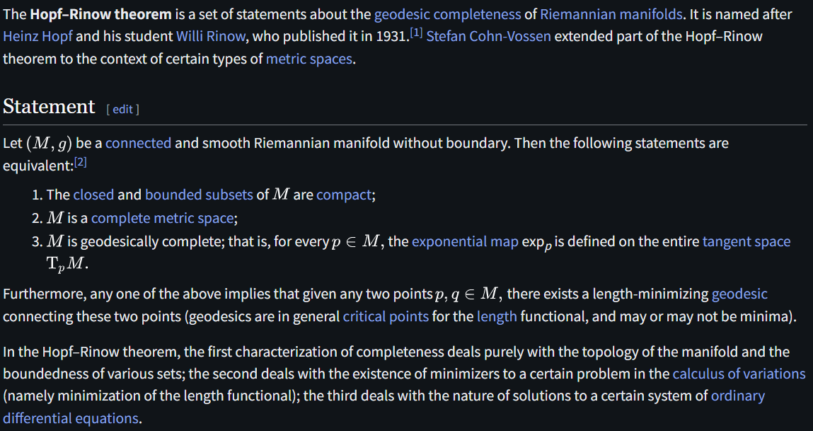

# Hopf--Rinow Theorem

文献:

https://en.wikipedia.org/wiki/Hopf%E2%80%93Rinow_theorem

解説:

大分基礎的な定理。
ざっくり言えば、多様体における、コンパクト性と完備性の同値性を述べたうえで、任意のの2点を結ぶ最短測地線の存在を保証する。
リーマン多様体上の最適化関連で出てくることもありそう。
Hadamard Manifoldの項で出てきたので記した。
