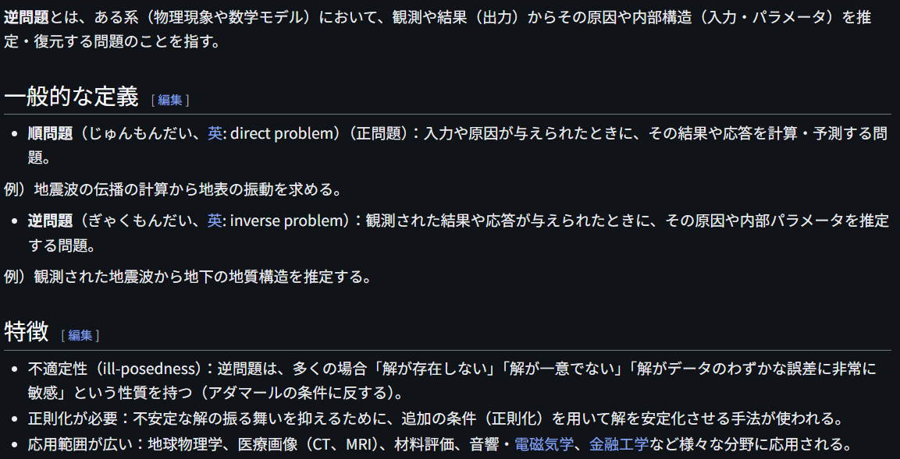
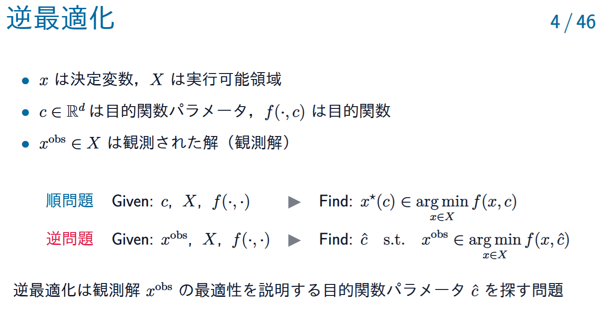

# InverseProblem

文献:

https://ja.wikipedia.org/wiki/%E9%80%86%E5%95%8F%E9%A1%8C

https://speakerdeck.com/ssakaue/gyakusaitekika-to-kikai-gakushuu?slide=6 (坂上さんの講演資料)

<!--  -->

> 逆最適化は観測解 $x^\mathrm{obs}$ の最適性を説明する目的関数パラメータ $\hat{c}$ を探す問題

解説:

逆問題というと非破壊検査や医療のイメージが強いが、逆最適化という逆問題の一種で最適化と繋がっている。
