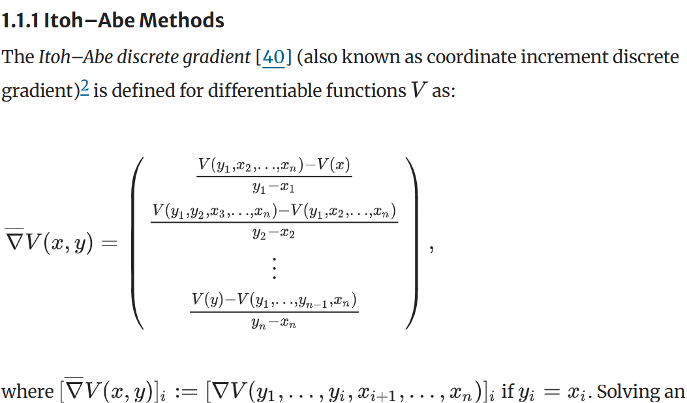
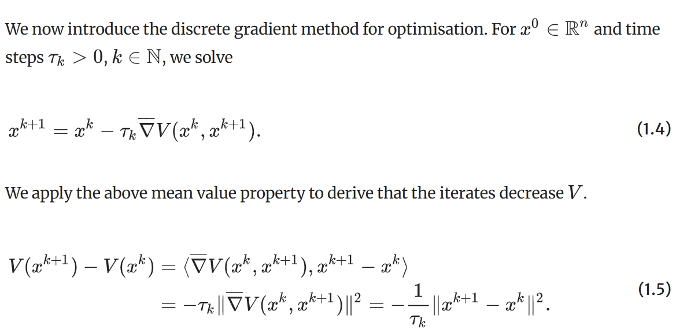
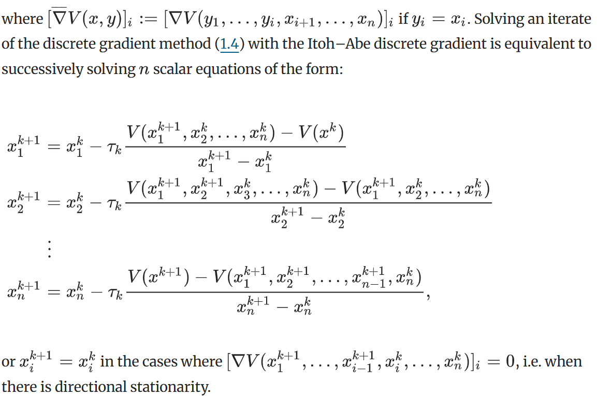

# Itoh--Abe Method

文献:

https://www.sciencedirect.com/science/article/abs/pii/0021999188901325?fr=RR-2&ref=pdf_download&rr=a38d0469ffc3d427

(提案論文)
 

https://link.springer.com/article/10.1007/s10208-020-09489-2

Riis, E.S., Ehrhardt, M.J., Quispel, G.R.W. et al. A Geometric Integration Approach to Nonsmooth, Nonconvex Optimisation. Found Comput Math 22, 1351–1394 (2022). https://doi.org/10.1007/s10208-020-09489-2

(この論文はOpen Access、[CC BY 4.0](http://creativecommons.org/licenses/by/4.0/))

解説:

勾配流などの文脈に近い。
考えている問題設定はZeroth Order Methodsに近いが、発想はかなり異なる。
もし次の反復点が見つかれば、それは絶対に関数値が減少している。
しかし、その次の反復点を見つけるのが、$n$ 個の等式を解くことを要求するので難しい。
あまり理解できていないが、Zeroth Order Methodsよりも優れている場合もありそう。
