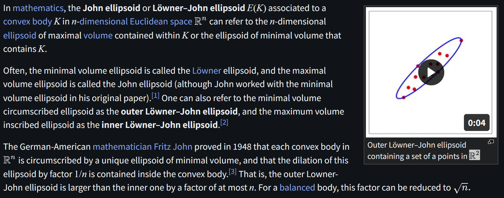

# John Ellipsoid

文献:

https://arxiv.org/pdf/2609.10888

https://en.wikipedia.org/wiki/John_ellipsoid

解説:

以下のような整理が出来る。

| 凸体を含む最小体積の楕円体 | 凸体に含まれる最大体積の楕円体 |
| :---: | :---: |
| 最小体積楕円体 | 最大体積楕円体 |
| the minimal volume ellipsoid | the maximal volume ellipsoid |
| the Löwner ellipsoid | the John ellipsoid |
| the outer Löwner–John ellipsoid | the inner Löwner–John ellipsoid |

楕円体法などに応用がある。

[シュタイナーの内接楕円](https://ja.wikipedia.org/wiki/%E3%82%B7%E3%83%A5%E3%82%BF%E3%82%A4%E3%83%8A%E3%83%BC%E3%81%AE%E5%86%85%E6%8E%A5%E6%A5%95%E5%86%86)は最大体積楕円体の特殊ケースである。
