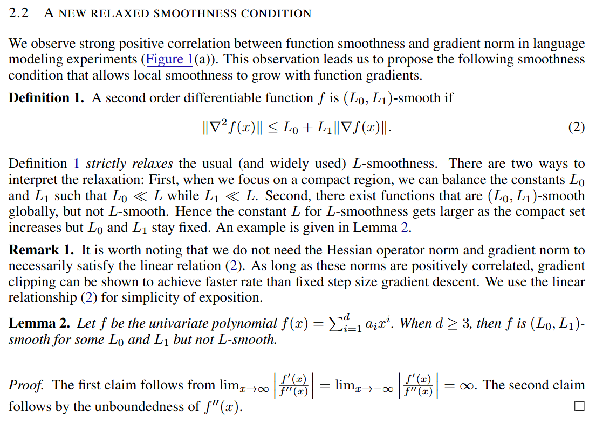
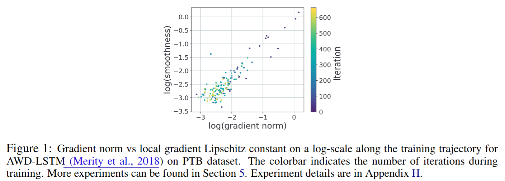

# (L0, L1) Smoothness

文献:

https://www.researchgate.net/profile/Mohammad-Alkousa-2/publication/413568957_First-Order_Methods_for_Optimization_Problems_with_Generalized_Smoothness_and_Generalized_Inexact_Oracle/links/6a8c89c7db725f1be9602a92/First-Order-Methods-for-Optimization-Problems-with-Generalized-Smoothness-and-Generalized-Inexact-Oracle.pdf

(これの[11]が以下の論文)
 

https://arxiv.org/abs/1905.11881

解説:

$L$-Smoothnessの一般化。
上記のFig.1にあるように、勾配ノルムとSmoothnessに相関があることを契機として導入されたようである。
確かに、$L$-Smoothnessの仮定は現実的な問題と不整合だとはよく感じるので、非常に妥当で面白い。
