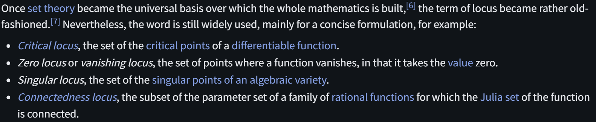

# Locus

文献:

https://en.wikipedia.org/wiki/Locus_(mathematics)#History_and_philosophy

解説:

和訳は単に[軌跡](https://ja.wikipedia.org/wiki/%E8%BB%8C%E8%B7%A1_(%E6%95%B0%E5%AD%A6))。
画像にあるように、Zero locusなどで零点集合を指すので、そういった用例を時々見かける。
