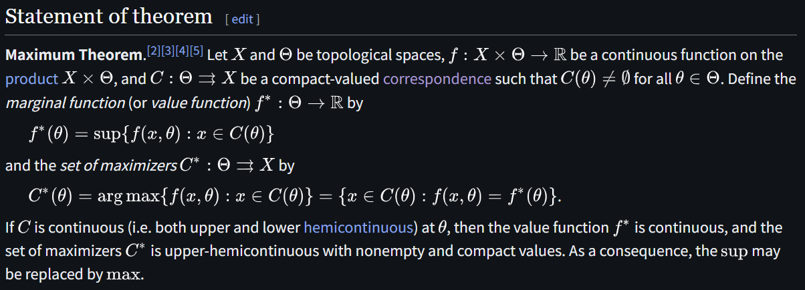
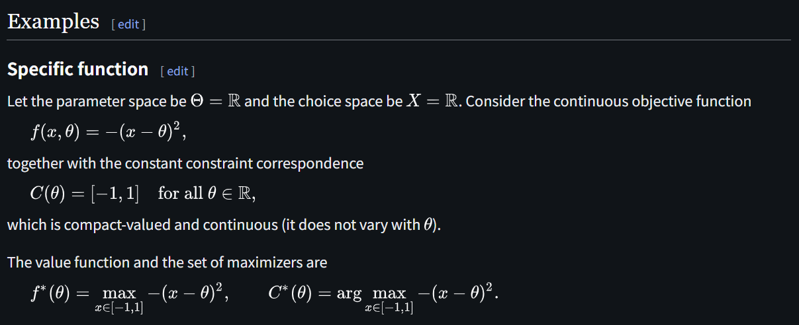
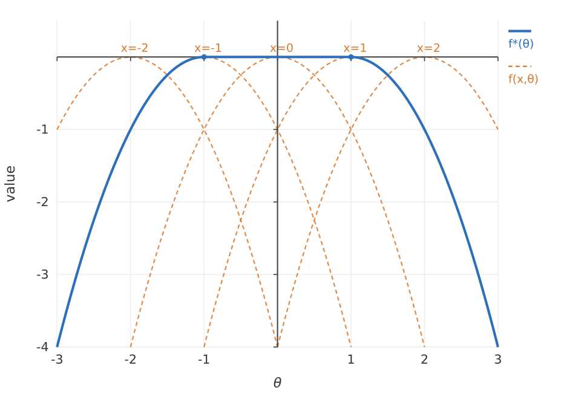

# Maximum Theorem

文献:

https://en.wikipedia.org/wiki/Maximum_theorem

(この $f^*(\theta)$ が連続というのが主張の一つ)

https://arxiv.org/abs/2608.25789

<!--  -->

> Berge’s maximum theorem holds significant relevance in fields such as economic theory, optimal control, and optimization theory. For instance, in demand theory, it is concerned with an agent’s optimal consumption concerning prices and income, while in capital theory, with the optimal investment strategy based on the existing capital stock.

(本論文のSection 1より引用)

解説:

この定理は、パラメータに依存する最適化問題が、パラメータに関して連続的な解を持つための条件を提供している。
