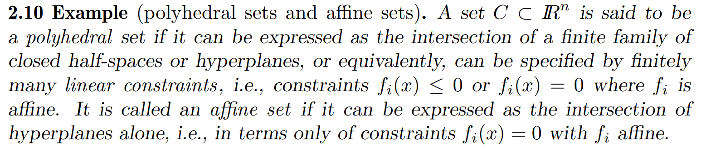
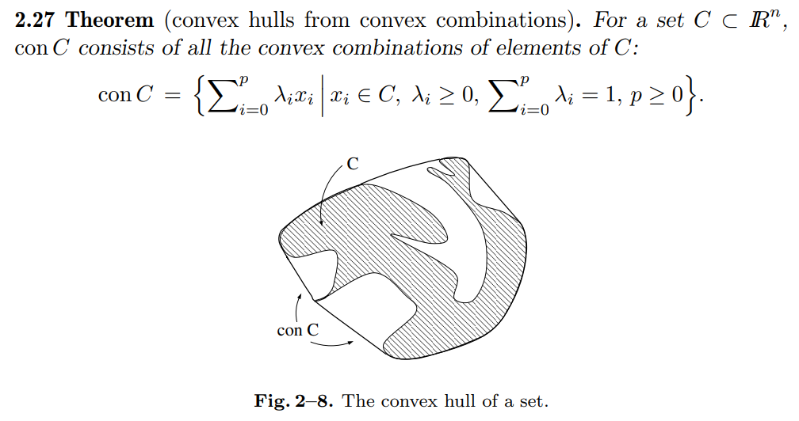
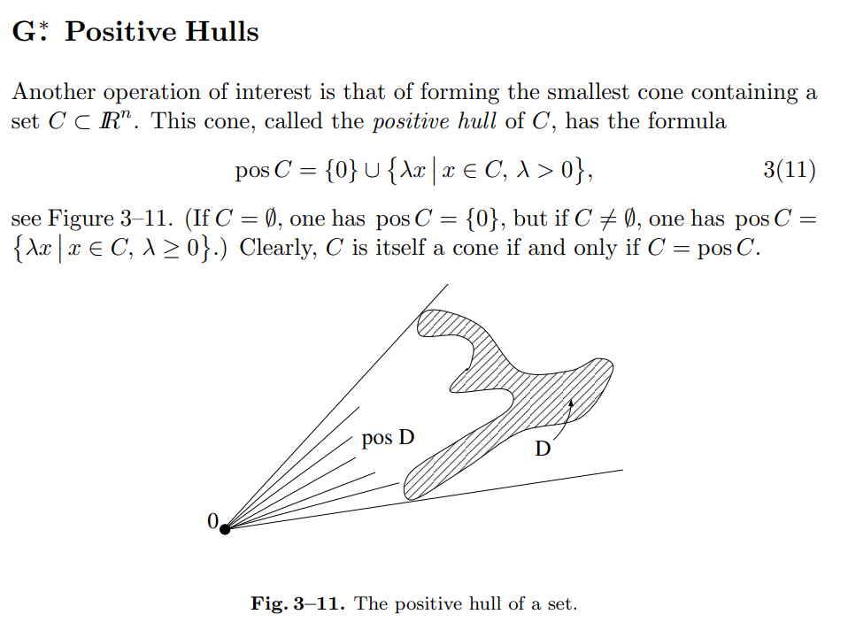
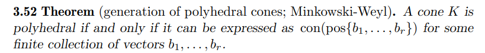

# Minkowski--Weyl Theorem

文献:

https://link.springer.com/book/10.1007/978-3-642-02431-3

(Variational Analysisの3. Cones and Cosmic Closureにて。証明も長いが載っている。)

(まず、以下がPolyhedralの定義。要は有限個の半空間の交わりで表せる集合。)

(次に、以下がconの定義。凸包。)

(次に、以下がposの定義。正錐包。)

(以上より、主張が理解できる。それはそうという感じがしてくる。)

解説:

[このサイト](https://people.inf.ethz.ch/fukudak/polyfaq/node14.html)の説明とは少し違ったように見えるが、揺れがあるのかも知れない。

todo: 同値性の確認。

[Stack Exchange](https://math.stackexchange.com/questions/1335176/what-is-the-weyl-minkowski-theorem)でも言及されている。
