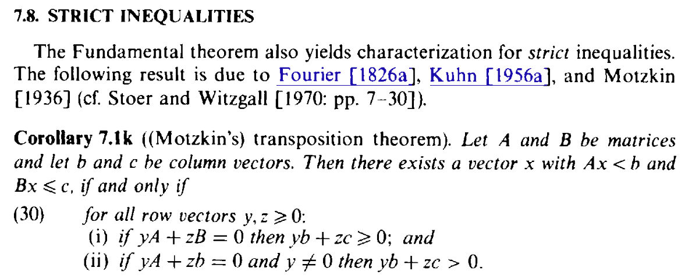
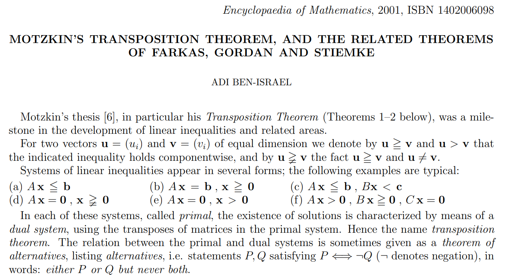
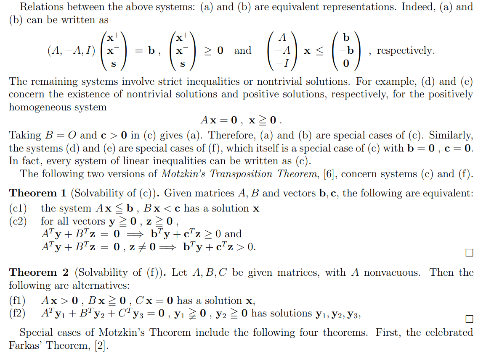

# Motzkin's Transposition Theorem

文献:

https://epubs.siam.org/doi/10.1137/1030065 (以下の文献と形式的な差異があるが、証明まで載っている。ただし長い。)

https://www.researchgate.net/publication/2628560_Motzkin's_Transposition_Theorem_And_The_Related_Theorems_Of_Farkas_Gordan_And_Stiemke

https://www.ism.ac.jp/~mirai/sscoke/2026/ (松井知己先生による講義の演習問題にほぼ同内容の出題)

解説:

出典としてやや古いものしかないが、Farkasの補題などを統一的に導けるという点で優れた一般性を持つ主張。ただし、この定理の証明自体にFarkasの補題が用いられている。

定理そのものの主張ではないが、いくつかの線形システムが定理で扱っている形式、つまり(c)の形式である $Ax \leq b, Bx < c$ に帰着できるという点は、重要かつ面白い。
