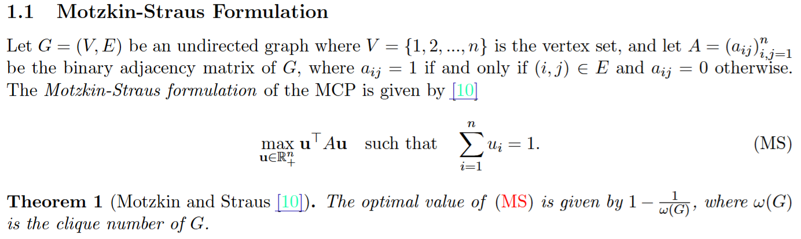

# Motzkin--Straus Formulation

文献:

https://www.cambridge.org/core/journals/canadian-journal-of-mathematics/article/maxima-for-graphs-and-a-new-proof-of-a-theorem-of-turan/AC3CC45896B053B75C856F25829CA95C

(ここでは載せないが、証明が載っている。そこそこ非自明で面白い。完全グラフの場合に帰着するのが要点っぽい。)
 

https://arxiv.org/pdf/1505.07077

解説:

グラフの最大クリーク問題に対する連続的な定式化。
$k$ 頂点の完全グラフがあるとき、その各頂点に $1/k$ の重みを割り振ると、目的関数値は
$$
\frac{1}{k}^2 \cdot 2 \cdot \binom{k}{2} = \frac{k-1}{k} = 1 - \frac{1}{k}
$$
となるので、大まかには理解出来る。
