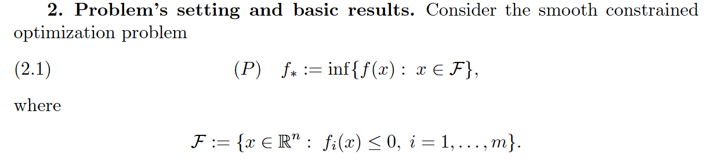
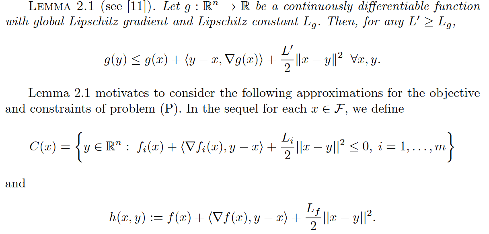
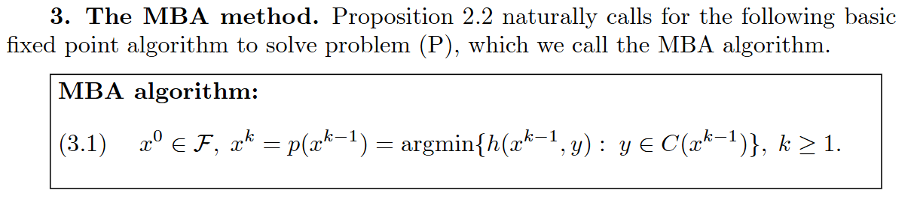

# Moving Balls Approximation

文献:

https://epubs.siam.org/doi/abs/10.1137/090763317

(提案論文)

解説:

非線形制約を各反復点の周りで二次上界による球状の凸制約に近似し、簡単な部分問題を逐次解く。
反復ごとに球の中心・半径が変化するためmoving ballsと呼ばれ、元の制約の実行可能性を保ちやすいのが特徴。
