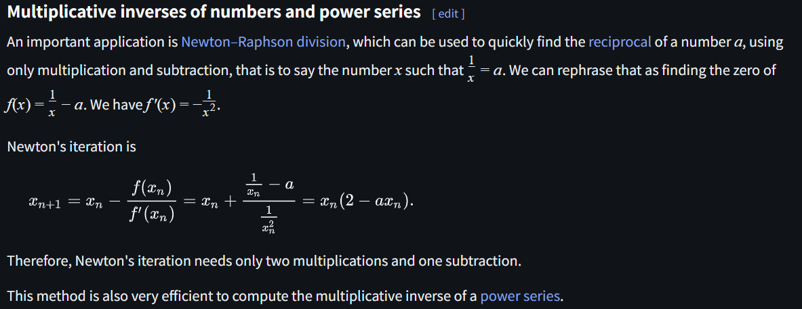
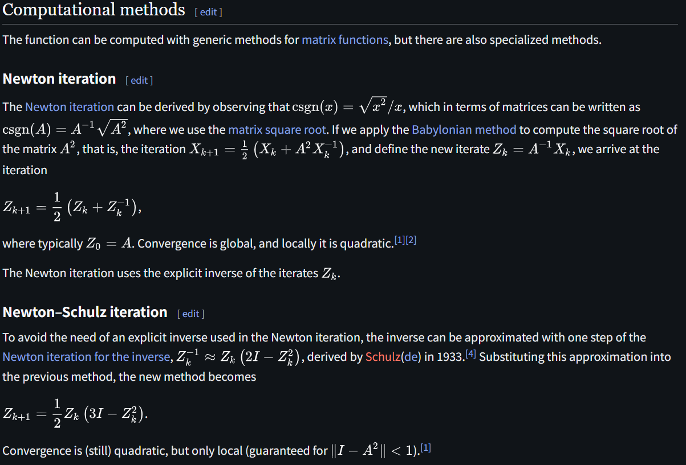

# Newton--Schulz

文献:

https://en.wikipedia.org/wiki/Newton%27s_method#Multiplicative_inverses_of_numbers_and_power_series

https://en.wikipedia.org/wiki/Matrix_sign_function#Newton%E2%80%93Schulz_iteration

解説:

Newton–Schulz法は、大雑把には行列向けのNewton法で、二次収束するのが偉い。
具体例として、行列符号関数の計算にも用いられる。
