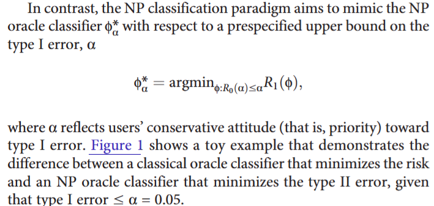
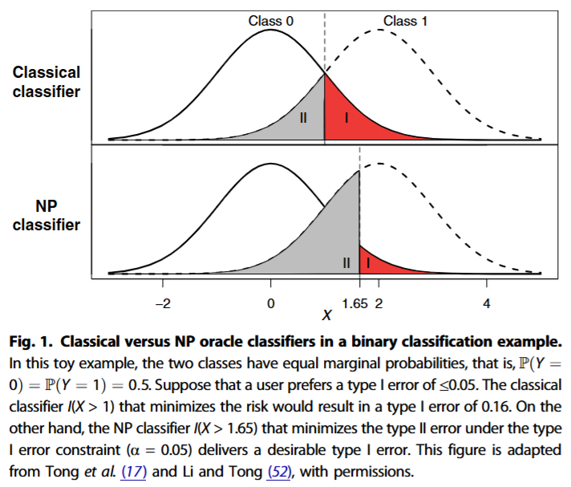

# Neyman--Pearson Classification

文献:

https://www.science.org/doi/10.1126/sciadv.aao1659

解説:

[第一種の過誤(偽陽性)](https://ja.wikipedia.org/wiki/%E7%AC%AC%E4%B8%80%E7%A8%AE%E9%81%8E%E8%AA%A4%E3%81%A8%E7%AC%AC%E4%BA%8C%E7%A8%AE%E9%81%8E%E8%AA%A4)を確実に抑えながら、第二種の過誤(偽陰性)を最小化する。
[deterministic nonlinearly constrained optimization](https://arxiv.org/pdf/2608.27676)の応用例として挙げられていた。
