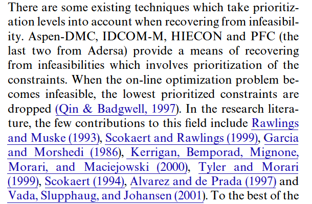

# Prioritized Constraints

文献:

https://www.sciencedirect.com/science/article/pii/S1474667017571554

(提案論文)
 

https://www.sciencedirect.com/science/article/pii/S0005109801001431

解説:

[優先制約](https://www.jstage.jst.go.jp/article/jacc/66/0/66_638/_pdf/-char/ja)とも呼ばれているようである。
実務寄りの要求から考えられている設定だと思われる。
そもそも制約が破られる前提でモデリングされていると思われ、通常の意味の制約とは性質が異なる。
